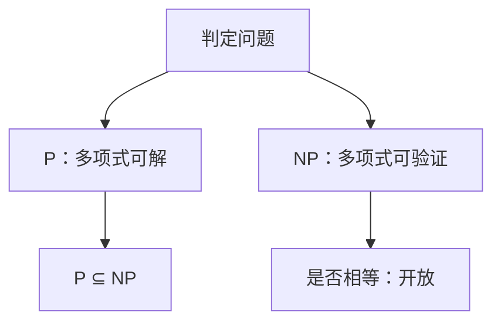

# P 与 NP

P 是多项式时间可解的判定问题；NP 是多项式时间可验证的判定问题。它们是否相等，本课不裁决。

<footer>—— 据 Cook, The Complexity of Theorem-Proving Procedures, 1971；Garey and Johnson, Computers and Intractability, 1979 整理</footer>

上一课[区间 DP 直觉](/cs/interval-dp)给出伪多项式 DP，并留下「$W$ 以二进制写入时表有多大」的缺口。此前排序、图算法、KMP 都默默停在多项式时间内，从未命名这个圈子。本课不从图灵机重讲计算是什么。缺口是：**给判定问题的两类**——P 与 NP——并说明 0-1 背包判定版为什么自然落在 NP，而不在本课证明它完全。

## 问题

判定问题：输入 $x$，回答是/否。P：存在最坏多项式时间算法。本栏已见的排序判定（「是否已有序」）、最短路可行性、连通性，都在 P。NP：存在多项式长证书，多项式时间验证器：是实例有某证书被接受，否实例任何串都不被接受。

0-1 背包判定「能否达到价值 $\ge K$」：证书是选哪些物品，验证加总重量与价值。找证书可以很难；验证书是线性。这就是 NP 的形状。本课不把非确定性图灵机展开成状态表。

### NP 不是「非多项式」

NP 不读 Non-Polynomial。它包含 P（多项式算法的运行记录可当证书）。未知的是是否 NP $\subseteq$ P。本课不引用未发表的证明，也不把「实践中指数」写成 NP 定义。

Cook 1971 定义多项式时间归约与 SAT 完全性；Karp 1972 列出一批。Garey/Johnson 是标准清单。本课只建类；归约与完全性是后两课。

## 方法

把优化改写成判定（有没有价值 $\ge K$ 的子集）。展示短证书与验证器。承认搜索可指数（枚举子集），验证多项式。P 的成员给算法；NP 的成员给验证器。 coNP 点名：否实例的短证，本课不展开。

[渐近记号](/cs/asymptotic-notation)里的多项式对输入长度，不是对数值 $W$ 本身。背包 DP 的 $\Theta(nW)$ 因此不一定把判定版放进 P。

## 机制

有了类，才能说「多项式归约保持哪一类」。本课不写归约。也不把图灵机模型与 RAM 模型的多项式差异展开：标准约定下二者多项式等价，后课归约默认这一层。

优化问题「找出最大价值」不是判定类的对象；它对应的判定在 NP，搜索可能 NP-难，用语留给后课。

## 边界

本课不列 NPC 清单，不证 SAT 完全。不把素数判定的历史（AKS 在 P）写成主线。加密、平均复杂度不进。后课默认：谈到 NP，即短证书可验；P 即多项式算法。归约是下一课的缺口。

## 小结

- P = 多项式可解判定；NP = 多项式可验证判定；$P\subseteq NP$。
- 先前算法课的对象默认在 P；背包判定是 NP 的直觉例子。
- NP 不是「指数」的同义词；$P=NP$ 开放。
- 出处：Cook, 1971；Garey and Johnson, 1979。
