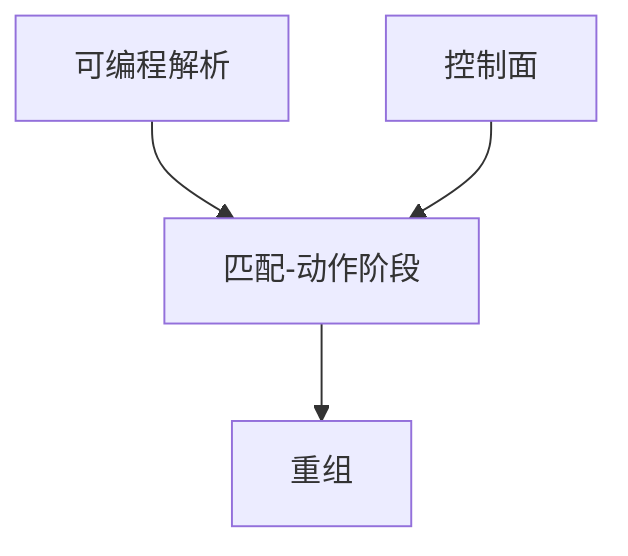

# P4 可编程

P4 描述解析器与匹配-动作流水线，编译到 ASIC 或 CPU；协议头不再焊死在硅里，但仍受阶段数与 TCAM 形状约束。

<footer>—— 据 Bosshart et al., P4, ACM SIGCOMM CCR 2014；P416 语言规范整理</footer>

[上一课](/cs/sdn-openflow) 的匹配域是固定的。新隧道头要等芯片代次。缺口是**可编程数据面**：P4 写 parse → match-action → deparse。本课不把 Clos 拓扑写完。

## 问题

OpenFlow 加字段靠规范版本。P4：声明头、解析图、表、动作，目标无关再映射到 Tofino 或智能网卡。仍不是通用 CPU：无任意循环、表宽与阶段固定。INT 带内遥测、自定义熵、新封装可在此做。控制面仍要某协议装表——P4 不替代 BGP，只替换「转发 ASIC 焊死」那一层。

不要把 P4 写成智能合约或机器学习训练。

P416。PSA/PNA 架构。本课不写完整编译器。

### 不是通用 CPU

解析与表可描述，阶段数与表宽仍硬。不取消 BGP，只放开头格式。错误程序可成黑洞。

## 方法

画：解析图 → 多级表 → 出端口。对照 TCAM：表仍可能编译成 TCAM/SRAM。与线路码对照：都是「可描述的转发」，一层在 PHY，一层在 L2–L4。

方法止于选定对象与对照；机制才说它如何嵌入已有分层与主干课。

## 机制

VXLAN/SR 新 SID 可用 P4 先部署再等标准芯片。错误程序可把交换机变成黑洞，需要测试与资源上限。C10K 后课是主机端；这里是网络端可编程。容量 $C$ 仍由端口 PHY 决定，P4 只动如何选口。

与 HOL：流水线阶段加深可能加纳秒，不解决输出热点。

## 边界

本课不引入 eBPF 与 P4 的全部对照。数据中心 Clos 是下一课。后课默认：数据面可编程受流水线资源约束，不是通用计算。

把全部政策塞进 P4 会让控制面版本与芯片资源强耦合。

上一课留下的缺口在本课收口；「P4 可编程」进入后课词汇表后只引用。文献用来钉对象与边界，不把本课写成该主题的独立综述。下一课[数据中心 Clos / 胖树](/cs/datacenter-clos)。

## 小结

- P4 定义解析与表，编译到受限硬件。
- 不取消控制面协议，只放开头格式。
- 资源阶段数是硬边界。
- 后课只引用本课钉死的对象，不从该领域总问题重开。
- 出处：Bosshart et al., 2014；P416。
