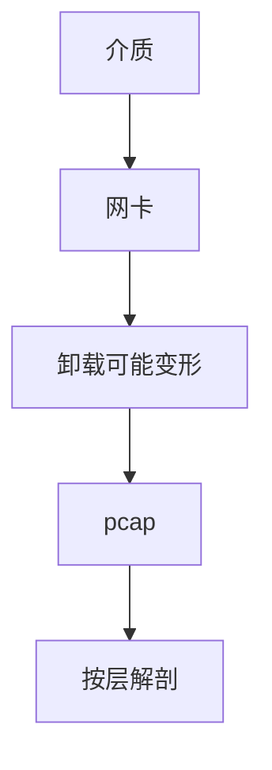
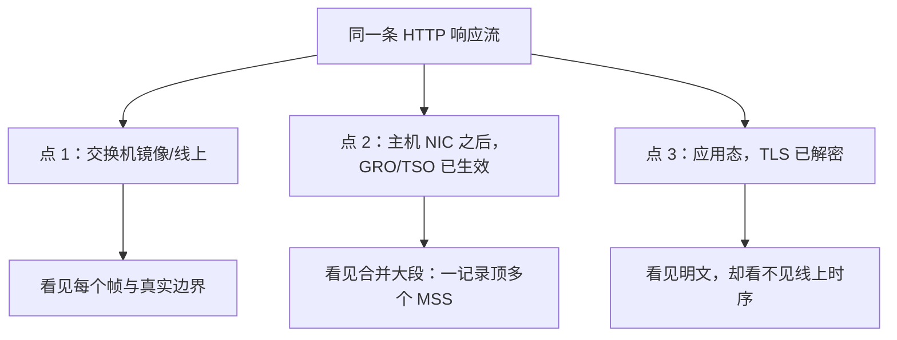

# 抓包与 Wireshark

在某点复制帧到用户态，才能对证协议叙事；GRO/TSO 与交换机镜像会改变你看见的边界。

<footer>—— 据 RFC 919 等广播直觉；pcap 与 Wireshark 实践；IEEE 802.3 帧对照整理</footer>

[上一课](/cs/network-measurement) 给汇总数字。[帧](/cs/frame-mac) 是真正 PDU。缺口是**捕获点与解释**：混杂、镜像、卸载变形。本课不把 ns-3 写完。

## 问题

状态机课说三次握手，线上是否如此要抓。libpcap：拷贝到 AF_PACKET 或 BPF。交换机 SPAN 看邻口。GRO 合并让「一段」其实是多 MSS。加密后只能看外层与长度——TLS 入口课的后果。DROP 在 ASIC 的包抓不到，除非镜像或 INT。

术语翻译：混杂模式就是「网卡不再只收发给自己 MAC 的帧，同网段路过的包都收上来」；SPAN（端口镜像）则是交换机把某些口的流量复制一份送到观测口。两者都为「看见不是给我的流量」，只该用于自己有权排障的链路。

不要把抓包写成攻击嗅探教程；对象是自己的排障点。

Wireshark 是分析器。pcapng 格式。本课不教过滤器黑客用法。

### 捕获点即叙事

GRO/TSO 改变边界；加密挡住内层。ASIC 丢包抓不到。只在授权链路上排障。错误的点会证明错误的层。

## 方法

画：线 → NIC →（可选 GRO）→ pcap → 解剖。对照日志。与 PTP 硬件戳：普通 pcap 时间戳抖动大。

```mermaid
flowchart TD
  WIRE["介质"] --> NIC["网卡"]
  NIC --> OFF["卸载可能变形"]
  OFF --> PCAP["pcap"]
  PCAP --> DISS["按层解剖"]
```

## 机制

LACP 哈希决定 SPAN 哪条成员。VXLAN 要解两层。QUIC 加密，只能看 UDP。权限与缓冲丢包使捕获自己丢。测量与捕获同时会改变时序（海森堡）。

同一条流量在不同点抓，看见的东西就不一样：边界、内容、时序各缺一块。说「我抓到了」之前，先说清「我在哪抓的」。

```mermaid
flowchart TD
  PKT["同一条 HTTP 响应流"] --> W["点 1：交换机镜像/线上"]
  PKT --> N["点 2：主机 NIC 之后，GRO/TSO 已生效"]
  PKT --> T["点 3：应用态，TLS 已解密"]
  W --> W1["看见每个帧与真实边界"]
  N --> N1["看见合并大段：一记录顶多个 MSS"]
  T --> T1["看见明文，却看不见线上时序"]
```

数字实例：MSS 为 1448 字节时，一条 64 KB 的响应在线上是约 46 个帧；开 GRO 的主机上抓，可能只剩几个几万字节的大段——按帧数算吞吐、按段边界估 RTT 都会算错，这就是「捕获点即叙事」。

常见误区：初学者容易把捕获丢包当成线上丢包。捕获缓冲区满、用户态分析跟不上时，pcap 会自己丢包（Wireshark 有丢包计数提示）；先看捕获统计是否干净，再对网络下结论。

法律与政策：只抓授权链路。

## 边界

本课不引入 eBPF 追踪的全部。ns-3 与 mininet 是下一课。后课默认：抓包验证叙事；注意卸载与捕获点。

在错误的点抓会「证明」错误的层。

下一课[ns-3 与 mininet](/cs/network-simulation)。

## 小结

- 捕获点决定看见哪一层。
- 卸载与加密改变可见性。
- 用来对证，不替代控制面遥测。
- 后课只引用本课钉死的对象，不从该领域总问题重开。
- 出处：pcap 实践；802.3/RFC 对照。
