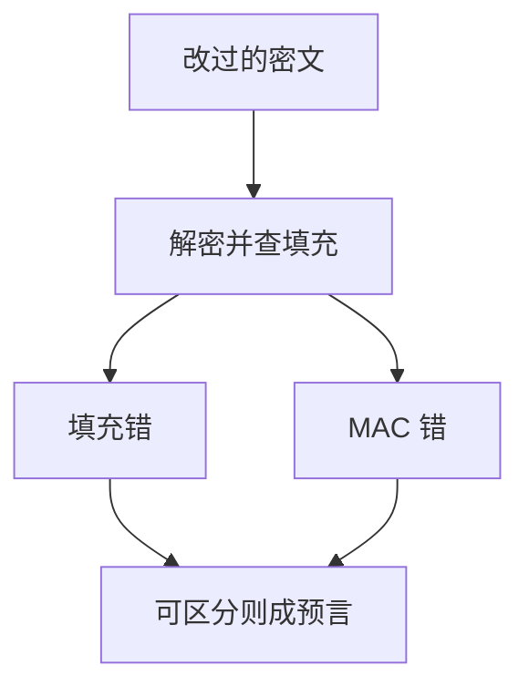

# 填充预言机

CBC 解密后若把「填充合不合法」与「MAC 失败」用可区分的方式告诉外界，主动敌手就能把解密器当成一位一位的预言。防御是 AEAD，以及失败不可区分。

<footer>—— Vaudenay, Security Flaws Induced by CBC Padding, EUROCRYPT 2002；对照 TLS 对填充与 MAC 的历史修补</footer>

## 定位

上一课[nonce 误用](/cs/nonce-misuse)是状态合同。缺口是**错误通道**：即使 nonce 唯一，分组密码的填充校验若变成可观测谓词，Dolev–Yao 的理想锁也不成立。本课讲机制与防御，不给可复现的明文恢复步骤。

后课默认已经读完本课钉下的合同，只补差，不从该领域第一性原理重开。

## 问题

PKCS#7 一类填充让明文长度凑整。CBC 解密后检查填充。若攻击者改密文块并得知「填充错还是 MAC 错」，就得到一位预言。历史 TLS 与若干框架因此换套件。缺口是：完整性必须在解密前或与解密原子地验；错误不可区分。

### 不是作业题

课程禁止把预言机利用写成实验指导。需要的只是：可区分的失败 = 额外的解密预言；关掉它。

Vaudenay 2002。Lucky Thirteen 一类是计时变体，同属错误/时间通道。TLS 1.3 删除 CBC 套件，从根上换 AEAD。

## 方法

陈述 Encrypt-then-MAC 与 AEAD 如何让「密文未认证则不解密」。统一错误码与常数时间失败路径。旧栈若必须留 CBC，也不可把填充错误单独抛出。

图中节点是本课的机制骨架；课程不把图展开成可运行的攻击步骤。

## 机制

主动敌手的能力包括改字节并看反应。规格若把内部校验暴露成不同 HTTP 状态、不同耗时、不同日志，就等于提供 $ \mathrm{Dec} $ 的部分信息。这与 nonce 复用正交：即使每条消息 nonce 都新，错误通道仍在。

前提写进合同之后，游戏外的误用只当失败模式点名，不在本课写成操作程序。

## 边界

本课不分析某 CVE 的报文。哈希结构下一课：消息摘要如何迭代，与填充预言无关，但同属「把可变长输入收成固定对象」的进阶。

## 小结

- nonce 合同之外，错误信息也是通道。
- CBC 填充校验可被当成预言；不要区分失败原因。
- AEAD 与 Encrypt-then-MAC 从结构上关掉。
- 下一课 Merkle–Damgård：哈希的迭代结构。
- 出处：Vaudenay, 2002；Krawczyk 对 MAC-then-encrypt 的讨论；RFC 8446 删除 CBC。
