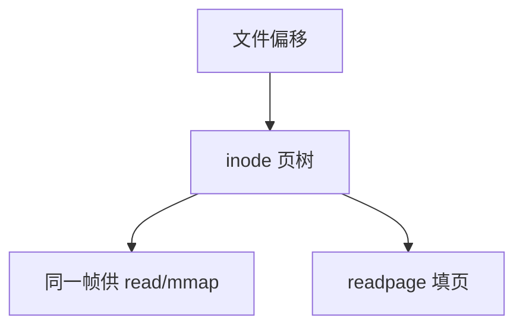

# 页缓存

每个文件的数据页按文件偏移索引放在统一的页 Cache 里；read、write 与 mmap 看见同一帧。

<footer>—— 据 McKusick 对缓冲缓存的演进；Bovet and Cesati 对 address_space 的整理</footer>

[上一课](/cs/buffer-dirty)已经承认脏页与「同一物理块不应有两份副本」。缺口是把缓存收成**按 inode 索引的页集合**：不是块设备上的 512 字节缓冲槽那么老的主线，而是与 [按需调页](/cs/demand-paging) 同一粒度的页。mmap 缺页填的就是这里。

## 问题

旧 Unix 缓冲缓存按设备+块号。文件空洞、大文件、mmap 需要按「文件偏移」找页，并允许稀疏。缺口：`address_space`（或等价物）用基数树/xarray 把索引 → 页框。`read` 拷到用户前先找页；未命中则 `readpage` 经 [VFS](/cs/vfs) 让 FS 填。同一页可被多进程 mmap 共享。shrinker 从这里丢干净页。

本课不把 xarray 的内部节点写成算法课。

缓冲头（buffer_head）仍可把一页拆成多个盘块，对接非页对齐的块大小。教学上页是主对象，块是填充单位。

## 方法

读：查 inode 的页 Cache，miss 则向 [buddy](/cs/buddy-allocator) 要页、发起读、插入树、拷贝或映射给用户。写：找或建页，改内容，标脏。匿名页不进这份按文件的树（它们走匿名 LRU）。与 dcache 分工不变：dentry 是名，页 Cache 是字节。

## 机制

页 Cache 让「磁盘是内存的下一层」可实现：热点文件留在 RAM，工作集可以主要是文件页。回收时丢掉它们等于缩小 Cache，不是杀进程。不要把页 Cache 当成 CPU 数据 Cache 的同构数字；缺失代价是毫秒级 I/O。数据库栏的缓冲池是用户态另一套，可以 `O_DIRECT` 绕过本课对象。

## 边界

本课不引入 `fadvise` 的全部提示。不保证页 Cache 与块设备硬件 Cache 的一致性协议。下一课：脏页何时由谁写成队列，而不是等置换偶然碰到。

后课默认：文件字节在按偏移索引的页里。后台把脏页推向设备，下一课 writeback。

## 小结

- 页 Cache 按文件偏移索引帧；读写映射共用。
- miss 走 VFS 的 readpage；shrinker 可丢干净页。
- 脏页的主动回写是 writeback 的缺口。
- 出处：McKusick et al., *4.4BSD*；Bovet and Cesati, *ULK*；Silberschatz et al., *OSC*。
