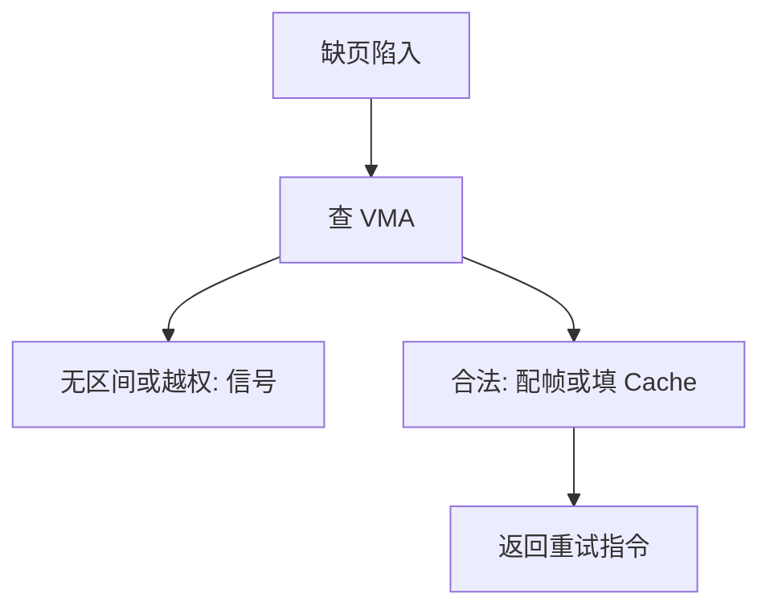

# 缺页路径

缺页陷入之后，内核要判断：非法、补页、写时复制，还是发给进程一个信号。

<footer>—— 据 Silberschatz et al., Operating System Concepts；Love, Linux Kernel Development 整理</footer>

[上一课](/cs/demand-paging)给出策略：合法访问可以在触及才占帧。[分页](/cs/paging-vm)的缺页异常已经能进内核，本课不重导页表。[brk 与堆](/cs/brk-heap)只保证区间合法。缺口是**路径**：硬件向量之后，内核如何找到那一段 VMA，并决定 minor/major、杀进程或重试指令。

## 问题

同一类「页表项无效」至少有三种前途：地址不在任何 VMA（野指针）；在 VMA 里但还没有帧（按需）；在 VMA 里且有帧但不能写（保护或后课 COW）。若缺页处理把三者混成一种「再配一页」，只读文本会被写成可写。缺口不是 TLB 怎么查，而是：取故障地址 → 查进程的虚区间树 → 对照错误码里的写/用户/指令位 → 分配或拒绝。

本课不把每种架构的 error code 位图背完。

minor 缺页：页已在内存（如页 Cache），只需填表。major：要读磁盘或 swap。会计进进程的缺页计数，调度与后课抖动会用到。

## 方法

入口沿用组成课的精确异常：保存 trapframe，内核用故障 VA 查 VMA。无 VMA 或权限不够：投递 `SIGSEGV`（后课信号），不配帧。有 VMA：按需分配帧、必要时从文件读入、置权限、冲本 CPU 的 [TLB](/cs/tlb-translate)，返回用户重试。栈守卫页可触发一次扩展，仍须受上限约束。

## 机制

路径把「按需」从口号收成可审计的分支：文件页走 inode 与后课页 Cache；匿名页填零。内核自己的缺页（例如拷贝用户缓冲时）不能杀内核，只能把错误返回给系统调用。这与用户指令缺页同走 MMU，处理函数不同。

不要在这里重写多级页表 walker：那是分页课与 TLB 课的对象。本课只使用「硬件已经指出 VA 与错误类型」。

## 边界

本课不引入 `userfaultfd` 把缺页交给用户态处理的全部协议。不把 NUMA 的远程帧分配写成默认。指令与数据缺页在统计上可分开，教学上同一条路径。多核上改页表之后其他 CPU 的 TLB 仍可能是旧的，那是后课 shootdown。

后课默认：缺页已能对 4K 页正确补表。TLB 压力与页表层数，下一课用大页来减。

## 小结

- 缺页先对 VMA 与权限分类，再配帧或发信号。
- minor/major 区分「是否访盘」，不改页表格式。
- 大页如何减少翻译项，是下一课。
- 出处：Silberschatz et al., *OSC*；Love, *LKD*；Tanenbaum *MOS*。
