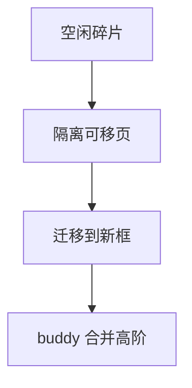

# 页迁移与 compaction

迁移把页内容拷到新页框并改所有 pte；compaction 在区内把可移页往一端赶，以便拼出连续高阶块。

<footer>—— 据 Linux 对 page migration 与 compaction 的文档；Gorman 对反碎片的讨论</footer>

[上一课](/cs/rmap)能改所有映射。[buddy](/cs/buddy-allocator) 在碎片化后交不出 2^n 大块，[THP](/cs/thp) 与 DMA 会失败。缺口是 **迁移 + compaction**：不是用户 `mremap` 的百科。

## 问题

不可移页（内核 pinned、部分驱动）挡在中间。compaction：扫描 zone，隔离可移页，迁移到另一端，腾出连续空闲。NUMA：`migratepages` 把页挪到目标节点。缺口：失败回退、延迟（一次 compact 可停很久）、与 [cgroup](/cs/memcg) 回收的交织。本课不把每条 isolate 函数当课纲。

同步 compact 发生在高阶分配失败路径；kcompactd 后台做。CMA 为连续分配预留，是亲戚。

## 方法

`migrate_pages`：分配目标页，拷内容，rmap 换 pte，释放源。compaction：把迁移当原语，循环直到出现足够空闲阶。对照 [bcache](/cs/bcache)：一个搬存储块，一个搬内存页。对照 FS [extent](/cs/ext4-extents)：都在对付碎片，介质不同。

## 机制

compaction 用迁移换连续物理内存，使大页与某些驱动继续可行。它改变 pfn，不改变用户虚址。不要写成磁盘碎片整理产品。与 [fsync](/cs/fsync) 无关——页在 RAM。

延迟：直接回收+compact 是分配延迟的来源之一，后课 memcg 限制会更频繁触发。

实现上：隔离页失败则 compact 放弃这一轮，高阶分配走回退阶。CMA 与迁移共用可移性，驱动 pin 会让 CMA 分配失败。跨 NUMA 迁移要更新页的 nid 与统计。 读法上只引用[上一课](/cs/rmap)的结论，不把对象换成训练推理或限价簿。

本课在操作系统进阶的「内存进阶 / 回收、迁移与加固」课序里，对象是 **页迁移与 compaction**。

- 先修只引用，不重导：上一课的结论当公理，本课只补差。
- 五栏不吞并：不把本课写成大模型训练/推理，也不写成限价簿或权重量化。
- 文献用 OSTEP、McKusick、内核文档与具名会议论文；不发明 arXiv 编号。

## 边界

本课不引入 memory compaction 的全部 sysctl。不保证实时系统能忍受 kcompactd。下一课消费者：透明大页。

版本字段会变，课序钉的是机制对象「页迁移与 compaction」，不是某一主线内核的结构体名。
后课默认：内核可搬家以拼连续框。匿名/文件透明 2MB 页如何折叠，下一课 THP。

## 小结

- 迁移改 pte 与内容所在 pfn。
- compaction 用迁移反碎片，服务高阶分配。
- THP 是下一课。
- 出处：Linux mm/migration、compaction；Gorman。
