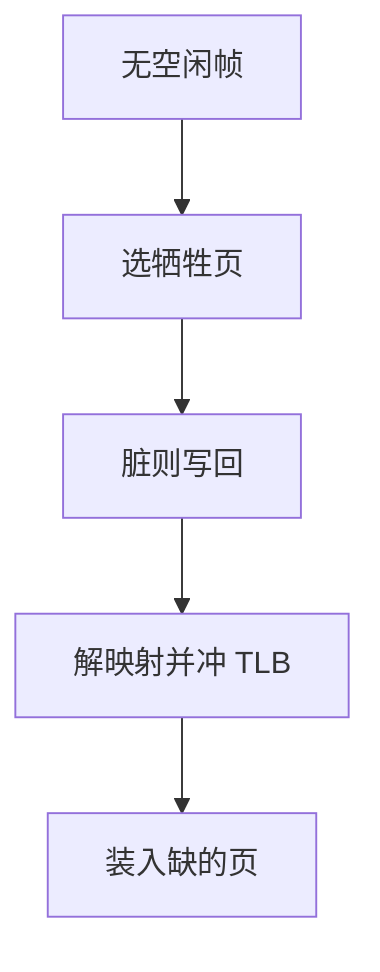

# 缺页与置换

物理页不够时，必须选出一页写回或丢弃，把帧交给缺页者；算法决定抖动还是工作。

<footer>—— 据 Belady, A study of replacement algorithms for a virtual-storage computer, IBM Systems Journal 1966 整理</footer>

[上一课](/cs/tlb-shootdown)在有空闲帧时补页。帧用尽后，再缺页必须**置换**。缺口不是再解释陷入入口，而是选牺牲页：FIFO、最优、LRU 与时钟近似。本课不把写时复制和文件映射提前。

## 问题

最优算法淘汰「未来最久不用」的页，离线才知道。FIFO 实现简单，可发生 Belady 异常：给更多帧，缺页反而增加。LRU 贴近局部性，要硬件或软件记使用时间。缺口是：在线算法如何逼近 LRU，以及脏页必须先写回再腾帧——写回接后课缓冲，本课只承认脏位。

本课不把 Linux 的 LRU 活跃/非活跃链表细节当考纲。

时钟算法：页表访问位置位，指针转圈，遇到未访问者淘汰，遇到访问者清位再走。是 LRU 的廉价近似。

## 方法

缺页且无空闲：按策略选页；若脏则加入写回；取消原页表映射并冲 [TLB](/cs/tlb-translate)；把帧交给新页。全局置换在全系统选；局部置换在该进程配额内选。工作集若大于物理内存，任何算法都会抖动：大部分时间在换页。

## 机制

置换把物理内存当成 Cache：虚页是 Cache 里的块，缺页是缺失。[局部性](/cs/locality-principle)再次决定命中率。抖动时[调度指标](/cs/scheduling-metrics)全面恶化：利用率看起来高（在等磁盘），用户吞吐接近零。对策是减少多道程度，而不是更频繁切换。

只读文本可丢弃后从文件再读，不必写回。匿名脏页要进交换区。区分二者靠页的来源，下一课 COW 与 mmap 会细化来源。

## 边界

本课不引入工作集窗口的精确调参，不把 NUMA 远程帧当默认模型。Belady 异常提醒：不要用「帧越多越好」在 FIFO 上当定理。也不把缺页率公式与 Cache 缺失分类一一对应成同一组数字。

第二次机会与时钟是同一族。NRU 用访问/脏两位分四类，教学上当作 LRU 的更粗近似。

后课默认：帧可被淘汰；脏匿名页走交换。`fork` 若立即复制所有页太贵，下一课用写时复制推迟复制。

## 小结

- 无帧则置换；LRU/时钟逼近最优，FIFO 有 Belady 异常。
- 脏页写回；抖动要减多道，不靠更小时间片。
- fork 的复制代价是 COW 的缺口。
- 出处：Belady, 1966；Silberschatz et al., *OSC*；Tanenbaum *MOS*。
