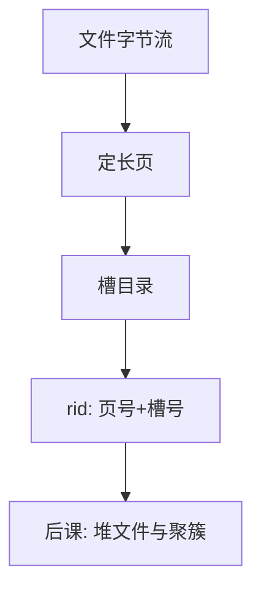

# 页与槽

磁盘按页搬；页内用槽目录指向变长记录，元组身份才能与物理偏移分开。

<footer>—— 据 Gray and Reuter, Transaction Processing；Ramakrishnan and Gehrke 对页组织的整理</footer>

[上一课](/cs/covering-index)把外模式收到视图。本课不重讲物化维护。缺口是：关系最终要落在[文件字节流](/cs/file-bytestream)上，而缓冲池按页换入换出。没有页内布局，就没有稳定的记录地址，索引只能指向「现在碰巧的偏移」。

## 问题

操作系统的文件是字节序列；数据库需要定长页（常 4KiB 或 8KiB），与[缓冲与脏页](/cs/buffer-dirty)对齐。页里若把记录紧密拼接，变长更新会移动后续字节，所有指针作废。缺口不是「再讲一遍文件」，而是**页头 + 槽目录 + 记录空间**：槽存偏移，记录可在页内滑动，对外只暴露页号与槽号。

本课不引入 B+ 树内部节点格式，那是索引课。这里只钉堆文件与索引页共用的槽化页。

记录标识 rid = (页号, 槽号)。槽号稳定，记录在页内搬家只改槽里的偏移。这是后课索引与堆文件的共同地址。

## 方法

页头记下空闲空间、槽个数、校验或 LSN（后课 WAL 才用）。槽目录从页尾向页头长，记录从页头向页尾长，中间是自由空间。删除把槽标空，或置删除位；空间可经整理收回。变长字段用偏移数组；超长字段溢出到溢出页，本课只承认有溢出，不把 TOAST 写完。

## 机制

槽化使更新局部：加长记录若本页放不下，才迁移到新页并在原槽留转发，索引不必立刻全改（转发有代价）。定长记录可以取消槽，用算术算偏移；变长与空值一多，槽更合算。校验和与页 LSN 把「这一页的版本」钉死，崩溃后[ARIES](/cs/aries-recovery)才知道页旧不旧。

本课不处理列存页、压缩页的全部变体；列存把属性切开，槽的含义变成列块，主干仍以行页为默认图像。

## 边界

本课不讲磁盘调度、RAID。页大小是工程常数，与文件系统块可以不同，库自己做缓冲。也不把「一行一页」当默认——那是极端宽行或溢出。

行锁若以 rid 为粒度，槽重用必须与事务可见性对齐，否则会锁错对象——那是后课并发的交界，本课只把 rid 交出去。后课默认：元组有 rid；堆与索引都通过页与槽找记录，而不是通过文件的字节下标。

页是缓冲池与日志共同的粒度。后课 WAL 的 pageLSN 打在页头上，槽目录是页内的寻址，两者一起才构成可恢复的记录。

## 小结

- 视图已在逻辑层；本课把记录放进槽化页，交出 rid。
- 槽把身份与页内偏移分开，供索引与堆共用。
- 记录如何排成堆、何时按键聚簇，是后课缺口。
- 出处：Gray and Reuter；Ramakrishnan and Gehrke；Garcia-Molina, Ullman and Widom。
