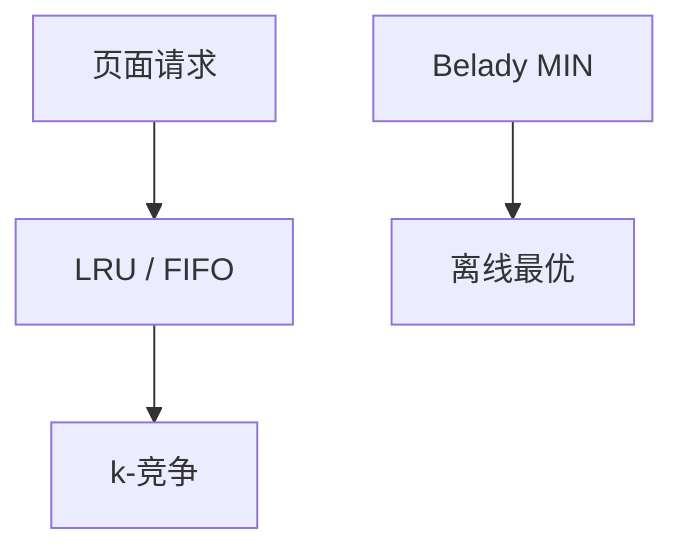

# 页面置换的竞争分析

$k$ 槽缓存，缺页代价 1；FIFO/LRU 对确定性对手 $k$-竞争，最优离线是 Belady 最远未来。

<footer>—— 据 Sleator and Tarjan, 1985；Belady, A Study of Replacement Algorithms, 1966；CLRS 第 15 章对照整理</footer>

上一课[在线算法与竞争比](/cs/competitive-ratio)给了 $\rho$。操作系统缓存：页面置换。缺口是 LRU/FIFO 的 $k$-竞争，以及确定性下界 $k$。不重写竞争比定义。后课租买是更简单的 2-竞争原型。不写具体内核 LRU 实现。

## 问题

请求序列 $p_1,p_2,\ldots$，槽 $k$。缺页则换出。离线 MIN：换出最远才再用的（Belady）。LRU：换出最久未用。Sleator–Tarjan：LRU 是 $k$-竞争；任何确定性算法 $\ge k$。随机标记算法对 oblivious 约 $H_k$-竞争。

缺口是缓存，不是列表更新（虽同一篇论文）。

### 不是工作集调参

竞争比不依赖输入分布。工作集是实践启发式。不要把调参数当 $\rho$ 证明。

Belady 1966 离线最优。Sleator–Tarjan 在线。后课 ski-rental 更干净的 2-竞争。

## 方法

势：在线缓存与 OPT 缓存的差集大小一类。缺页时势变证明摊还 $\le k\cdot$ OPT 缺页。下界：交错 $k+1$ 页。

写回代价可折进模型，本课单位缺页。

## 机制

OPT 每缺一次可以「覆盖」在线 $k$ 次缺的势债。对手总请求不在在线槽内的那页。与 $k$-server 在度量空间是推广。与 OS 课 LRU 近似硬件：本课纯竞争。

## 边界

本课不写 ARC 等自适应。不写多层缓存。后课默认：分页 LRU $k$-竞争。下一课租买问题。

## 小结

- LRU/FIFO 确定性 $k$-竞争，下界 $k$。
- 离线 Belady 最远未来。
- 随机对 oblivious 可到 $H_k$。
- 出处：Sleator and Tarjan, 1985；Belady, 1966。
