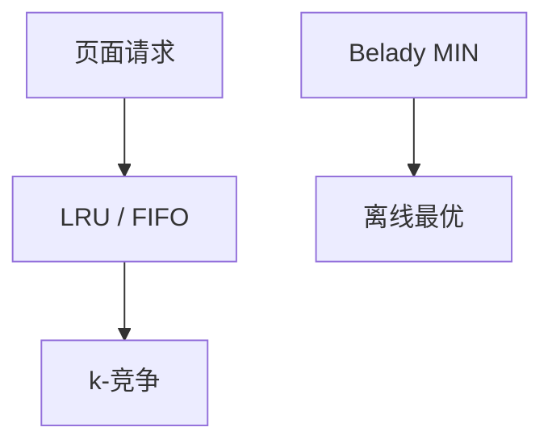

# 页面置换的竞争分析

$k$ 槽缓存，缺页代价 1；FIFO/LRU 对确定性对手 $k$-竞争，最优离线是 Belady 最远未来。

<footer>—— 据 Sleator and Tarjan, 1985；Belady, A Study of Replacement Algorithms, 1966；CLRS 第 15 章对照整理</footer>

上一课[在线算法与竞争比](/cs/competitive-ratio)定义了 $\rho$。本课把它用在操作系统的页面置换上：缺口是 LRU/FIFO 的 $k$-竞争证明，以及确定性算法的下界 $k$。竞争比定义不重写，具体内核的 LRU 近似实现也不写。后课租买是更干净的 2-竞争原型。

## 问题

模型：请求序列 $p_1,p_2,\ldots$ 进 $k$ 个槽的缓存，请求页不在槽内即缺页，代价 $1$，须换出一页。离线最优是 Belady 的 MIN：换出未来最远才再用的页。在线侧，LRU 换出最久未用的页。Sleator–Tarjan 的结论：LRU 与 FIFO 都是 $k$-竞争，而任何确定性算法竞争比不低于 $k$——下界恰好被 LRU 达到。随机化能突破确定性下界：标记算法对 oblivious 对手约 $H_k$-竞争，$H_k$ 是调和数，量级 $\ln k$。

缺口是缓存这一问题的竞争分析；列表更新出自同一篇论文，本课不碰。

### 不是工作集调参

竞争比是对最坏输入的逐请求保证，不依赖输入分布。这与统计调参不同一层次：工作集模型是实践启发式，参数调得好只说明平均表现好，不是 $\rho$ 的证明，不要把调参当证明。

Belady 1966 离线最优。Sleator–Tarjan 1985 给出在线的 $k$-竞争与下界。后课 ski-rental 是更干净的 2-竞争。

## 方法

上界用势函数：取在线缓存与 OPT 缓存的对称差大小为势。OPT 每缺一次页，势至多增加 $k$（换入一页、差集成员至多被换出 $k$ 个），而在线每缺一次页势减一；配平即得在线缺页数 $\le k\cdot$ OPT 缺页数。下界用对手构造：让对手交错请求 $k+1$ 页，确定性算法的缓存里永远缺着下一步要请求的那页，OPT 按最远未来策略只偶尔缺。

```mermaid
flowchart TD
  REQ["页面请求"] --> LRU["LRU / FIFO"]
  LRU --> K["k-竞争"]
  OFF["Belady MIN"] --> OPT["离线最优"]
```

写回磁盘的代价可以折进模型，本课按单位缺页计。

## 机制

$k$ 这个比来自槽位数本身：OPT 每缺一次可以承担在线 $k$ 次缺页的势债，最优常数因此压不过 $k$；对手的策略就是总去请求在线缓存里没有的那页。同一问题是 $k$-server 在均匀度量空间上的特例。OS 课讲的时钟算法等是 LRU 的硬件便宜近似；本课谈的是竞争意义下的 LRU 本身。

## 边界

本课不写 ARC 等自适应策略，也不写多层缓存。后课默认：分页语境下 LRU 是 $k$-竞争，确定性下界即 $k$。下一课租买问题。

## 小结

- LRU/FIFO 确定性 $k$-竞争，确定性下界恰为 $k$。
- 离线最优是 Belady 的最远未来策略。
- 随机化对 oblivious 对手可压到 $H_k$。
- 出处：Sleator and Tarjan, 1985；Belady, 1966。
