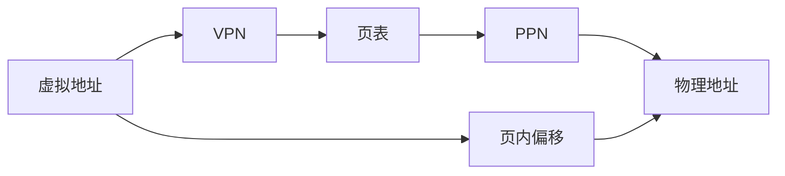

# 虚拟内存分页

给每个进程一套连续的虚拟地址，用页表把它映到不一定连续、也不一定都在 DRAM 里的物理页。

<footer>—— 据 Patterson and Hennessy, Computer Organization and Design (RISC-V)；Hennessy and Patterson, CA:AQA 整理</footer>

[上一课](/cs/inclusive-exclusive-cache)把 cache 缺失分成三类。Cache 仍用物理或虚拟地址去索引 SRAM，地址空间大小等于程序员看见的 DRAM 窗口时，保护与隔离还没有对象。[特权级](/cs/privilege-rings)已经禁止用户直接碰机器状态，但还没有把「用户的指针」和「DRAM 的行」分开。[局部性原理](/cs/locality-principle)在页这一级同样适用。本课不重讲 cache 标签。缺口是：程序要用的地址空间可以大于物理内存，且各进程必须看不见别人的物理页。本课只钉页、页表与缺页。

## 问题

若程序直接发出物理地址，链接时就要固定装入位置，进程之间也无法用同一套指针约定。DRAM 不够时，只能整程序换入换出。缺口不是再做一块更大的 cache，而是**固定大小的页：虚拟页号经页表变成物理页号，页内偏移原样通过**。

缺页：页表项无效或页不在 DRAM，陷入内核，从磁盘取页——粒度是页，不是 cache 行。本课不把磁盘调度写进来。

页是保护与换入的单位；cache 行是延迟隐藏的单位。两者都吃局部性，但缺失代价差几个数量级。

## 方法

虚拟地址切成 VPN 与页内偏移。页表是 VPN 到 PPN 的数组，附带有效、可写、用户可访问等位。[特权级](/cs/privilege-rings)下，用户访问若越权，精确异常路径已经准备好。命中则物理地址 = PPN 拼接偏移，再进 cache 与[SRAM 与 DRAM 阵列](/cs/memory-array-sram-dram)。

每个进程一份页表（或根指针不同）。内核在特权态改页表；用户只看见虚拟地址。后课 TLB 才会说查页表本身也是访存。

## 机制

分页让装入地址无关：编译用虚拟 0，内核随便找空物理页。换页让工作集留在 DRAM，其余在磁盘——Denning 工作集在这里成为容量问题的页版。Cache 仍处理字与行；本课不把页表项缓存在数据 cache 里讲完。

写权限位让[写回与写分配](/cs/write-back-allocate)那一套脏数据在页级也有对应：页脏则换出时要写磁盘。本课只承认这一位存在。

## 边界

本课用单级页表，不管 64 位空间下表有多大——那是[多级页表](/cs/multi-level-page-table)。也不引入 TLB。Cache 用物理标签还是虚拟索引，是实现选择，本课只要求最终比较发生在翻译之后或与翻译一致。

后课默认：load/store 发出虚拟地址；不在页表或权限失败则缺页异常。翻译延迟必须被下一课藏住。

## 小结

- 虚拟页号经页表变物理页号；偏移不译。
- 缺页是页级容量/强制问题，代价远高于 cache 缺失。
- TLB 与多级页表是后课的缺口。
- 出处：Patterson and Hennessy, *COD* RISC-V；Hennessy and Patterson, *CA:AQA* 虚拟内存。
