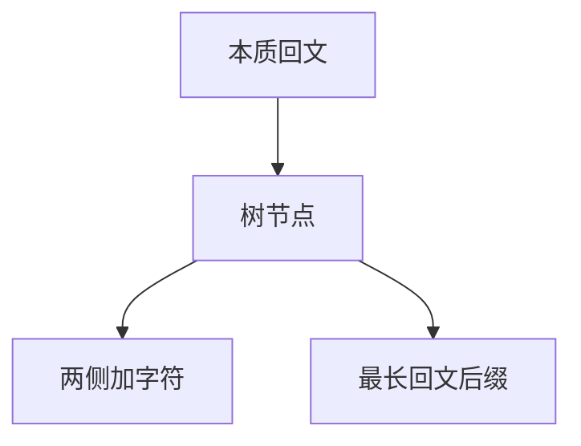

# 回文自动机

每个本质不同回文一个节点；失配跳到当前回文的最长真回文后缀，加字符只在两端对称时生长。

<footer>—— 据 Rubinchik and Shur, EERTREE: An Efficient Data Structure for Processing Palindromes in Strings, 2018（Eur. J. Comb. / 会议前置版本）；Manacher 线性回文半径整理</footer>

[上一课](/cs/suffix-automaton) 的状态按结束集合走，不专门压缩回文。[KMP](/cs/kmp) 的 $\pi$ 也不是回文。Manacher 给出每个中心的最长半径，但不索引「本质不同回文」。本课不克隆 SAM。缺口是回文树（eertree / palindromic automaton）：本质不同回文 $O(n)$ 个。

## 问题

串的本质不同回文个数 $\le n+1$（奇偶各一棵树的经典界）。节点 = 一个回文串；转移 $c$ 表示两侧加 $c$。fail 指向最长真回文后缀。在线加字符：从 last 沿 fail 找到能加该字符的回文，没有则新建。缺口是**把回文集合做成自动机**，从而计数、最长回文、回文分割 DP 的转移可沿节点走。

Manacher 1975 线性最长回文。eertree 由 Rubinchik–Shur 系统化（会议 CPM 等，期刊 2018 左右）。本课不发明 arXiv 号。

## 方法

两棵根：偶空与奇「虚」。维护 last。加字符与 SAM 同风格但谓词是回文可扩展。每个节点 `len`。出现次数可挂 fail 树求和。

与 Manacher：Manacher 要每个中心的最长；eertree 要集合与转移。两者都线性，问题不同。与 SAM：回文约束更强，节点更少类。

## 机制

新建节点时 fail 必须存在且唯一最长。实现注意奇偶长度。不要用中心枚举 $+ $ 哈希当本课的结构定义——那是后课哈希的应用。

字符串索引课序接下来从确定性自动机转到期望相等：滚动哈希。

## 边界

本课不把回文树与 SAM 联合结构写完。二维回文不是一维自动机。哈希冲突合同与本课无关。

后课默认：本质回文用 eertree 或 Manacher。要期望比较子串，用字符串哈希。

## 小结

- 回文自动机：本质回文 $O(n)$ 节点 + fail。
- 在线加字符沿 fail 扩展。
- 下一课滚动哈希，不保证零错误。
- 出处：Manacher；Rubinchik and Shur, eertree。
