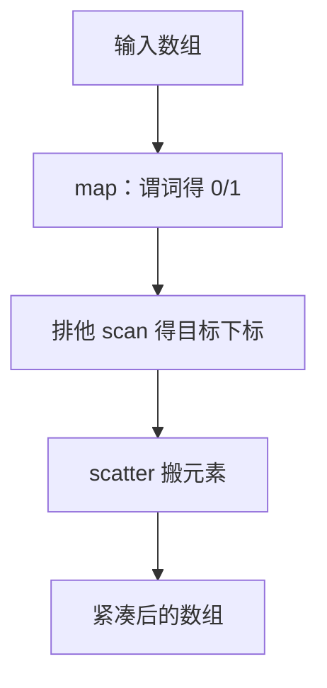
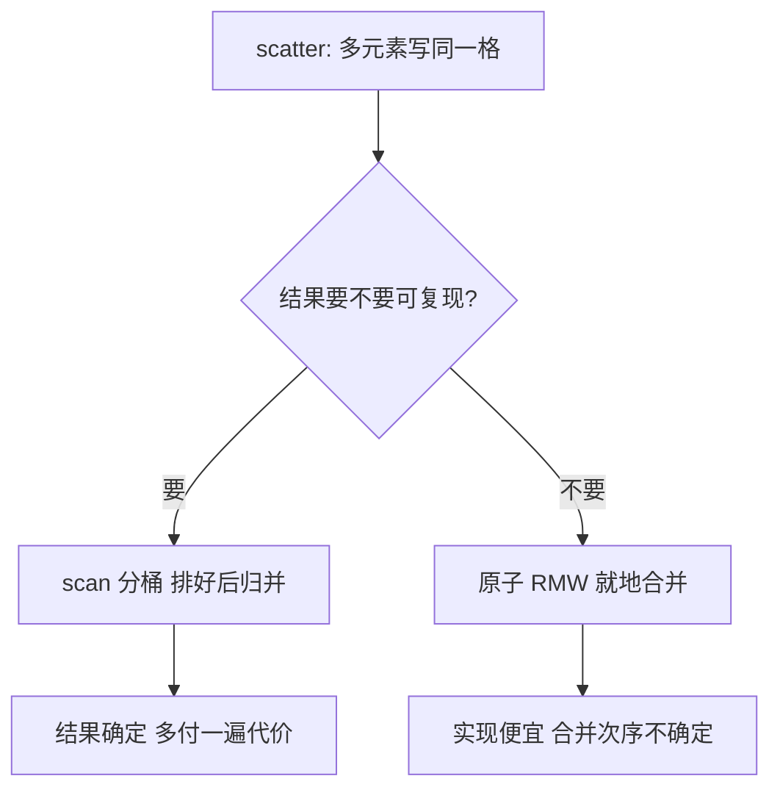

# 数据并行的模式

数据并行把「这些元素互不干扰」写进数据的形状：形状对了，锁就没有存在的理由。

<footer>—— 据 Blelloch, Vector Models for Data-Parallel Computing, 1990；Iverson, Notation as a Tool of Thought, CACM 1979 整理</footer>

[上一课](/cs/par-openmp-mpi)给了两套编程直觉，但没回答「什么时候并行是安全的」。缺口是模式：如果独立性被写进数据的形状——每个元素一份独立计算——那么锁、栅栏、调度都从程序文本里消失。数据并行不是某个 API 的别名，而是比 API 更稳的一层抽象：同一份模式组合，可以从线程循环一路换到 [GPU SIMT 与 warp](/cs/gpu-simt) 的上万线程，上层代码不动。

## 问题

基本模式四个。map 对每个元素施加同一个纯操作；reduce 用结合运算把集合折成一个值；scan 算前缀——[PRAM 与前缀和](/cs/pram-prefix-sum)的主角，紧凑、过滤、分配下标的公共子程序；gather/scatter 按下标集合搬运。各自的坑：reduce 改变结合次序，浮点和与串行不同；scan 需要的只是结合律，运算不可交换也行；scatter 有写冲突——两个元素落进同一格，硬件不会替你合并，结果取决于谁后写。错法：把带跨迭代依赖的循环（`a[i]=f(a[i-1])`）当 map 打并行——依赖在迭代之间，形状根本不成立，开再多线程也是串行链。

数字实例：scan（前缀和）输出的是「从头到我这的累加值」：输入 $[1,2,3,4]$、运算取加法，输出 $[1,3,6,10]$。过滤正是用它算新下标——每个幸存元素一查表就知道自己该搬去第几格，不用任何锁或临界区。

常见误区：把 `a[i]=f(a[i-1])` 这样的循环当 map 打并行。第 $i$ 次迭代要等第 $i-1$ 次的结果，是一条串行依赖链，开一万个线程也只会排队。判断标准不是「循环体短不短」，而是「元素 $i$ 需不需要元素 $i-1$ 的结果」。

## 方法

方法是「先形状，后实现」：把内核拆成模式组合，再挑运行时。例：按谓词过滤 = map 出 0/1 标志 + 排他 scan 算新下标 + scatter 搬元素——三步全是已知模式，work/span 立刻可写，实现从 OpenMP 循环到 GPU 内核都能承接。融合（fusion）把相邻 map 串成一遍过，省掉中间数组的整轮读写：$k$ 个模式各一遍内存，融成一遍，算术强度从 $O(1)$ 提到 $O(k)$——这一步是后面 roofline 课的伏笔。形状的规则性还决定实现选择：规则的 map/scan 吃得到 SIMD 与 SIMT；不规则的 scatter 在向量机上退化成逐元素访存，红利消失。

## 机制

模式可组合的机制在账本上：map 的 $W=n,S=1$、scan 的 $W=O(n),S=O(\log n)$ 已知，串接的组合界直接相加，运行时不需要理解应用语义——这正是[任务并行](/cs/par-task-parallel)一课的工作窃取也能免费承接静态形状的原因。无锁的机制在内存模型上：元素之间不共享写，程序天然 DRF——[语言内存模型与 data race](/cs/language-memory-model) 的结论是 DRF 程序可以按顺序一致交错理解，弱一致硬件不再需要你操心。scatter 的冲突是语义选择而非实现细节：原子 RMW 拿到正确但不确定的次序，scan 分桶拿到确定但多一遍的代价——先问结果要不要可复现，再选机制。词法分析、括号匹配这类「看似天生串行」的问题，也靠 scan 变成模式组合，而不是靠手写锁。

同一形状红利在数据库里也兑现一次：[向量化执行](/cs/vectorized-execution)把算子从一行一次改成一批一次——与 GPU 把一次一元素改成 warp 一批，是同一个模式直觉。

方法一节那张图画的是「过滤流水线怎么拼」；scatter 的写冲突具体有哪两条出路、各自代价是什么，是另一个问题。

## 边界

本课不写任务并行——不规则、运行时才现身的并行是下一课的主题；也不写分布式洗牌版的 MapReduce：那是无共享机器之间的另一套账，上一课的 MPI 直觉已够定位它。scan 的推导不再重复，只当已知原语调用。模式清单也不求完备：zip、split、join 都是同一思想的变体，遇到再认。

## 小结

- map/reduce/scan/gather-scatter 是数据并行的基本模式，独立性写在形状里。
- reduce 次序变结果变；scan 只要结合律；scatter 的写冲突要语义决策。
- 融合把强度从 $O(1)$ 提到 $O(k)$；规则形状才吃得到 SIMD 与 SIMT。
- 模式先行、实现后选：同一组合可跨线程、向量、GPU 承接。
- 出处：Blelloch, 1990；Iverson, CACM 1979。

术语翻译：DRF（data-race-free，无数据竞争）指任何两个同时发生的访存至少有一个是读——不存在两个线程同一时刻写同一格。这类程序可以按「简单顺序执行」理解，在弱内存序硬件上也不会出意外，这正是「形状写对了、锁就不需要了」的底气所在。
