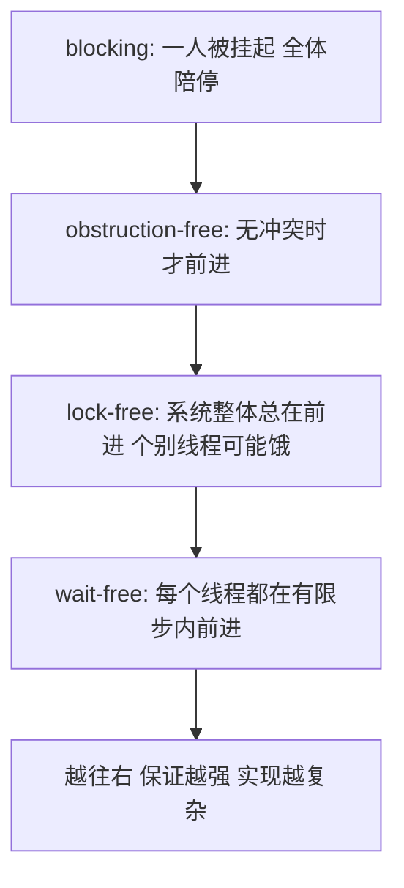
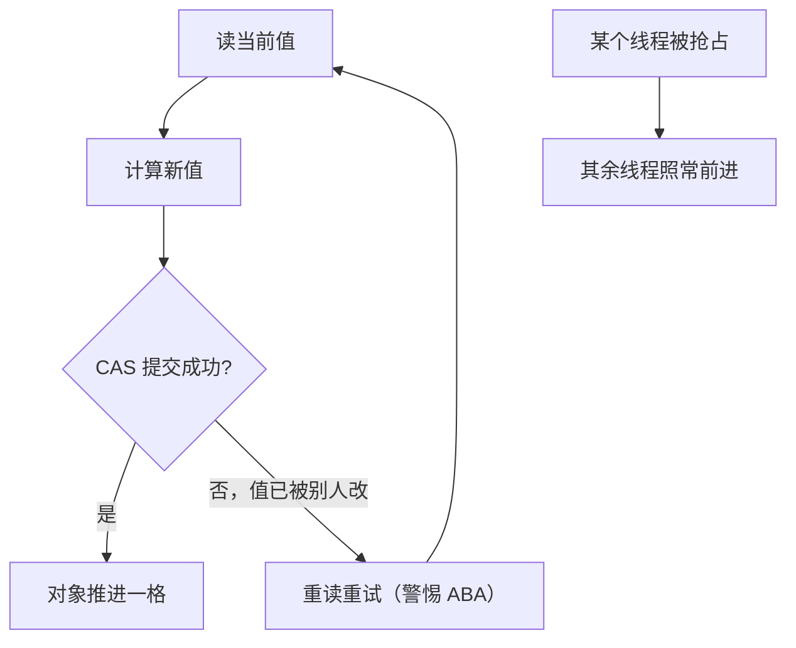

# lock-free 并行

锁把进度押在持有者身上；无锁把进度写进对象的规格：无论谁被挂起，系统整体总在前进。

<footer>—— 据 Herlihy and Shavit, The Art of Multiprocessor Programming；Herlihy, Wait-Free Synchronization, ACM TOCS 1991 整理</footer>

[上一课](/cs/par-task-parallel)把不规则并行交给工作窃取，前提是任务之间几乎不共享可变状态。缺口就在共享数据结构本身：计数器、队列、哈希表被多核同时读写时怎么办。锁是一条路——[自旋锁](/cs/spinlock)与 [MCS 锁](/cs/mcs-lock)已给过排队与乒乓的账——但锁的病根是进度依赖持有者：持有者被抢占、被换出甚至崩溃，临界区外的所有人陪停。无锁结构把进度条件写进对象规格。本课写它的谱系、做法与代价。

## 问题

进度条件是一条谱系：blocking（一个线程的意外能拦住全体）→ obstruction-free（无冲突时前进）→ lock-free（整体总有人在前进，个别线程可能饿）→ wait-free（每个线程都在有限步内前进）。每升一级，实现的复杂度与常数都显著上升。错法一：把「无锁」当「更快」——CAS 重试循环在争用下烧的是同一根缓存行的带宽，[MCS 锁](/cs/mcs-lock)那种排队锁在高争用下反而更稳。错法二：手写 CAS 循环却省掉内存序——弱一致机器上重排会把「先检查后提交」的不变量打穿，[acquire / release](/cs/acquire-release) 的语义正是为这一步存在的。

「无锁≠更快」可以类比买饭：CAS 循环像一窝蜂挤在窗口抢最后一份，抢不到的从头再来，人越多浪费越多；排队锁像取号叫号，看着笨，高峰期反而人人有确定进展。争用越凶，这两种的差距越明显。

## 方法

主力是 CAS 循环：读当前值、算新值、CAS 提交，失败重读重试；[原子读改写](/cs/atomic-rmw)给过 CAS/TAS/fetch_add 三类形态。实例用 Treiber 栈：入栈就是一次头指针 CAS，一行核心。两个必须正面处理的坑：ABA——CAS 只认值不认历史，指针绕一圈回来照样通过，对策是打标签、延迟回收或 [无锁栈与 hazard pointer](/cs/hazard-pointer)；内存回收——不能在他人还握着指针时释放，回收策略与正确性绑定（[无锁与 ABA](/cs/lockfree-aba)有总览）。正确性判据用线性化：每个并发操作等价于在它的调用与返回之间的某个瞬时原子生效的串行操作——没有这个判据，「对」与「快」都无从谈起。

ABA 的直觉版：你下楼前看见车位上停着一辆红色轿车，回来看到还停着红色轿车，就断定没人动过——其实别人开走又停回了一辆同款。CAS 只比对「现在像不像」，不比对「中间变过没有」，所以要版本号打标签或延迟回收来补上历史感。

## 机制

进度谱系的结构由共识数给出：一个对象能无等待地解几路共识，决定它在 Herlihy 层次里的位置——读-写寄存器的共识数有限，CAS 与 LL/SC 是 $\infty$，所以后者能「通用构造」任意对象，前者连无等待的先进先出队列都造不出。性能机制的另一面在缓存：一次 CAS 是对缓存行的读改写，x86 的 lock 前缀锁的是缓存行而非总线，争用的物理形态就是[伪共享](/cs/false-sharing)式的行乒乓。安全发布靠 release 写配 acquire 读：发布者先把数据就位再翻标志，读者看到标志即看到数据，顺序由[语言内存模型](/cs/language-memory-model)保证而不是运气。

共识数不是理论装饰：读-写寄存器的共识数是 $2$，因此不存在无等待的先进先出队列；CAS 的共识数是 $\infty$，才有一切对象的通用构造——Herlihy, TOCS 1991。

## 边界

本课不重写锁的排队机制（spinlock、mcs-lock 已给）；RCU 与 epoch 回收点名不展开；事务内存是另一条把组合性问题交给硬件的路（见[事务内存](/cs/transactional-memory)），不在此并线。分布式共识与它词汇相同、模型不同：那里没有共享内存，只有消息，不在本课。也不要把无锁读成性能定理——它是进度规格；换性能要在屋顶图上重新记账。

## 小结

- 进度谱系：blocking → obstruction-free → lock-free → wait-free，代价逐级上升。
- CAS 循环是主力；ABA 与内存回收是必须正面处理的两个坑。
- 正确性用线性化陈述；数据发布用 acquire/release，不靠运气。
- 无锁换来的是抗抢占的进度，不自动是性能；高争用下排队锁可能更稳。
- 出处：Herlihy, ACM TOCS 1991；Herlihy and Shavit, The Art of Multiprocessor Programming。

术语翻译「线性化」：它不是要求代码真的一步不差地串行跑，而是要求每个并发操作的效果，等价于在「你调用」和「你拿到返回」之间的某个瞬间一步完成。有了这个判据，调用者可以放心把并发对象当串行对象推理——这是无锁结构敢叫「对」的依据。
