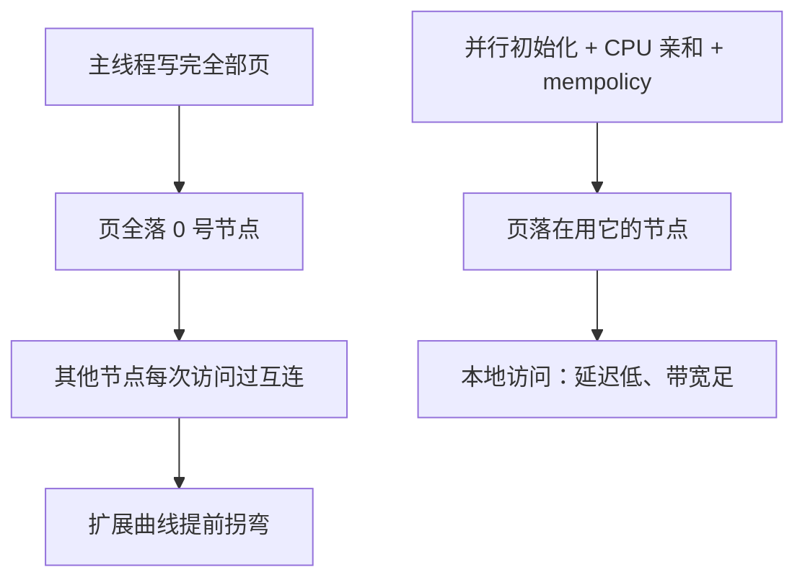

# NUMA

同一物理地址，不等于同一访问代价：内存控制器长在插槽里，跨过互连的每一次访存都在还路费。

<footer>—— 据 Drepper, What Every Programmer Should Know About Memory, 2007；Lameter, NUMA: An Overview, ACM Queue 2013 整理</footer>

[上一课](/cs/par-simd-vectorization)把单核内的并行吃满；核再多、插槽再多，下一个成本跳变不在指令里，而在「这段内存在哪」。[互连与 NUMA](/cs/interconnect-numa)已给过体系结构账：地址全局共享，本地与远程延迟分档；[NUMA 内存策略](/cs/numa-mempolicy)与 [NUMA 调度](/cs/numa-sched)给过 OS 侧的旋钮。缺口在程序侧的模式：什么时候「一次访存一个价」的假设会拖垮并行程序，怎么把数据放到用它的核旁边。

## 问题

NUMA 打破的是从 PRAM 一路残留下来的「访存均匀」假设：跨插槽的远程访问延迟更高、带宽更低，还要挤占互连。错法一：主线程一口气初始化大数组——物理页全部落在 0 号节点，之后其他节点的线程每次访问都过互连；扩展曲线常常在第二个插槽就断。错法二：线程在节点间漂移——缓存与内存的亲和全丢；[CPU 亲和](/cs/cpu-affinity)在 NUMA 上不是洁癖，是正确性前提。错法三：只盯延迟不看带宽——远程带宽通常比远程延迟先成为瓶颈，因为一致性流量与别人的正常流量挤同一条互连。

数字实例：本地访存若约 80 ns，远程常要 110–140 ns，带宽还可能只剩一半甚至更少——相当于从隔壁工位拿文件变成跨城快递，而且跨城的路只有一条，大家共享。扩展曲线在第二个插槽拐弯，多半就是这笔账在起作用。

## 方法

方法三步：分区、放置、验证。分区：把数据按「谁用谁拥有」切开，每个节点处理自己的份额——数据并行的分区思想从循环内挪到插槽之间；只读数据可以每节点复制一份，用空间换互连流量，代价是更新要传播。放置：first-touch 规则决定页落点——谁先写，页归谁的节点——所以并行初始化是常规动作：让将要用这页的线程碰第一下；线程用亲和钉在节点上，与内存策略（绑定、交错、首选）对齐。验证：本地与远程的延迟、带宽分开量——Drepper 的测量表里远程通常多付三到七成——再看强扩展曲线在几个插槽处拐弯。

## 机制

机制账在互连上：远程访问占用的不只是自己那一份带宽——目录查询、远端缓存的一致性回写、别的插槽的正常流量都走同一条路；[伪共享](/cs/false-sharing)的行乒乓在 NUMA 上从跨核升级成跨插槽，代价翻几倍。自动 NUMA balancing 的机制是缺页采样：内核故意让错节的访问出缺页，把页迁向实际使用方——它治已病不治未病，搬页本身有抖动，负载一变又重来；设计期放对页，永远比运行期搬家便宜。同插槽内也并非严格均匀：mesh 拓扑下核到内存控制器的跳数不同，UMA 是近似的近似，不要在账本里当成精确事实。

first-touch 陷阱的标准修法：把主线程的初始化循环改成并行版（如 `#pragma omp parallel for`），让每个页被将要用它的节点碰到；事后 `migrate_pages` 也能搬，但那是补救，不是设计。

## 边界

目录一致性协议已在[互连与 NUMA](/cs/interconnect-numa) 给过，不重讲；CXL 与分层内存、GPU 的 HBM 分区不写。内存策略 API 的逐一罗列归 numa-mempolicy，本课只取模式。远程访问的常数也因平台而异：比值随代际与拓扑变，账要自己量，不要引用别家机器的数字。

## 小结

- NUMA 打掉「一次访存一个价」：本地与远程的延迟、带宽分档。
- 分区、放置、验证：数据按使用方切，first-touch 落页，亲和钉线程。
- 远程带宽常先于延迟成为瓶颈；伪共享跨插槽代价翻倍。
- 自动 balancing 治已病；设计期的并行初始化才是正解。
- 出处：Drepper, What Every Programmer Should Know About Memory, 2007；Lameter, ACM Queue 2013。
