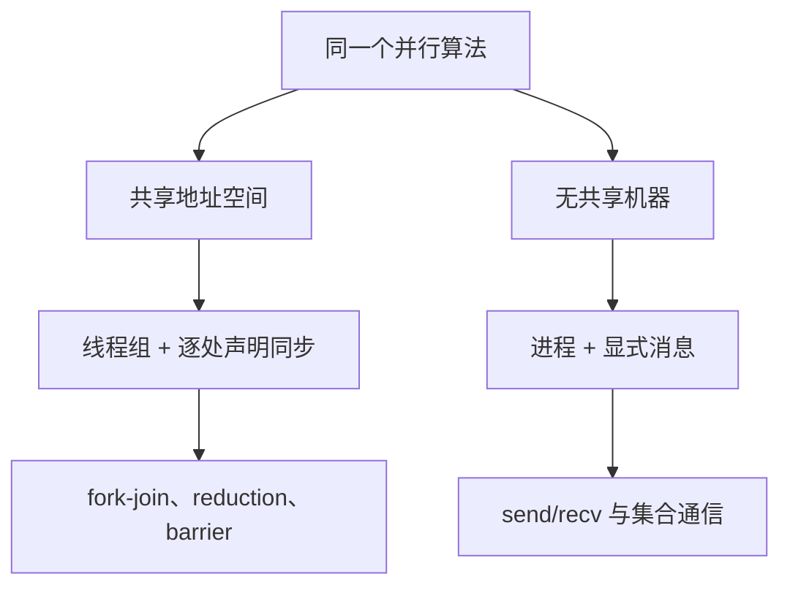

# OpenMP 与 MPI 的直觉

OpenMP 把并行写成给编译器的标注，MPI 把并行写成进程之间的消息；选哪套不是口味，是「内存共享到哪一层」的决定。

<footer>—— 据 MPI Forum, MPI: A Message-Passing Interface Standard, 1994；OpenMP Architecture Review Board 规范整理</footer>

[上一课](/cs/par-pram-to-practice)把 PRAM 的四条假设逐项翻成真实成本：$P$ 有限、访存分层、同步收费。缺口是落点：真要写并行程序，共享内存这条线怎么写、无共享那条线怎么写。OpenMP 与 MPI 分别是两套直觉的主流化身：前者把线程组藏进编译器标注，后者把世界切成靠消息说话的进程。底层机制已有课垫底——[线程与共享地址空间](/cs/thread-shared-addr)给过共享侧，[fork](/cs/fork) 给过进程侧——本课站在它们之上谈编程模型，不重讲切换与页表。

## 问题

共享内存模型的全部成本都压在「哪些访问会撞」上。OpenMP 的 `parallel for` 把循环切块分给线程组，写的人必须自己声明撞在哪里：reduction 声明「各攒各的、出口合并」，barrier 声明「在此对齐」，critical 圈住残余的共享写。漏声明不是报错，而是 data race——[语言内存模型与 data race](/cs/language-memory-model) 的 UB 结论直接适用。MPI 一侧没有撞的机会，因为根本没有共享：每个 rank 对自己的地址空间负责，一切交换显式写进 send/recv；代价是「把字节搬过网络」从此成为你代码的一部分。错法：把 `MPI_Send` 当普通函数调用——它的返回只表示本地缓冲完成，不等对端收到。

## 方法

两套直觉各记一句。OpenMP：「共享在，同步要逐处声明」——调度子句 static/dynamic/guided 控制怎么切块，块大小就是负载均衡与局部性的折中。MPI：「边界画死，移动算钱」——先想清楚数据属于谁，再想谁要找谁；broadcast、reduce、allreduce 把常见通信拓扑一次说清。选型随之而定：问题能切成大方块、通信比小，MPI 顺；细粒度共享、负载不规则，OpenMP 与线程顺；大机器两者混用——rank 之间 MPI，rank 之内 OpenMP。

## 机制

两套各有一笔机制账。OpenMP 的线程组是 fork-join：进入并行区派生、出口汇合；reduction 的合并在出口做，加法次序不定——浮点结果与串行版本逐位不同，这是并行的正常代价，不是 bug。MPI 的消息靠信封匹配（通信子、源、tag）；大消息走 rendezvous，对端没有张贴接收就把发送方拖住，「发了」与「被收」之间隔着一个运行时。集合通信在进程树上折叠：allreduce 的通信量随 $P$ 按树深对数增长，不是 $P$ 倍带宽——大模型张量并行每层要付的 allreduce 账，用的正是这一条直觉（见[张量并行](/llm/tensor-parallel)），同一本账换了个领域记账。

`#pragma omp parallel for reduction(+:s)` 的出口合并次序不确定：同一程序两次运行可以逐位不同。要可复现，得固定切块并自己写树形归约，而不是指望编译器替你保证。

## 边界

本课不写 GPU 直通与 CUDA-aware MPI；不写无锁与 CAS（后面 lock-free 课）；扩展性的实验语言——强扩展、弱扩展——已有 [Gustafson 定律](/cs/gustafson-law)与强扩展弱扩展两课承担，这里不立基准。OpenMP 的任务与依赖子句归下一课的「任务并行」视角，本课停在循环级。两套系统的实现细节——线程池、缓冲管理、拓扑感知的 rank 放置——也不展开：本课只立直觉与记账方式。

## 小结

- OpenMP 把并行写成编译器标注：共享在，同步逐处声明，出口合并。
- MPI 把并行写成显式消息：数据归属与通信都在代码里，字节移动算钱。
- 浮点 reduction 次序不定是代价不是 bug；可复现要自己固定归约树。
- 选型看通信比与粒度；大机器常用 MPI 之间、OpenMP 之内的混用。
- 出处：MPI Forum 标准，1994；OpenMP ARB 规范；Herlihy and Shavit, The Art of Multiprocessor Programming 第 1 章的共享与分布式对照。
