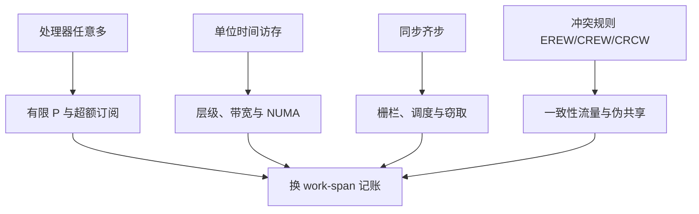
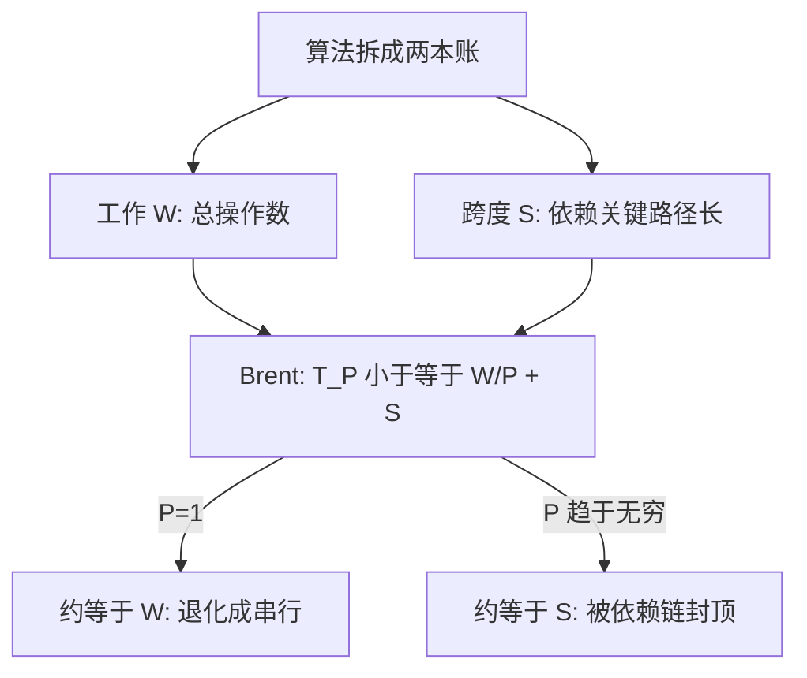

# 从 PRAM 到实践

模型故意把机器说得过分简单：P 台处理器、一块单位时间访存的共享内存、同步齐步走。简化不是天真，而是把「什么能并行」从器件细节里剥出来，单独回答。

<footer>—— 据 Karp and Ramachandran, Parallel Algorithms for Shared-Memory Machines, 1990；JáJá, An Introduction to Parallel Algorithms, 1992 整理</footer>

[上一课](/cs/gpu-case-map)给 GPU 编程收束：roofline 定目标、层次账、warp 账、指令账、profile 验收五步决策链，在归约、转置、GEMM 三个案例上各走一遍；课程末尾把「并行结构抽象回算法模型」的题目正式交棒。硬件把「能同时动」摆到了你面前，但「这个问题本身能不能并行、能并行到什么程度」是更早也更高一层的问题——它属于模型，不属于器件。本课是「并行计算模型」的第一课。算法课里的[PRAM 与前缀和](/cs/pram-prefix-sum)与[Work-span 与 fork-join](/cs/work-span-model)已经立起扫描原语与成本记账，本课不再推导，而是把 PRAM 的每条理想化假设逐项对着真实机器翻账，看它破在哪里、破掉之后该换哪本账。后面的课默认你已经读完本课，并带上这个读法：先在模型侧记账，再看机器在哪里背叛模型。

## 问题

PRAM 用四条假设换来干净的语言：处理器数任意多；任何处理器任何一拍都能访问共享内存的任何字，单位时间；所有处理器同步齐步；同拍访存冲突按 EREW/CREW/CRCW 规则裁决。在这套语言里，前缀和 $O(n)$ 工作、$O(\log n)$ 跨度，与任何具体芯片无关。

缺口从第一拍就存在：真实机器处理器数有限、访存分层且带宽有限、同步一次要花几十到上千个周期、内存模型还是弱一致的。拿着 PRAM 的界直接预测机器时间，误差常见一到几个数量级。不翻账会错在哪：你以为把循环切成一千份就有一千倍，在两插槽机器上试完，得出「并行无用」的错误结论。

「并行无用」的错账常见成因：把扩展不到理想倍数全记成「机器不行」。实际三本账要分开查——串行部分有没有封顶（Amdahl）、$P$ 够不够（超额订阅）、访存卡在哪一层。不翻账就下结论，和拿小学算术预言潮汐是一个错误。

### 假设逐条对着机器

四条假设各自对应一项真实成本。本课先把映射钉住，后面各课逐项展开。

CRCW 的并发写还要先约定仲裁：common、arbitrary、priority 三种语义下同一问题的界不同。common CRCW 里 $n$ 个处理器一拍能算出 $n$ 路 OR，EREW 做不到这么快。用模型报结果时，必须写清自己在哪种约定下。

## 方法

方法不是抛弃 PRAM，而是把它的产出翻译成机器听得懂的两本账。第一本：把算法的界拆成工作 $W$ 与跨度 $S$，[Work-span 与 fork-join](/cs/work-span-model) 的 Brent 定律给出 $T_P\le W/P+S$——这是模型与机器之间最短的一座桥，$P$ 有限与齐步失效都被这两个量吸收。第二本：把访存成本从「单位时间」换成层数与字节数，[外存算法与 I/O 模型](/cs/external-memory-model)示范过一次完整的换账动作：$M$、$B$ 一进来，同一个算法的界就重写。

数字实例：某算法 $W=10^6$、$S=20$。$P=100$ 时 $T_P \le 10^6/100 + 20 \approx 10^4$，几乎全由工作决定；$P=10^5$ 时 $T_P \le 10+20 = 30$，跨度接管——再加处理器也不快了。Brent 不等式正是用这两个数告诉你「钱花在哪、天花板在哪」。

「问题节」那张图把四条假设逐条对到真实成本；拆出来的 $W$ 与 $S$ 怎么经 Brent 变成任意 $P$ 下的时间上界，是这一步的细节。

于是本课程的读法固定下来：先在模型侧证明跨度小（值不值得并行），再在机器侧把强度与局部性补回来（并行了卡在哪）。

## 机制

翻译为什么成立：work-span 的 DAG 观点把「齐步」弱化成「依赖被尊重」，其余全交给调度器——调度是否近最优，由 work-span 课收拢的工作窃取结论保证。访存一侧，「单位时间」的谎言由缓存层次承担：PRAM 在意的是字级冲突规则，到了真机上变成对缓存行所有权与一致性流量的在意——[伪共享](/cs/false-sharing)就是 EREW 语义在缓存行粒度上的账单：字级不冲突的两个写，行级照样互相打。至于「处理器任意多」，[Gustafson 定律](/cs/gustafson-law)早已提醒：并行度最终被问题的内在并行性与同步粒度封顶，不由愿望决定。

## 边界

本课不写 OpenMP 与 MPI 的任何 API（下一课），不展开无锁、SIMD、NUMA 与 roofline（后面各课）。BSP、LogP 这类把通信周期记进模型的桥模型只点名不立为主线：网络进了模型，代价是可组合性变差，本课程选 work-span 统一记账。CRCW 三种仲裁之争也停在语义层：选哪种，取决于你想让模型替你回答什么。

## 小结

- PRAM 用「任意多处理器、单位访存、齐步、冲突规则」四条假设，换一个与器件无关的并行性答案。
- 假设逐条破产：$P$ 有限、访存分层、同步收费、一致性流量；Brent 的 $T_P\le W/P+S$ 是第一座桥。
- 本课程读法：先 work-span 记账，再看机器的哪本账背叛了模型。
- 出处：Karp and Ramachandran, 1990；JáJá, 1992；Brent, 1974。

术语翻译：BSP、LogP 这类「桥模型」就是把网络通信的周期数也记进账本的并行模型——比 PRAM 真实，代价是公式变复杂、算法之间的可组合性变差。本课程选 work-span 当主账本，就是宁可先算清「值不值得并行」，再把机器账逐项补上。
