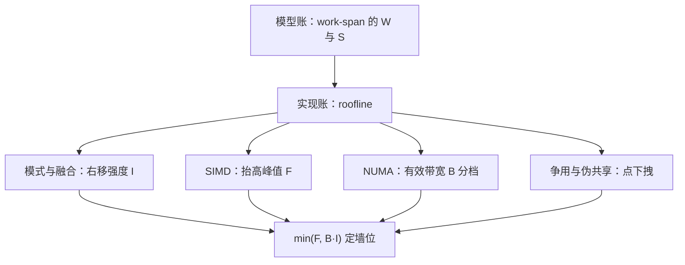
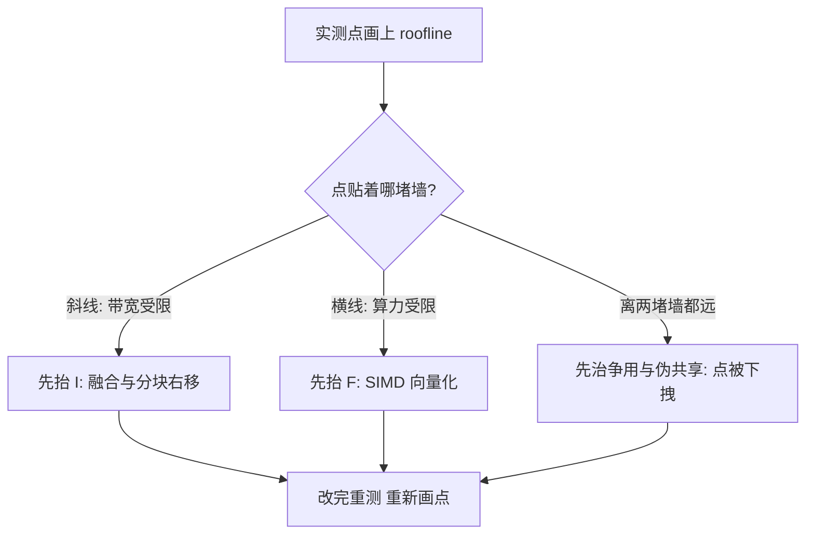

# roofline 的深化与收束

屋顶图不教你改代码，它只回答一个问题：这个内核现在撞在哪堵墙上。深化的部分，是把「多少字节真的动了」数对。

<footer>—— 据 Williams, Waterman, and Patterson, Roofline: An Insightful Visual Performance Model, CACM 2009 整理</footer>

[上一课](/cs/par-numa)把有效带宽按节点分了档。本课程从 [PRAM 的理想账](/cs/par-pram-to-practice)出发，经过 OpenMP/MPI、[数据并行的模式](/cs/par-data-parallel-patterns)、[任务并行](/cs/par-task-parallel)、[lock-free](/cs/par-lockfree)、[SIMD 与向量化](/cs/par-simd-vectorization)与 NUMA，最后要一张图把所有账并拢。[Roofline 模型](/cs/roofline-model)已画好屋顶：横轴算术强度 $I$，纵轴可达性能 $P\le\min(F, B\cdot I)$。本课做三件深化——点怎么算才不撒谎、屋顶怎么分层读、优化次序怎么定——并以此把全课程收进一张图。本课程到此收束。

## 问题

深化的缺口有三个。其一，点的位置会撒谎：强度若用「算法最少字节」算，缓存复用就被算没了——同一段代码在 L2 屋顶与 DRAM 屋顶上是两个点，你优化的是哪一个必须先说清。其二，屋顶不止一横一斜：每层存储一条斜线（斜率是该层带宽）、算力一条横线，脊点 $I^{*}=F/B$ 把「向量化值多少」变成一个可算的数。其三，优化次序：先垂直爬到当前屋顶，还是先右移强度，做反了力气全白费。错法：拿矩阵乘的理论强度宣布自己「计算受限」，实测点却贴着 DRAM 斜线爬——朴素三重循环的每个 FLOP 都在搬字节，强度不过零点几个 FLOP 每字节。

数字实例：脊点 $I^{*}=F/B$ 就是拿算力除带宽——单核 $50$ GFLOP/s、$25$ GB/s 时 $I^{*}=2$ FLOP/字节。强度 $0.25$ 的内核在斜线上（搬字节忙），强度 $40$ 的在平顶上（算得忙）；你的点离脊点多远，直接给出「向量化还值几个钱」。

## 方法

测量协议先立：算力与字节都取实测——FLOP 事件与各层缓存、DRAM 的读写字节数来自 [PMU 计数器](/cs/pmu-counters)，点画在 $\min(F, B\cdot I)$ 的图上，配[强扩展与弱扩展](/cs/strong-weak-scaling)的曲线一起看：扩展一旦拐弯，先查拐点是不是带宽墙，再怀疑同步——[Gustafson 定律](/cs/gustafson-law)「串行段不变」的假设在带宽墙前最先失守。优化次序按图行事：[SIMD 与向量化](/cs/par-simd-vectorization)抬的是横线（峰值 $F$），[数据并行的融合](/cs/par-data-parallel-patterns)与分块右移点（抬 $I$），[NUMA](/cs/par-numa)与合并抬的是有效 $B$——上一课的分档直接进斜率；无锁重试与伪共享不改变屋顶，只把点往下拽。

## 机制

机制一：强度是分母的函数——分母取哪一层的字节，决定你跟哪张屋顶比；[缓存无关结构](/cs/cache-oblivious)与分块的机制，就是把分母从 DRAM 字节换成 L2 字节，同一个算法在图上换了位置。机制二：脊点的账——单核几十 GFLOP/s 对几十 GB/s，脊点只有个位数 FLOP 每字节：SAXPY 强度约 $1/6$，天生贴斜线，向量化救不了它；矩阵乘分块后强度上百，才配得上平顶。机制三：两张图并读——[work-span](/cs/work-span-model) 回答「值不值得并行」（跨度封顶加速），roofline 回答「并行了以后卡在哪」（墙位定上限）；前者是算法的账，后者是机器的账，合起来才是完整账本。

WWP 2009 原文的两个样例正是两端：SAXPY 强度约 $0.17$ FLOP/字节，永远在斜线上；朴素三重循环矩阵乘强度也只有零点几，分块之后才爬上平顶——「算法上限」与「实现位置」是两件事。

方法一节那张图是「全课程各本账怎么并拢」；实际动手时「先治哪个」的判断顺序，是另一个问题。

常见误区：一上来就猛调 SIMD。若点在斜线上（带宽受限），把算力屋顶抬到天上去也不会变快——像在堵死的独木桥旁边再修一条高速引道，车照样过不了河。先看点在哪堵墙上，再决定力气往哪花。

## 边界

本课程不进集群：网络进账后屋顶要多一维通信项，超出共享内存模型的边界。GPU 与专用加速器各有自己的屋顶形状，归专门的 GPU 编程课。roofline 也不管延迟敏感的尾延迟、能耗与可靠性——它是一张带宽-算力的静态图，动态行为要回到计数器与剖析器。模型的理想账（PRAM）与机器的账（本课）永远不该只用其中一张下结论。

## 小结

- 点要用实测字节算：算法强度撒谎，同一段代码在 L2 与 DRAM 屋顶上是两个点。
- 脊点 $I^{*}=F/B$ 量化向量化值多少；SAXPY 贴斜线，分块矩阵乘才上平顶。
- 优化次序：先爬到当前屋顶，再右移强度；NUMA 分档进斜率，争用把点下拽。
- work-span 与 roofline 并读：值不值得并行，并行之后卡在哪。
- 本课程从 PRAM 走到屋顶图收束：模型给上限与正确性，机器给墙，写并行程序就是在两者之间翻译。
- 出处：Williams, Waterman, and Patterson, CACM 2009。

直觉类比：把 roofline 想成运力图——斜线段是「每升油能拉多少货」受限的省道（带宽封顶），平顶是「车再多也只开这么快」的高速（算力封顶）。算术强度就是「每搬一字节捎带几次运算」的装载率：装得越满越靠右，越早撞上算力横线。
