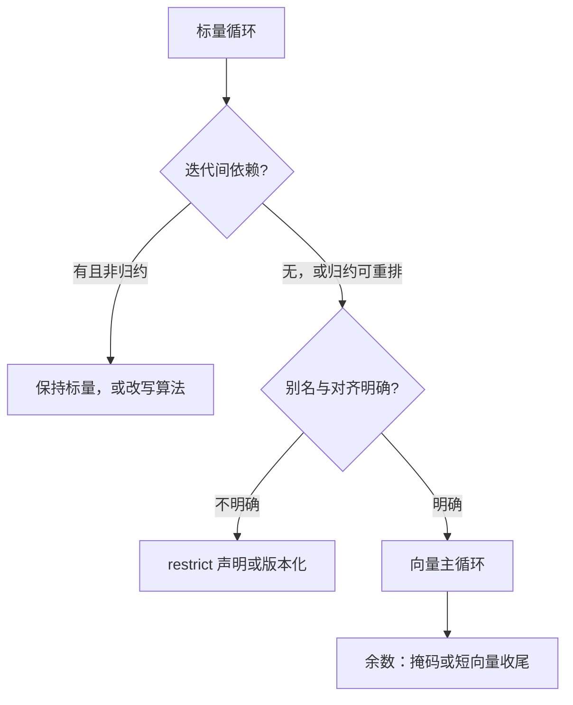

# SIMD 与向量化

同一条指令驱动十六条 lane：没有锁，没有调度，没有一致性流量——向量是并行里最便宜的那一档。

<footer>—— 据 Backus, Can Programming Be Liberated from the von Neumann Style?, CACM 1979；Flynn 分类整理</footer>

[上一课](/cs/par-lockfree)处理的都是多核之间的协调；本课转向单核内部最便宜的并行。硬件侧已有课垫底：[SIMD 与向量](/cs/simd-vector)给了数据级并行的位置，[SIMD 扩展：SSE / AVX / NEON](/cs/simd-extensions)与 [RISC-V 向量扩展 RVV](/cs/rvv-vector)给了指令集对照，[向量处理器与 lane](/cs/vector-lanes)给了 lane 流水，[Flynn 分类](/cs/flynn-taxonomy)把格子画好。缺口在软件侧：什么样的循环能被打进向量寄存器、编译器替你做到哪一步、什么时候必须亲手写。

## 问题

向量化的中心问题是规律性：迭代之间没有依赖（或只有允许改变次序的归约依赖）、访问连续、地址对齐、分支能用掩码表达。任何一条破掉，代码就在那一点退回标量。错法一：以为加一条 pragma 就快若干倍——别名未声明、`if` 密集、内层循环太短，任何一处都让编译器放弃，或生成一条掩码慢径与快径并存的版本化代码。错法二：在带宽墙下的内核上追峰值算力——[Roofline 模型](/cs/roofline-model)先画好了图：强度上不去，向量宽度翻倍也白翻；这正是本课程最后收束的伏笔。

## 方法

先让编译器做。[自动向量化](/cs/auto-vectorization)的依赖分析认得「迭代独立」与「归约」两类可打的模式；别名用 `restrict` 声明消除，或生成运行时检查的版本化代码——入口判断一次，循环体里各自向量化；循环组织成 peel/main/remainder 三段，对齐的主循环用宽寄存器，余数用短向量或掩码收尾。编译器放弃时才手写 intrinsics 或调库（BLAS 一类），并把分支改写成掩码、把 gather 改回规整访问。验收只认端到端时间与计数器，不认「汇编看上去向量了」。

## 机制

向量为什么便宜：一条取指译码驱动 $k$ 条 lane，控制开销按 $k$ 摊薄，每运算能耗比加核低得多——GPU 用 [SIMT](/cs/gpu-simt) 把同一思想放大成上千 lane，控制包装不同，内核相同。掩码执行的机制是「两条路径都算、按掩码合并」：分支密集时你在给不走的路径付费——SIMT 的发散是同一机制的线程版。gather/scatter 的机制短板：不规则下标让每条 lane 各自访存，规律性红利消失——上一课数据并行的「形状规则」在这里兑现成速度差。

部分 CPU 对重负载 AVX-512 分档降频：宽寄存器在频率墙上打折。「512 位一定更快」要用端到端时间验证，不能数指令条数。

## 边界

指令集编码差异——定宽寄存器与变长 VL——已在 simd-extensions 与 RVV 两课给过，不重复；SMT 是同一核上另一维并行，与向量共享端口，混用时互相抢资源，点到为止；GPU warp 的编程侧归专门的 GPU 编程课。本课也不立「向量比例」当指标：向量化是手段，墙位与端到端时间才是账。

## 小结

- 向量化是单核内最便宜的并行；前提是规律性：无依赖、连续、对齐、可掩码。
- 先自动后手写；编译器放弃的点通常是别名、分支与余数。
- 掩码执行给不走的路径付费；gather 丢掉规律性红利。
- 强度上不去，向量宽度翻倍也白翻——roofline 收束的伏笔。
- 出处：Backus, CACM 1979；Flynn, 1966；Hennessy and Patterson, CA:AQA 数据级并行。
