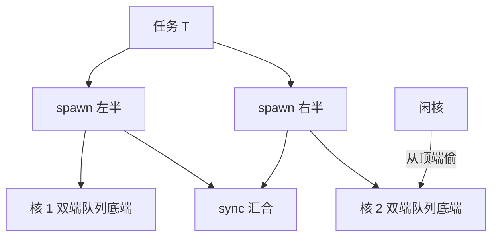

# 任务并行

并行度不必预先量好装进循环：任务把它留给运行时，让闲着的核自己去偷。

<footer>—— 据 Blumofe and Leiserson, Journal of the ACM, 1999；Frigo, Leiserson, and Randall, The Implementation of Cilk-5, PLDI 1998 整理</footer>

[上一课](/cs/par-data-parallel-patterns)把独立性写进形状，代价是并行度必须在写代码时就知道：map 多少元素、scan 多长，静态可数。树遍历、图搜索、自适应细分——它们的并行度要到运行时才现身。任务并行把「一段可跑的子计算」当单位，动态抛给运行时；[Work-span 与 fork-join](/cs/work-span-model)已把 $W$、$S$ 与 Brent 界立好，本课补工程侧：任务怎么切、调度怎么偷、粒度怎么定。

## 问题

任务并行的中心问题是粒度与依赖的平衡。切太粗：核闲着，$W/P$ 项吃亏——不平衡；切太细：派生与入队的固定开销吃掉收益，任务数失控。错法一：递归分治「两路都 spawn 到底」——任务数随深度指数增长，队列把内存吃穿；正解是 cutoff：子问题小于阈值就地串行。错法二：以为任务多就快——并行度被跨度封顶，$T_P\ge S$ 是硬下界，一百万个串行依赖的任务不会比一条链快。错法三：在任务里随手共享可变状态——fork-join 的近最优性假设任务间无竞争，锁一进来，进度、回滚、优先级反转的问题全部回来，那是下一课的主题。

## 方法

方法是 fork-join 加工作窃取：spawn 两半、sync 汇合；每个核一个双端队列，自己的任务底端压弹，闲核从他人顶端偷——两端分开，竞争与偷取都稀有。工程三件套：cutoff 定粒度，叶子任务给到几十微秒量级的连续工作量；窃取目标随机化，摊平不平衡；动态负载（分枝定界、不规则树）交给运行时，静态规则的循环留给上一课的数据并行。两者还常组合：外层任务并行切出大块，内层每个任务再用数据并行与 SIMD 吃满本地核。流水线也是任务并行：各阶段各挂一个队列，阶段间天然并行——[五级流水线](/cs/pipeline-five-stage)是它在硬件里的原型，[流水线并行](/llm/pipeline-parallel)把同一思想搬进模型切分。

## 机制

窃取为什么近最优：偷只发生在有核闲着的时候。Blumofe–Leiserson 给出期望时间 $\le W/P+O(S)$、空间 $O(P\cdot S_1)$（$S_1$ 是单核执行的空间）——窃取调度的最坏内存也只是单核的 $P$ 倍。队列两端分工的机制：自己一端 LIFO 保热数据与递归局部性，被偷的一端 FIFO 拿走最老最大的任务，偷一次转移一大块工作。throttling 的机制：任务对象携带闭包与捕获上下文，派生速度长期超过消费速度时内存线性堆积——运行时要给未完成任务的存量设上限，否则「并行」先以内存耗尽的形式失败。

cutoff 阈值不是越小越好：叶子任务低于几十微秒时，派生与队列操作的固定开销开始反噬。Cilk 的经验法则是让串行叶子承担上千条指令，把调度开销摊到不足百分之一。

## 边界

本课假设任务基本不共享可变状态；共享数据结构本身怎么办，是下一课 lock-free 的主题。优先级、实时与亲和约束不写——那是操作系统调度器的事；Cilk、TBB、OpenMP task 的语法差异点名即可。跨机器的任务分发也不在：那是 MPI 一侧的作业系统，记账单位从任务变成消息。

## 小结

- 任务并行处理运行时才现身的并行度；fork-join 与工作窃取是标准表达。
- 粒度靠 cutoff：太粗不平衡，太细被调度开销反噬。
- 期望时间 $\le W/P+O(S)$、空间 $O(P\cdot S_1)$；任务多不等于快，跨度是硬下界。
- 流水线是按阶段切的任务并行，硬件与模型切分里各有一次兑现。
- 出处：Blumofe and Leiserson, JACM 1999；Frigo, Leiserson, Randall, PLDI 1998。
