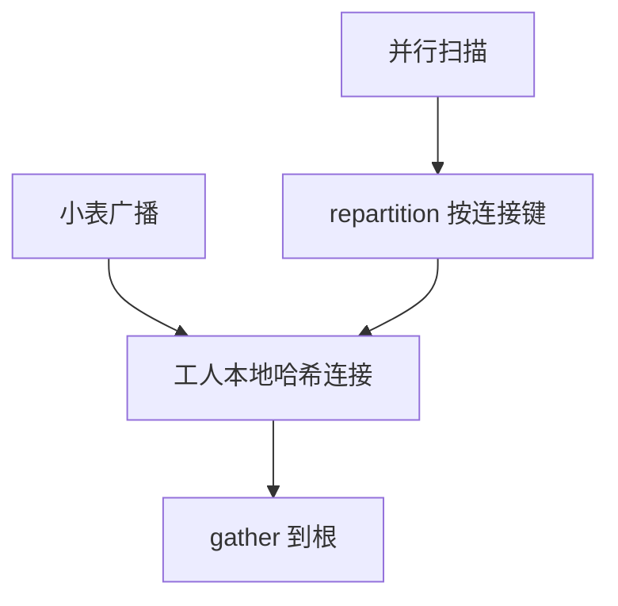

# 并行查询与 exchange

exchange 把 Volcano 树切成多个数据流：广播、重分区、收集。并行度是计划上的标签，不是另一种 SQL。

<footer>—— 据 Graefe Volcano 并行；DeWitt and Gray 并行数据库；Selinger 之后的物理标签</footer>

[上一课](/cs/grace-hash-join)在单机用文件分区。本课不递归划分。缺口是多核与多节点：同一逻辑算子跑 $D$ 份，数据必须按连接键对齐或广播。exchange（交换算子）实现 Volcano 的 `next`，底下是队列、网络或共享内存。主干分片直觉点到水平切；进阶钉执行器里的切流。

## 问题

流水并行：不同算子叠在不同核（有限）。划分并行：同一扫描切成 range/hash/round-robin 多工人。连接：若两边都按连接键 hash 重分区（shuffle join），则工人 $i$ 只连自己的键范围，正确性同 Grace。广播连接：小侧复制到所有工人，大侧划分扫——避免大 shuffle。

缺口是 **exchange 的次序与代价**：网络比内存哈希贵，优化器要把 shuffle 字节计入校准过的模型。倾斜使某一工人收到大部分键，并行名存实亡。

Graefe 把 exchange 插进迭代器树。DeWitt and Gray，《Communications of the ACM》并行数据库。分布式后课 shuffle 与本课同构，只是网络更宽。

## 方法

计划节点标 DOP。扫描：按页或按范围并行。exchange 类型：gather（收向协调器）、repartition（按键）、broadcast、round-robin。资源：工人数 ≤ 核数或槽位；超订会抖。

合并有序流：并行排序后 merge exchange 保序，服务归并连接。破坏序的 exchange 会逼上层再排。

## 机制

事务与快照：所有工人读同一快照（MVCC）或同一锁协议视图。取消：协调器 close 所有 exchange。死锁：工人之间若再拿锁，等待图跨线程——事务进阶课。本课假设扫描与哈希工作集已定。

代价：启动工人的固定税使短查询并行变慢。优化器应对小基数关并行——回归可表现为「自动 DOP 开太大」。

## 边界

本课不讲列存延迟物化——下一课。也不把两阶段提交当 exchange。存算分离后课的 shuffle 落在对象存储上，接口仍是这三种交换。

后课默认：并行计划用 exchange 显式切流；广播 vs shuffle 由大小估计决定。延迟物化决定工人之间传列还是传 RID。

没有 exchange 的「并行」只是算子内 SIMD，不是划分并行。

## 小结

- exchange 提供 gather、repartition、broadcast，对齐 Grace 正确性。
- 倾斜与启动税限制 DOP；短查询常串行。
- 延迟物化下一课：尽量晚读列，减少 shuffle 宽度。
- 出处：Graefe；DeWitt and Gray；Ramakrishnan and Gehrke。
