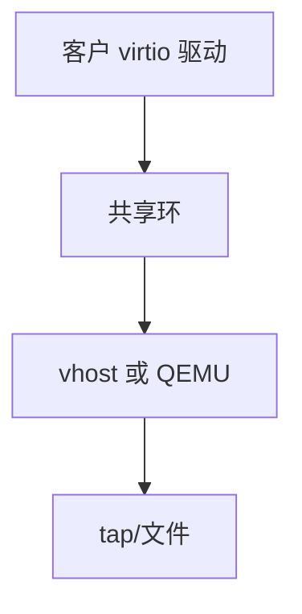

# 半虚拟化

半虚拟化让客户知道自己在 VM 里：用 hypercall 或 virtio 环替代模拟遗留设备，从而少 VM-exit、少模拟税。

<footer>—— 据 Barham et al., Xen；Russell, virtio；[KVM/QEMU](/cs/kvm-qemu) 为先修</footer>

[EPT](/cs/shadow-page-table) 解决 MMU。[VM-exit](/cs/vmx-vmexit) 仍会被模拟网卡打爆。缺口是 **virtio/xen PV**：客户驱动配合。

## 问题

模拟 e1000：每发包 PIO/MMIO exit。virtio：共享环、kick 可用 eventfd，批量。缺口：virtio-net/blk/fs；与 [sendfile](/cs/sendfile-splice) 在客户内仍有效。本课不把 virtio 规范全章抄来。

启蒙（enlightenment）是 Windows 用语。对象是知情客户，不是类型 1 专属。

## 方法

客户装 virtio 驱动 → 发现 PCI virtio 设备 → 环与 QEMU/vhost 通信。vhost：部分数据面进宿主内核，少到用户。对照 [tun](/cs/bridge-tun-tap)：tap 仍常是后端。对照 XDP：宿主可对 tap 再加速。

## 机制

半虚拟把设备模型从「精确模拟硬件」换成「为 VM 设计的 ABI」，性能接近直通的一部分，可迁移性更好。不要写成云网卡型号。与 [SCSI](/cs/scsi-stack)：virtio-blk 绕过客户 SCSI 模拟。

无 PV 驱动则掉进慢模拟。

实现上：vhost-net 在宿主内核消费 virtio 环，QEMU 只处理控制面。无 PV 驱动时海量 exit 模拟 e1000。virtio-fs 用 FUSE 协议过环，语义接近本地但不是。 读法上只引用[上一课](/cs/shadow-page-table)的结论，不把对象换成训练推理或限价簿。

本课在操作系统进阶的「虚拟化与隔离进阶 / Hypervisor」课序里，对象是 **半虚拟化**。

- 先修只引用，不重导：上一课的结论当公理，本课只补差。
- 五栏不吞并：不把本课写成大模型训练/推理，也不写成限价簿或权重量化。
- 文献用 OSTEP、McKusick、内核文档与具名会议论文；不发明 arXiv 编号。

## 边界

本课不引入所有 virtio 特性位。不保证 GPU 半虚拟的完整。下一课硬件级：SR-IOV 与直通。

版本字段会变，课序钉的是机制对象「半虚拟化」，不是某一主线内核的结构体名。
后课默认：知情客户可用环 I/O。把物理函数切成虚拟函数，下一课 SR-IOV。

## 小结

- 半虚拟用 hypercall/virtio 减少模拟。
- vhost 把数据面放进宿主内核。
- SR-IOV 直通是下一课。
- 出处：Xen；virtio；KVM vhost。
