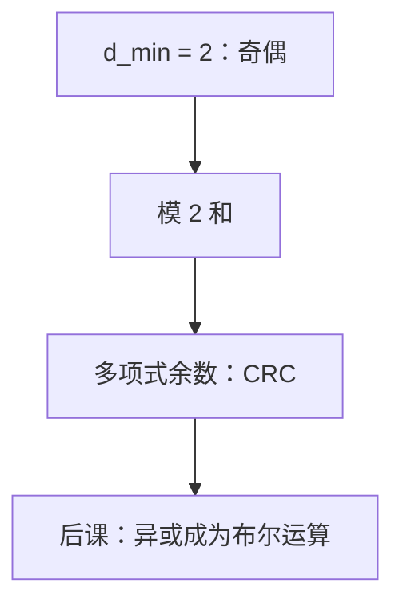

# 奇偶与 CRC

一位偶校验把码字推进偶数重量；CRC 把同一件事做成多项式除法的余数，突发翻转比随机单比特更常见时更有用。

<footer>—— 据 Hamming, 1950；Peterson and Brown, Cyclic Codes for Error Detection, 1961；Knuth, The Art of Computer Programming, Vol. 2 整理</footer>

上一课[汉明距离](/cs/hamming-distance)钉死了 $d$ 是度量，$d_{\min}=2$ 能检一位。本课不重证三角不等式，也不从「循环码理论」另起一篇综述。缺口是：距离还没有**构造**。一位奇偶怎么把 $d_{\min}$ 抬到 $2$；帧、磁盘上常用的 CRC 与奇偶是同一类运算的加长版，还是另一套几何。

## 问题

偶校验：添一位使全体比特模 $2$ 和为 $0$，合法字落在超平面上，$d_{\min}=2$，奇数位错必被发现，两位错看不见。缺口因此不是再定义距离，而是承认：这就是 $d=2$ 的线性码，电路上是一排异或。突发错（连续 $k$ 位）在链路上比独立翻转更常见，一位奇偶不够；把比特当成 $\mathbb{F}_2$ 上多项式的系数，除以固定生成元 $g(x)$，余数当校验，就是 CRC。

本课只钉检错。纠错定位（Hamming 码的综合征）上一课已点名，不在这里把矩阵写完。布尔代数还没有正式公理，异或先当模 $2$ 加。

### CRC 不是「已经纠正」

余数不合则发现，合则**可能**漏检（错多项式是 $g$ 的倍式）。把 CRC 通过当成数据正确，后课重传与 ECC DIMM 会少一步。纠正需要距离更大的码或重读。

Hamming 用奇偶作检错与 $(7,4)$ 的构件。Peterson–Brown 把循环冗余系统化。Knuth Vol. 2 的多项式算术给出 $\mathbb{F}_2[x]$ 上除法的同一套语言，本课不展开乘法实现。

## 方法

奇偶：$p=\bigoplus_i x_i$。CRC：把信息比特当多项式 $m(x)$，发送 $x^{r}m(x)-q(x)g(x)$ 使 $g$ 整除；接收端再除一次看余数是否为零。$r=\deg g$。常见 $g$ 是工程约定（如 CRC-32 多项式），本课不背表。能检的突发长度与 $g$ 的性质有关，最坏 $d_{\min}$ 仍由码决定。

## 机制

链路帧尾、以太网、压缩文件的 checksum 家族，多数是 CRC 或弱哈希；本栏网络课会再碰到帧，那时默认本课：CRC 管检，不管密码学完整性。后课[布尔代数](/cs/boolean-algebra)把与、或、非写成公理，异或是导出运算；本课的校验已经在用它。

## 边界

本课不引入 CRC 的线性反馈移位寄存器画法以外的时序细节——触发器还没有。也不把 MD5/SHA 当 CRC：加密哈希防主动攻击，CRC 防随机翻转。UTF-8 非法序列检测不是 CRC。

后课默认：一位奇偶 $d=2$；CRC 是多项式检错。组合功能从布尔公理开始写。

## 小结

- 偶校验强制偶数重量，检奇数位错。
- CRC 用 $\mathbb{F}_2[x]$ 余数检突发；通过不等于正确。
- 下一步需要的是对 $\{0,1\}$ 的代数，不是更长的校验多项式。
- 出处：Hamming, 1950；Peterson and Brown, 1961；Knuth, TAOCP Vol. 2。
