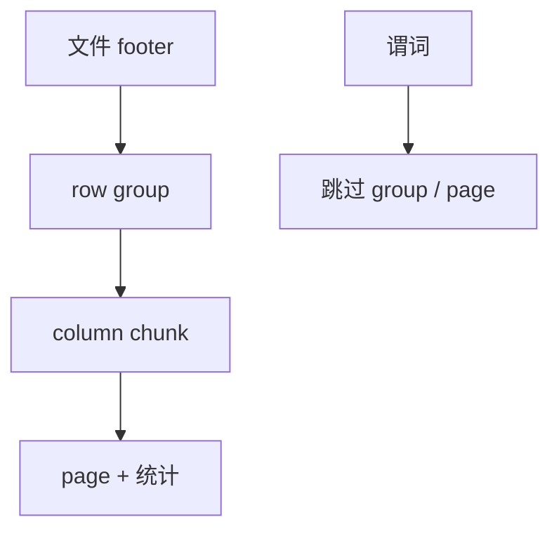

# Parquet / ORC

开放列存文件把 row group、列块、编码与页统计写成可交换合同，让引擎不必共享缓冲池也能共享数据。

<footer>—— 据 Apache Parquet 格式；Apache ORC；Dremel / C-Store 谱系</footer>

[上一课](/cs/column-compression)给出块内编码。本课不选 RLE 阈值。缺口是**文件级标准**：数据湖与多引擎（Spark、专用 OLAP、入库工具）要读同一份字节。Parquet 与 ORC 把 PAX 思想放到文件：footer、row group、column chunk、page、min/max 与字典。

## 问题

专有表空间把数据锁在一种引擎。分析把表卸成文件后，格式必须自描述：哪些列、编码、压缩、统计、嵌套（Parquet 的 repetition/definition 来自 Dremel）。缺口不是「大数据产品课」，而是存储进阶里的开放页格式，相对 InnoDB 页只在一个缓冲池里。

谓词下推进文件：读 footer 的 zone 统计，跳过 row group；再读列块统计，跳过 page。这是后课 zone map 的文件实例。嵌套结构不是文档库：仍是列存的嵌套编码。

Parquet 源自 Google Dremel 的列式嵌套；ORC 来自 Hive。本课对照合同，不背所有 version 字段。

## 方法

写：按 row group 切（行数或字节阈值），每列一块，选编码与可选压缩器（与编码叠）。读：投影列集合 → 只打开那些 chunk；谓词 → 用统计裁剪。schema 演化：加列、可选字段，与模式迁移课的文件版。

与事务：文件通常不可变，更新靠写新文件+元数据提交（湖仓表格式后课）。本课单个文件内部。

## 机制

向量化扫描直接吃 page 解成列向量。并行：按 row group 切给工人，exchange 前已是列批次。小文件问题：每个文件一个 footer，调度税高——后课表格式用 compaction 合文件，与 LSM 同构。

类型系统：十进制、时间戳精度不一致会在引擎间产生静默错，合同要钉。

## 边界

本课不把 Iceberg/Delta 的快照日志写完。也不讲位图索引在库内的实现——后课。ORC 的索引流、Parquet 的 bloom 模块点名存在。

后课默认：分析交换用 Parquet/ORC 一类列文件。zone map 与跳过索引：min/max 与更一般的跳过结构，库内表也用。

开放格式把「页」从一种引擎的缓冲池里解放出来。

## 小结

- Parquet/ORC 标准化 row group、列块、编码与统计。
- 谓词用统计跳过；文件不可变，事务在元数据层。
- zone map 下一课：把跳过从文件合同收回库内表。
- 出处：Apache Parquet；Apache ORC；Dremel。
