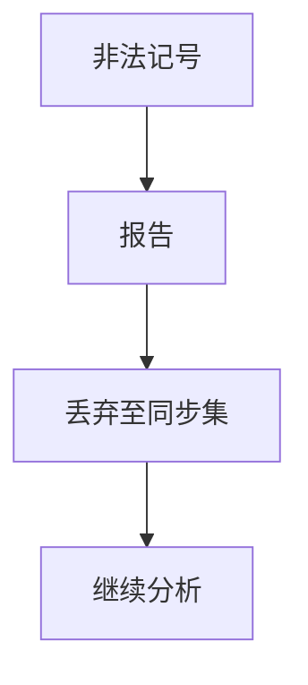

# 错误恢复

分析器的职责不止于第一个非法记号：要报告、要跳到能再同步的符号，并尽量不引发雪崩式误报。

<footer>—— 据龙书第 4 章错误恢复；Burke and Fisher, A Practical Method for LR and LL Syntax Error Diagnosis and Recovery 整理</footer>

上一课[Pratt](/cs/pratt-parsing)在合法表达式上漂亮。真实编译器面对缺括号、多逗号。主干 LL 课点过 FOLLOW 作同步集。缺口是**恢复策略**：恐慌模式、短语级修补、yacc 的 `error` 记号。本课钉「报告一次、跳过、继续」，不把 IDE 的红线协议写完。

## 问题

查表空或 nud 缺失：输入不是语言的前缀。若立刻 `exit`，用户只看见第一处。若胡乱插入记号，后续整棵树错位，报错上百条。缺口是**同步**：丢弃直到遇见 `;`、`}` 或 FOLLOW 中的记号，使栈与输入再次对齐。

yacc：`error` 产生式允许在某非终结符下吃掉错误短语。bison 的 `yyerrok` 解除「刚恢复」抑制，避免相邻错误被吞。

### 同步不是「猜对用户意思」

恢复后的 AST 可以残缺，类型检查必须能容忍空洞节点。不要在恢复里做复杂程序变换。语义动作里申请的内存要能在弹出栈时释放——上一课 yacc 已点过所有权。

龙书 4.1.4 与 4.5.5。Burke–Fisher 讨论 LR/LL 诊断。本课不把 GLR 多栈恢复写成算法作业。

## 方法

恐慌：从当前记号丢到同步集。短语级：尝试插入/删除一个记号看能否继续（限一步，防组合爆炸）。错误产生式：文法里显式 `error`。统一：每个语法错误一条主诊断，带行号；恢复后计数，太多则停。

词法错误（非法字符）在 lex 动作里吞掉一字并警告，不要把垃圾字符送进语法栈。

## 机制

雪崩：缺一个 `)` 会导致整份参数列表全部「期望逗号」。抑制：同一行或同一子树只报一次。LR 比 LL 更难点「期望什么」：状态里有多条项。实用做法：列出该状态可移进的记号集合，截断显示。

PEG 的有序选择把失败藏在左枝，诊断要另记最深失败位置（Ford 也讨论过误差报告），与 LR 的 FOLLOW 不同源。

## 边界

本课不写 tree-sitter 的增量，不算最小编辑距离的全局最优修补。后课默认：前端能在错误后同步并继续建残树。下一课：编辑器里改一个字符不必重头分析——增量解析。

不要承诺「总能恢复成用户意图」。恢复的契约是：编译器进程不崩，诊断位置可信。

## 小结

- 恢复 = 报告 + 同步 + 抑制雪崩。
- `error` 记号与 FOLLOW 同步是两条实用路。
- 残树必须让后遍可拒绝而非误优化。
- 出处：Aho et al., 龙书；Burke and Fisher。
