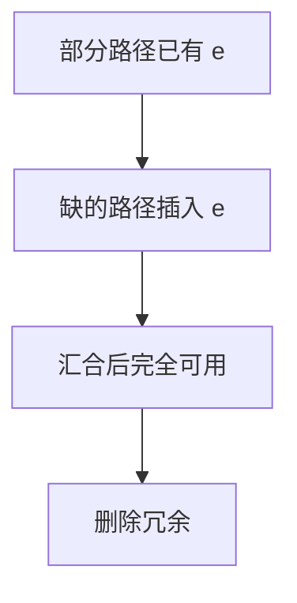

# 部分冗余消除

表达式在某些路径上已算过、某些没有：在缺少的路径上插入计算，使汇合点可用，再删除冗余。这是全局 CSE 与 LICM 的共同推广。

<footer>—— 据 Morel and Renvoise, Global Optimization by Suppression of Partial Redundancies, 1979；Knoop, Rüthing and Steffen, Lazy Code Motion 整理</footer>

上一课[SROA](/cs/sroa)把更多表达式变成标量。缺口是**部分冗余**：`a+b` 在 `if` 的一枝算过，汇合后再算。PRE / lazy code motion：插入使变成完全可用，且尽量懒（不无故延长存活）。本课钉思想，不把全部数据流方程展开成作业。

## 问题

可用表达式要求**所有**前驱都可用才消除。部分：有的前驱有。插入：在没有的前驱出口补上。缺口是**插入点选择**，避免多余计算与非法投机（陷阱）。

LCM（lazy code motion）把计算下移到尽可能晚，减寄存器压力。

### 插入不是随便投机

不能在不执行的路径上插入可能除零的运算，除非证明安全或原程序也会执行。与 LICM 的「必执行」同一类约束。

Morel–Renvoise 1979。Knoop–Rüthing–Steffen LCM。龙书 9.5 相关。LLVM 有 GVN-PRE。

## 方法

数据流：预期（anticipated）、可用、稍后。解方程，标记插入与删除。SSA 上可用 φ 与新名实现。

与 GVN：先编号再 PRE，识别代数等价。与循环：不变式外提是 PRE 的特例（环外插入）。

## 机制

代码体积：插入复制运算。临界边（从多后继到多前驱）要拆，否则插入点不唯一——CFG 变换。不要在 PRE 里移动 store；那是另一套（store PRE 更危险）。

## 边界

本课不证 LCM 最优性。后课默认：部分冗余可经插入变成 CSE。下一课值范围：另一格，服务消除比较与越界。

也不把 PRE 当死代码（那是删除无观察，不是移动计算）。

## 小结

- PRE：插入补齐路径，消除部分冗余。
- 懒移动减寄存器压力；投机受陷阱约束。
- LICM 是循环上的特例。
- 出处：Morel and Renvoise, 1979；Knoop et al. LCM；龙书。
