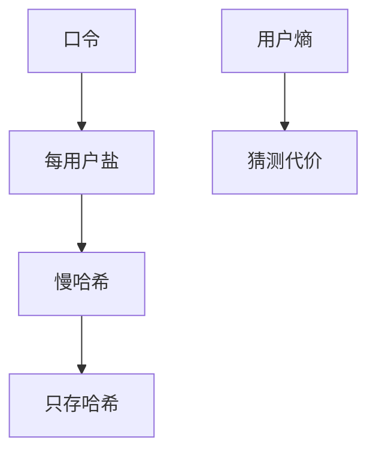
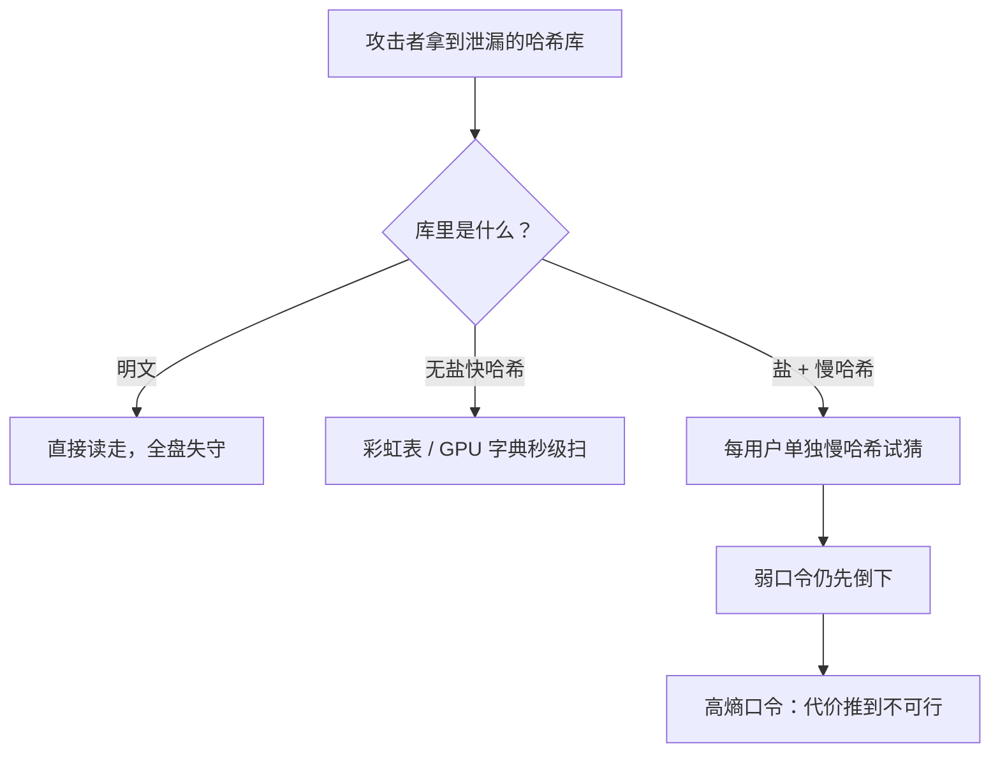

# 密码破解

离线猜口令吃的是哈希与熵，不是登录框的速率限制。盐挡住预计算表，慢哈希挡住尝试速率；用户选的口令熵往往仍不够。

<footer>—— 据 Morris and Thompson, Password Security, CACM 1979；NIST SP 800-63B；Provos and Mazières, bcrypt</footer>

上一课[TOTP](/cs/totp-mfa)假定第一因素仍常是口令。缺口是**泄漏后的离线猜测**：哈希库一旦出门，攻击者在自己的机器上试。本课讲防御参数，不提供字表或工具教程。

后课默认已经读完本课钉下的合同，只补差，不从该领域第一性原理重开。

## 问题

明文存口令是事故。无盐哈希被彩虹表；快速哈希让 GPU 试亿次。缺口是：盐（每用户）、慢哈希（Argon2/bcrypt/scrypt）、禁止泄露的常见口令、MFA。不重写 HKDF——那是高熵 IKM。

「彩虹表」就是预先算好、压缩存盘的巨型『哈希→口令』对照表——用空间换时间的离线猜测。盐的作用一句话：给每个用户的口令加一段随机前缀再哈希，使同样的「123456」在不同账户里哈希值都不同，整张表一次性作废。

### 在线与离线

登录接口要锁定与速率限制；那挡在线。泄漏库是离线，只能靠哈希造价与熵。

Morris–Thompson 1979。NIST 现鼓励长度与检查泄漏集，不强制定期轮换复杂规则。本课禁止破解作业。

## 方法

对照存储：明文 / 快哈希 / 盐+慢哈希。指出 pepper（服务器密钥）是额外，密钥仍要管。下一课生物识别：不可轮换的测量，不是口令。

```mermaid
flowchart TD
  PWD["口令"] --> SALT["每用户盐"]
  SALT --> SLOW["慢哈希"]
  SLOW --> STORE["只存哈希"]
  ENT["用户熵"] --> COST["猜测代价"]
```

## 机制

身份单元里口令是共享秘密中最弱的常见形态。哈希参数是把离线猜测推进计算安全游戏。生物下一课把「测你是谁」的错误率写成 FAR/FRR。

数字实例：现代 GPU 对纯 MD5 每秒能试约百亿次；换成调到单次约 100 ms 的 Argon2，同一台机器每秒只剩 10 次——快了 9 个数量级。这就是「慢哈希」的全部含义：把猜测速率压到按年计，等用户改密码。

```mermaid
flowchart TD
  L["攻击者拿到泄漏的哈希库"] --> Q{"库里是什么？"}
  Q -- "明文" --> W0["直接读走，全盘失守"]
  Q -- "无盐快哈希" --> W1["彩虹表 / GPU 字典秒级扫"]
  Q -- "盐 + 慢哈希" --> W2["每用户单独慢哈希试猜"]
  W2 --> W3["弱口令仍先倒下"]
  W3 --> W4["高熵口令：代价推到不可行"]
```

盐与 pepper 别混：盐明文存在同一张库里，唯一使命是让相同口令的哈希互不相同（顺带废掉彩虹表）；pepper 是不写进库、只活在服务器配置里的全局密钥——库泄了它还在，代价是多管好一把钥匙。

## 边界

本课不给 GPU 配置。生物识别 FAR/FRR 下一课。

## 小结

- MFA 之外，口令泄漏走离线猜测。
- 盐+慢哈希+拒绝常见口令。
- 在线速率限制管不了已泄漏的哈希库。
- 下一课生物识别错误率。
- 出处：Morris and Thompson, 1979；NIST SP 800-63B；Provos and Mazières, bcrypt。
