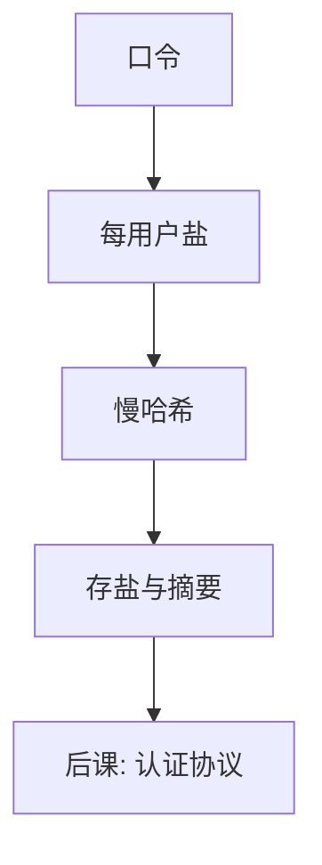

# 口令与加盐

库里不存口令原文；盐让同一口令不再撞成同一串，慢哈希让离线猜测变贵。

<footer>—— 据 Morris and Thompson, Password Security, CACM 1979；Anderson 对口令存储的整理</footer>

[上一课](/cs/cert-revoke)用证书绑机器与服务身份。本课不重做 X.509。缺口是：人带着可记忆的秘密来证明自己。口令熵通常远低于密钥，且会被复用。存储必须假设库会被抄走——[威胁模型](/cs/threat-model)里的「磁盘与备份在边界内仍可能泄露」。

## 问题

明文存口令，一份泄露则全部身份作废。只做一次哈希，彩虹表与预计算把常用口令一次对上所有用户。缺口不是再讲[哈希与碰撞](/cs/hash-collision)的抗碰撞，而是口令专用：每用户随机盐、慢哈希（或内存硬函数），使离线猜测按「每一猜测 × 每一用户」付钱。在线猜测另用限速与锁定，那是认证协议课。

盐不是保密材料，可与哈希一起存。胡椒（pepper）是服务器侧额外密钥，丢了则全体无法验证，本课只点名，不做成默认。

## 方法

注册：抽盐，存 $(\mathit{salt}, H(\mathit{salt}\|\mathit{password}))$ 或标准口令哈希 API 的输出。验证：用同一盐重算比较。禁止「可逆加密口令」当默认：那把保密重新绑到另一把主密钥上，主密钥一丢仍全军覆没。本课不讨论口令强度 UI，只锁定存储布局。

## 机制

盐打碎预计算表；慢哈希（迭代、内存困难）把 GPU 穷举的速率压下来。这不把弱口令变成密钥：在线与针对性猜测仍成立。完整轴：口令哈希不提供对会话的认证，只服务「核验人记得的秘密」。传输中口令必须走已认证的保密信道，否则盐与哈希都是事后。

同一口令在不同盐下摘要不同，泄漏一份哈希不能直接对上另一用户。

## 边界

不要把加盐写成「加密」。不要给具体破解步骤或词表攻击配方。本课也不把生物特征、硬件令牌写进存储格式。恢复流程（邮件重置）往往比哈希更弱，属于协议与运营，下一课会碰到认证的消息顺序。

口令复用使一次泄露变成多站身份事故；这是人的熵与威胁模型问题，不是盐算错。后课默认：口令核验针对盐化慢哈希；如何证明「我是这个用户」的消息往返，是认证协议。

传输中的口令必须走已认证保密信道。盐化存储保护的是盘上的抄本，不是线路上的明文。

## 小结
- 离线猜测的代价由慢哈希与盐共同决定；在线猜测要限速，属下一课协议。
- 可逆「加密存口令」把全部身份绑到主密钥，本课不当默认。

- 证书绑服务；本课把人的秘密存成盐化慢哈希，假设库会泄露。
- 盐破预计算；慢哈希抬离线代价；弱口令仍弱。
- 核验之后如何建会话、防重放，是认证协议缺口。
- 出处：Morris and Thompson, 1979；Anderson, *Security Engineering*。
