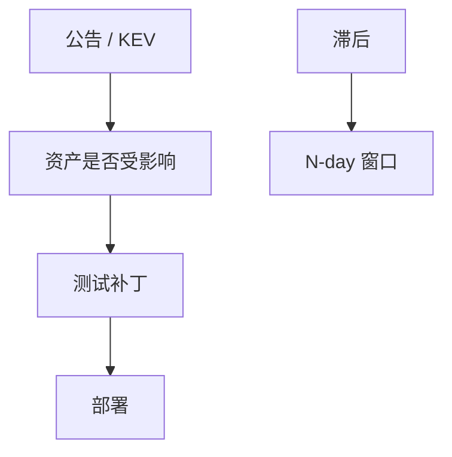

# 补丁与 N-day

洞一旦公开，时钟对防御方启动。N-day 不是新科学，是补丁滞后、依赖滞后、测试滞后叠成的窗口。优先级应对准暴露面，而不是只对准 CVSS 红字。

<footer>—— 据 Anderson 对补丁经济学；NIST SP 800-40；对照 CISA KEV 目录的思想</footer>

## 定位

上一课[CVSS](/cs/cve-cvss)给了分。缺口是**时间**：已知洞在你系统里还活着。本课收补丁管道与例外，不写 exploit 开发。

后课默认已经读完本课钉下的合同，只补差，不从该领域第一性原理重开。

## 问题

虚拟补丁、WAF、配置关闭可缩窗口，但不能代替供应商补丁。依赖滞后：库已修，镜像未编。缺口是资产清单（SBOM）与暴露面。

### 例外要过期

「系统太老不能打」必须有补偿与截止日期。

SP 800-40。CISA KEV：正在被用的已知洞。本课禁止利用 N-day 的步骤。

## 方法

画：情报→影响分析→测试→部署→验证。对照红队后课：他们吃的就是这窗口。下一课逆向：你如何在没有源码时理解补丁在改什么。

图中节点是本课的机制骨架；课程不把图展开成可运行的攻击步骤。

## 机制

发现课接到运营。逆向下一课服务「无源码的理解」，不是写恶意软件。

前提写进合同之后，游戏外的误用只当失败模式点名，不在本课写成操作程序。

## 边界

本课不提供未授权入侵。逆向工程下一课：方法与法律/合同边界在叙事里点名。

## 小结

- 分数之后是时钟：公开到修补的窗口。
- SBOM 决定你知不知道自己中招。
- 例外必须补偿并过期。
- 下一课逆向工程（理解，非利用）。
- 出处：NIST SP 800-40；Anderson；CISA KEV。
