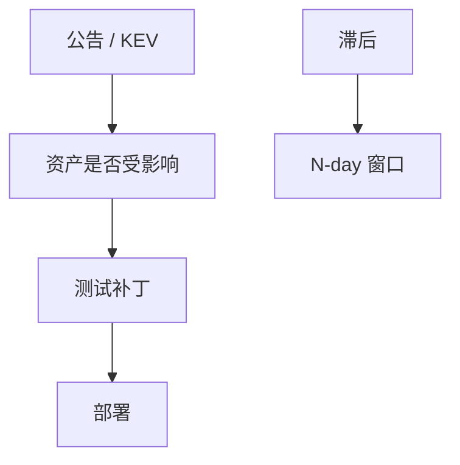
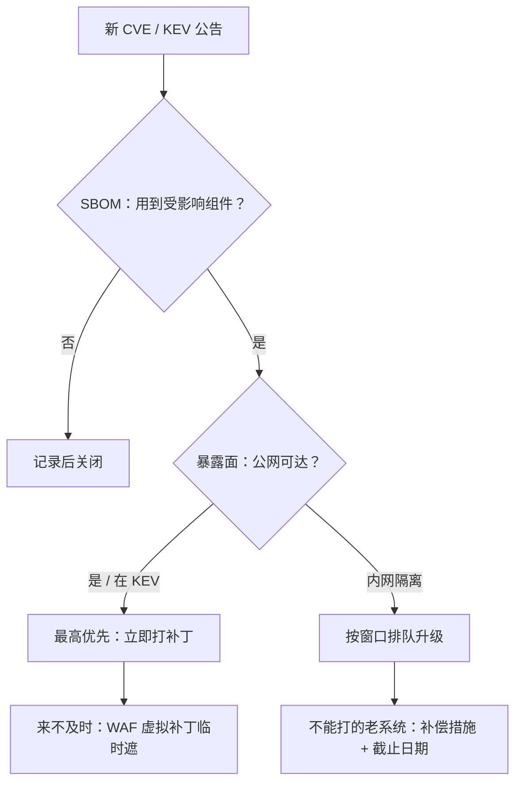

# 补丁与 N-day

洞一旦公开，时钟对防御方启动。N-day 不是新科学，是补丁滞后、依赖滞后、测试滞后叠成的窗口。优先级应对准暴露面，而不是只对准 CVSS 红字。

<footer>—— 据 Anderson 对补丁经济学；NIST SP 800-40；对照 CISA KEV 目录的思想</footer>

上一课[CVSS](/cs/cve-cvss)给了分。缺口是**时间**：已知洞在你系统里还活着。本课收补丁管道与例外，不写 exploit 开发。

后课默认已经读完本课钉下的合同，只补差，不从该领域第一性原理重开。

## 问题

虚拟补丁、WAF、配置关闭可缩窗口，但不能代替供应商补丁。依赖滞后：库已修，镜像未编。缺口是资产清单（SBOM）与暴露面。

「SBOM」（软件物料清单）就是软件的配料表：这份镜像里装了哪些库、各自什么版本。没有它，公告说 OpenSSL 有洞时你只能全盘排查；有了它，一条查询就知道哪几百台机器真用了受影响版本。依赖滞后常常不是「不修」，是「不知道自己有这味料」。

### 例外要过期

「系统太老不能打」必须有补偿与截止日期。

「为什么重要」：没有截止日期的例外会悄悄永久化——老系统一拖三年，补偿措施（防火墙规则、关闭端口）早没人记得为什么存在，而洞还在。可核对的写法是「例外至 2026-12-31，到期未升级则下线」，把时钟重新挂回墙上。

SP 800-40。CISA KEV：正在被用的已知洞。本课禁止利用 N-day 的步骤。

## 方法

画：情报→影响分析→测试→部署→验证。对照红队后课：他们吃的就是这窗口。下一课逆向：你如何在没有源码时理解补丁在改什么。

```mermaid
flowchart TD
  ADV["公告 / KEV"] --> AFF["资产是否受影响"]
  AFF --> TEST["测试补丁"]
  TEST --> DEP["部署"]
  DELAY["滞后"] --> WIN["N-day 窗口"]
```

## 机制

发现课接到运营。逆向下一课服务「无源码的理解」，不是写恶意软件。

常见误区：CVSS 10 分就一定最先修。优先级其实是「分数 × 暴露面 × 是否正被利用」：一个 10 分洞若只在内网隔离环境可达，可能不如一个 7 分但直接暴露公网、且进了 KEV 目录（确认有真实攻击）的洞紧急。

```mermaid
flowchart TD
  A["新 CVE / KEV 公告"] --> B{"SBOM：用到受影响组件？"}
  B -- "否" --> Z["记录后关闭"]
  B -- "是" --> C{"暴露面：公网可达？"}
  C -- "是 / 在 KEV" --> D["最高优先：立即打补丁"]
  C -- "内网隔离" --> E["按窗口排队升级"]
  D --> F["来不及时：WAF 虚拟补丁临时遮"]
  E --> G["不能打的老系统：补偿措施 + 截止日期"]
```

## 边界

本课不提供未授权入侵。逆向工程下一课：方法与法律/合同边界在叙事里点名。

## 小结

- 分数之后是时钟：公开到修补的窗口。
- SBOM 决定你知不知道自己中招。
- 例外必须补偿并过期。
- 下一课逆向工程（理解，非利用）。
- 出处：NIST SP 800-40；Anderson；CISA KEV。
