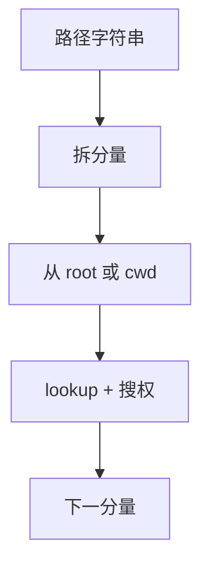

# 路径查找

把路径字符串拆成分量，从根或工作目录起逐级 lookup；权限在每一层目录的搜索位上检查。

<footer>—— 据 Bach 对 namei 的叙述；POSIX 对路径名解析的整理</footer>

[上一课](/cs/inode-dir)规定目录是名字到 inode 号的文件，并给出 `/a/b` 的直观走法。[dcache](/cs/dcache) 能加速每一分量。缺口是**完整算法**：绝对/相对、`.` `..`、工作目录、根（chroot）、末尾斜线、以及何时跟随符号链接——链接本身下一课才展开，本课留下「遇链接则再解析」的接口。

## 问题

只说「从根 inode 读目录」不够：进程有 cwd 与 root，线程可以有不同 cwd。查找必须在每一层验证执行（搜索）权限，否则用户能靠猜 inode 号越权。缺口不是再定义 inode 字段，而是 namei 状态机：当前目录 inode、剩余分量、标志（要目录还是要文件、是否跟链接）。最后一分量对 `unlink` 与 `open` 处理不同。

本课不把 Linux 的 `nameidata` 每个标志位背完。

「。」是当前，「..」是父。越过挂载点要换超级块，那是 VFS/挂载课；本课承认查找会碰到挂载点接口。

## 方法

绝对路径从进程 root 开始，相对路径从 cwd。循环：取下一分量，dcache 或目录文件 lookup，检查当前目录的搜索位。末分量按调用意图处理（必须存在 / 必须不存在 / 跟随链接）。深度与符号链接跳数有上限，防环。结果是目标 inode（或 dentry），交给 `open` 填[文件表](/cs/file-table)。

## 机制

路径查找把「用户看见的树」变成 inode 号序列，是一切按名系统调用的共同前缀。它不搬文件数据页——那是页 Cache。权限沿路径每一目录检查，最后才看目标的读/写位，这解释了为何对目录没有 x 就不能打开其下文件。不要把查找写成安全课的提权步骤；只讲检查点。

## 边界

本课不引入 `openat` 相对任意 fd 的全部细节，只承认「起点可以不是 cwd」。不把 Unicode 正规化当内核默认。硬链接与符号链接在下一课改变「名与对象」；本课的 lookup 假定分量要么是目录项要么失败。

后课默认：分量级 lookup 已有。两个名字对着同一 inode，或一个名字存着另一条路径，下一课硬链接与符号链接。

## 小结

- namei 从 root/cwd 逐分量 lookup，并检查目录搜索位。
- 末分量语义随系统调用而变。
- 链接如何改写解析，是下一课。
- 出处：Bach, *UNIX*；POSIX pathname resolution；Tanenbaum *MOS*。
