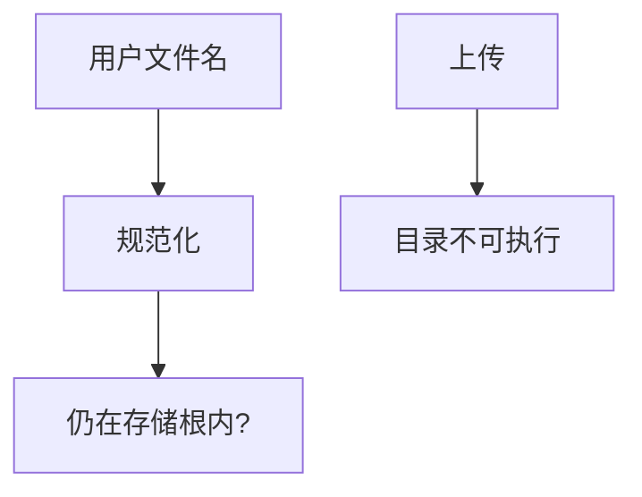

# 路径穿越与上传

文件名若还能携带父目录或未检测的扩展名，存储根就不再是根。上传是同一问题的入口：内容类型与扩展必须由服务器决定，不能信客户端。

<footer>—— 据 CWE-22；CWE-434；OWASP 文件上传</footer>

## 定位

上一课[反序列化](/cs/deserialization-attacks)在对象图。缺口是**文件系统名字**。本课讲规范与根目录约束，不给读系统文件的步骤。

后课默认已经读完本课钉下的合同，只补差，不从该领域第一性原理重开。

## 问题

拼接根路径与用户名未经规范化会逃出根。上传：双扩展、内容与 MIME 不一致、可执行目录。缺口是：规范化后必须仍在根内；文件不可执行。

### 符号链接

根内链接可指到根外。策略要禁跟随或 chroot。

CWE-22 与 CWE-434。禁止穿越 payload 教程。命令注入下一课是壳解释器。

## 方法

规范化后做前缀检查。上传存随机名于不可执行桶。下一课命令注入。

图中节点是本课的机制骨架；课程不把图展开成可运行的攻击步骤。

## 机制

完整中介：路径是客体名。逃根则 ACL 按错客体评。命令注入把字符串送进壳。

前提写进合同之后，游戏外的误用只当失败模式点名，不在本课写成操作程序。

## 边界

不写穿越序列。命令注入下一课。

## 小结

- 对象图之后，路径是另一解释器。
- 规范化加根前缀；上传不可执行。
- MIME 由服务器测，不信客户端。
- 下一课命令注入。
- 出处：CWE-22；CWE-434；OWASP。
