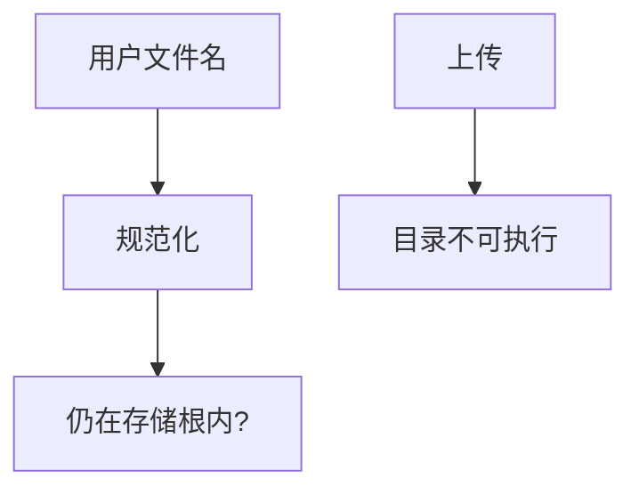

# 路径穿越与上传

文件名若还能携带父目录或未检测的扩展名，存储根就不再是根。上传是同一问题的入口：内容类型与扩展必须由服务器决定，不能信客户端。

<footer>—— 据 CWE-22；CWE-434；OWASP 文件上传</footer>

上一课[反序列化](/cs/deserialization-attacks)让攻击者控制对象图。本课换一个解释器：**文件系统的名字**。讲规范化与根目录约束两条合同，不给读系统文件的步骤。

后课默认已经读完本课钉下的合同，只补差，不从该领域第一性原理重开。

## 问题

根路径与用户输入直接拼接、不先规范化，就会逃出根：`..` 段、多余分隔符、URL 编码都会在内核解析时被合并，最终打开的文件在根外。上传是同一合同的另一半：文件名可带双扩展骗过校验，内容与声明的 MIME 可以完全不一致，落在可执行目录里就等于投放代码。缺口因此是两条：路径规范化之后必须仍在根内；上传文件不可执行。

### 符号链接

名字合同的漏洞不止在字符串：根内的符号链接可以指到根外，前缀检查全过、`open` 却落在别处。策略要么禁止跟随符号链接，要么用 chroot/容器把进程可见的文件系统真切成根。

CWE-22 与 CWE-434。禁止穿越 payload 教程。命令注入下一课是壳解释器。

## 方法

方法两步，顺序固定：先按操作系统同样的规则规范化（解析 `.`、`..` 与编码），再做根前缀检查——顺序反了检查必被绕过，因为检查的是未解析形式。上传侧：文件名由服务器取随机名，用户名至多作展示；存入不可执行的目录，MIME 与扩展由服务器探测内容决定，不信客户端声明。下一课命令注入。

```mermaid
flowchart TD
  NAME["用户文件名"] --> NORM["规范化"]
  NORM --> ROOT["仍在存储根内?"]
  UP["上传"] --> EXEC["目录不可执行"]
```

## 机制

从仲裁原则看，这是「完整中介」要求：每次访问都要按真实客体名重新评 ACL。路径是客体名，逃出根意味着被检查的名字与被打开的名字不同，ACL 评的是另一个客体，仲裁失效。命令注入是把字符串送进壳解释器——同一形状的问题换了解释器。

## 边界

不写穿越 payload 序列，不给绕过实例。命令注入下一课。

## 小结

- 对象图之后，文件系统名字是另一个待规范的解释器。
- 先规范化、再做根前缀检查；上传存随机名、不可执行。
- 内容类型由服务器探测，不信客户端声明。
- 下一课命令注入。
- 出处：CWE-22；CWE-434；OWASP。
