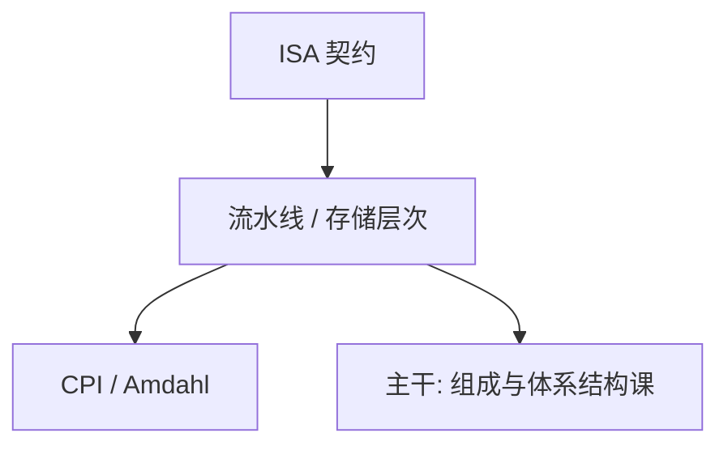

# Patterson / Hennessy

用 CPI、Amdahl 与层次化存储把「快」写成可算的数；ISA 与实现分开，量化先于故事。

<footer>—— Patterson and Hennessy, Computer Organization and Design；Hennessy and Patterson, Computer Architecture: A Quantitative Approach</footer>

[上一课](/cs/diffie-hellman-paper)附录对照了公钥方向。附录对照，不插入主干。主干已在[流水线五级](/cs/diffie-hellman-paper)、[CPI 与阿姆达尔](/cs/cpi-amdahl)、[局部性](/cs/locality-principle)、Cache 与一致性各课用过量化方法；这里对照 **这两本教材的问题**：如何把组成与体系结构收成可教的定量栈，而不是厂商故事。不重画五级流水线。

## 问题

EDVAC 草稿给了存储程序；主干从门走到乱序。Patterson/Hennessy 的缺口是教材结构：指令集作为契约，实现用流水线与存储层次去堆 CPI，用 Amdahl 挡住「只加速一部分」。RISC-V 进入后版 COD，主干[RISC-V 整数指令](/cs/riscv-int-isa)已选它当 ISA，不必回到 MIPS 课序。

两本书分工：COD 偏组成与教学机器；CA:AQA 偏量化与多核、向量。主干课序把它们拆进组成课与体系结构课，附录对照方法而不是目录。

## 方法

先定义性能（延迟、吞吐、CPI），再引入流水线冒险、Cache 缺失分类、一致性协议。主干[MESI](/cs/mesi-protocol)、[存储一致性](/cs/memory-consistency)已按这条量化链取用。附录不把某一年附录里的具体处理器型号插进主干——型号是附录级，规则已写明。

## 机制

量化迫使「局部性」「缺失类型」「转发」成为可考对象，而不是示意图。主干严格按树上课，教材章节顺序不必等于课序（本栏先流水线后 Cache，与常见教学一致，但不为赶教材而插入型号）。

### 为何对照而不插入主干

若按某版 COD 章节替换本栏树，向量、虚拟化会打乱「从比特到安全」的深度优先。附录对照定量方法的出处，型号与具体微结构世代不进主干。

## 边界

不要把 Hennessy/Patterson 图灵奖演说当另一本教材。下一篇对照龙书如何把编译收成通行证与形式化前端，主干编译课已经按通行证走。

量化方法不自动给出乱序与 SIMD 的正确性；那些课仍要冒险与向量模型，教材只提供测量框架。

对照结束应回到主干流水线与 Cache 课的量化尺子。具体处理器型号仍不进入主干。

## 小结
- 附录对照，不插入主干。
- 下一篇对照龙书编译通行证。

- 附录对照 Patterson/Hennessy：ISA 与实现分离，性能可量化。
- 主干流水线、CPI、Cache、一致性已取用；型号不进主干。
- 不按某版教材目录重排课序。
- 出处：*Computer Organization and Design*；*Computer Architecture: A Quantitative Approach*。
