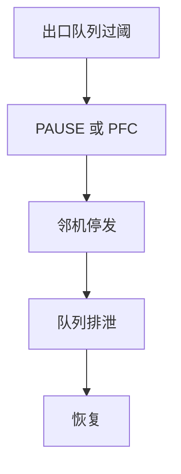

# PAUSE 与 PFC

链路层暂停是跳上的反压，不是端到端窗口；PFC 按优先级暂停，避免一张暂停卡死全部类别。

<footer>—— 据 IEEE 802.3x PAUSE；IEEE 802.1Qbb PFC 整理</footer>

[上一课](/cs/autonegotiation)可广告流控能力。缺口是**暂停帧做什么**：[TCP 窗口](/cs/tcp-window) 保护接收主机；交换机输出队列满时，需要一跳内让对端停发。[端到端论证](/cs/layering-e2e) 提醒：这是性能优化，不是文件正确性。本课不把巨帧 MTU 写完。

## 问题

802.3x PAUSE：对端停止该口全部发送一段时间。无损存储网（后课 RoCE）怕丢包，于是用 PFC：八个优先级各有暂停，背压只打中无丢类别。HOL 后课会说明为何整口暂停会让无关流饿死——PFC 是针对类别的补丁，不是交换机结构的最终解。

PAUSE 跨越中间交换机时会传播拥塞，形成「停车波」。这不是 AIMD，没有公平定理。

PFC 依赖 802.1p 优先级字段。配错类别会让控制面 BPDU 也被暂停。本课不把 DCQCN 算法写完。

### 暂停不是 rwnd

一跳反压保护邻机队列，不保护文件正确性。整口 PAUSE 会冻无关流；PFC 按类补，仍可能传播停车波。公网核心不要开。

## 方法

接收方队列过阈 → 发 PAUSE/PFC → 发送方停止对应队列 → 阈下恢复。画与 TCP 对照：rwnd 在两端主机；PAUSE 在相邻 MAC。不要用 PAUSE 替代拥塞控制来跑广域 TCP。

方法止于选定对象与对照；机制才说它如何嵌入已有分层与主干课。

## 机制

主干交换课把全双工链路当成总能塞帧。本课承认缓冲有限。生成树阻塞口不发数据，与暂停不同：阻塞是拓扑，暂停是瞬态反压。LACP 后课的成员口各自暂停，逻辑链路仍在。

无损以太网 = 不丢 + 必须有足够缓冲与PFC 调参；丢仍可能发生在阈值配错时。

## 边界

本课不引入量化拥塞通知的全部反馈环。巨帧与 MTU 是下一课。后课默认：PAUSE 整口、PFC 按类；都是一跳反压。

不要在互联网核心开 PFC：没有统一优先级语义，暂停会放大故障。

上一课留下的缺口在本课收口；「PAUSE 与 PFC」进入后课词汇表后只引用。文献用来钉对象与边界，不把本课写成该主题的独立综述。下一课[巨帧与 MTU](/cs/jumbo-mtu)。

## 小结

- PAUSE/PFC 是链路反压，不是 rwnd。
- PFC 按优先级隔离暂停，仍可能传播拥塞。
- 端到端正确性仍在 TCP/应用。
- 后课只引用本课钉死的对象，不从该领域总问题重开。
- 出处：IEEE 802.3x；IEEE 802.1Qbb。
