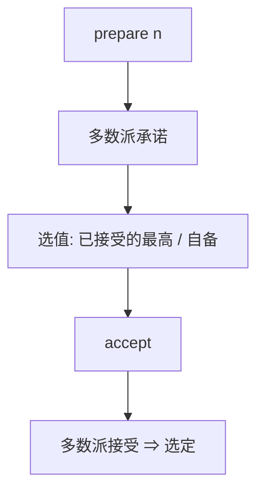

# Paxos

两阶段：先争一个提案编号的承诺，再对那个编号接受值。多数派相交让两个被选中的值不能不同。活性不保证——FLP 允许。

<footer>—— 据 Lamport, The Part-Time Parliament, TOCS 1998；Paxos Made Simple, 2001 整理</footer>

上一课[复制状态机](/cs/replicated-state-machine)要一条全序日志。缺口是**单槽共识**：多数崩溃停进程如何对「这个 index 写什么」达成一致。本课钉 Basic Paxos，不把 Multi-Paxos 的稳定领导者写完。后课默认：prepare/accept、承诺、多数派这些词已经钉死。

## 问题

提议者选编号 $n$，向接受者发 prepare。若 $n$ 大于该接受者已承诺的编号，则承诺忽略更小者，并返回已接受的最高值。提议者若收到多数派回复：若有人带过值，必须提议其中编号最高的那个；否则可提议自己的值。然后 accept。若多数派接受，该值被选定。

缺口：为何安全。任意两个多数派相交，后一次 prepare 会看见前一次已接受的值并被迫跟着走，于是不能选定第二个不同值。与[quorum 寄存器](/cs/quorum-rw)同构在相交，对象是「这个槽的值」而不是客户端 blob。

TOCS 1998 用议会寓言；2001 短文去掉寓言。编号必须全局唯一且单调，常用 `(计数, 节点 id)`。

## 方法

角色可重叠：每节点提议者+接受者+学习者。学习者靠 accept 广播或向多数派查询。冲突：两个提议者交错 prepare，可能活锁——这是活性，不是安全洞。编号加一重试。

信道可丢消息、可延迟；崩溃恢复必须把承诺编号与已接受值写进稳定存储，否则[崩溃恢复](/cs/failure-models)会改口。

## 机制

FLP：纯异步下可能永远活锁或永远选不出。实践加随机退避与「尽量一个提议者」。安全证明不依赖超时。部分同步下超时让某个提议者的 $n$ 跑在前面，于是终止。

单槽只决定一个值。状态机需要槽序列——下一课。不要把 2PC 的协调者当 Paxos：2PC 阻塞在协调者崩溃，Paxos 换提议者。后课专门对照。

本课不写拜占庭 Paxos。口头撒谎会分裂多数派观察，Lamport 的原版假定非拜占庭。

## 边界

本课不写磁盘布局、不引入联合多数派（membership）。不把 ZooKeeper 当 Paxos 实现细节。后课默认：一个值的安全 = 编号承诺 + 多数派相交；活 = 终有一个提议者独占足够久。Multi-Paxos 把独占做成领导者任期。

相交保证至多一个值；prepare 的「跟着已有值走」保证一旦有值就不能换。两句话就是安全。

## 小结

- Prepare 争承诺，accept 写值；多数派相交保唯一。
- 已接受值必须被更高编号带着走。
- 安全异步成立；终止靠部分同步与反活锁。
- 出处：Lamport, TOCS 1998；*Paxos Made Simple*, 2001。
