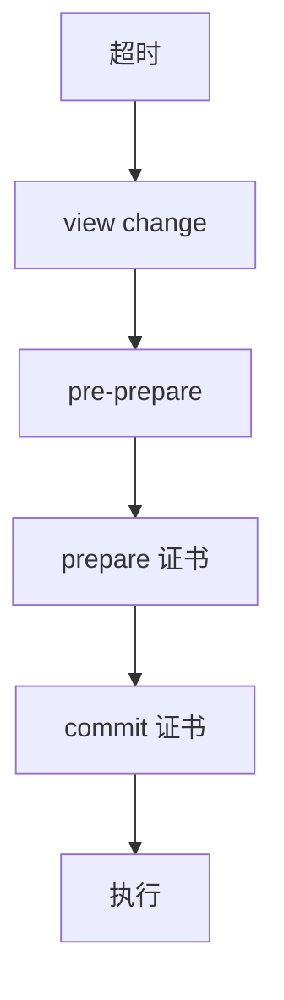

# PBFT

部分同步下用 $n=3f+1$ 做拜占庭状态机：预准备、准备、提交三阶段，证书交叉验证，视图更换换主。

<footer>—— 据 Castro and Liskov, Practical Byzantine Fault Tolerance, OSDI 1999 整理</footer>

上一课[VR](/cs/viewstamped-replication)的视图更换假定备份只崩溃或慢。缺口是**备份撒谎**：准备证书必须防伪造、防分裂。本课接[拜占庭将军](/cs/byzantine-generals)的 $n\gt 3f$，时间用部分同步，不把口头 OM 递归再写一遍。后课对照 2PC：2PC 连崩溃协调者都堵，更不抗撒谎。

## 问题

主（primary）在视图里给请求编号并广播 pre-prepare。备份验证后广播 prepare。收集 $2f$ 个匹配 prepare（加自己）形成 prepared 证书——保证诚实节点对「这个序号是这个请求」有交集。再广播 commit，收集 $2f+1$ 个 commit 后执行。三阶段让诚实节点在执行前对请求与序号有法定人数交叉。

主坏：备份超时触发 view change，新主带着 prepared 证书证明必须带着走的请求，避免分叉执行。

OSDI 1999 强调实用：MAC 而不是每次数字签名、垃圾回收、窗口。安全在异步下保持，活靠部分同步。

## 方法

认证信道：点对点 MAC 或签名。摘要链减少载荷。状态检查点做垃圾回收，类似快照但要证书证明检查点合法。客户端自己收集 $f+1$ 个相同应答才接受——因为主可能对客户端撒谎。

与 Raft：多了撒谎，法定人数从 $f+1$ 变成 $2f+1$ 这一档（$n=3f+1$）。不能用「多数派心跳」当正确性。

## 机制

prepared 证书相交：两个不同请求不能在同一序号都达到 prepared（诚实节点不协助）。commit 让节点知道「足够多诚实者已 prepared」，于是执行后崩溃恢复仍能证明。这比崩溃 Paxos 多一轮，税来自拜占庭。

[FLP](/cs/flp-impossibility)仍在：异步下 view change 可能永远抖。随机与超时是活性。恶意主可以在被换掉前拖延迟，但不能让两个诚实节点提交不同的同一序号请求。

本课不把比特币当 PBFT。也不写 BFT-SMaRt 的全部优化。权益与委员会是后课 PoW 直觉的对照对象，不是 PBFT 本身。

## 边界

本课不证全部不变量，不引入异步 BFT 的心跳复杂度下界细节。后课默认：崩溃 RSM 用 Raft/Paxos；$f$ 撒谎用 $3f+1$ 与三阶段。下一课把共识与两阶段提交的阻塞差讲清，避免把协调者当法定人数。

交叉证书替代「信任主」。主只是性能优化，不是信任根。

## 小结

- PBFT：$n=3f+1$，pre-prepare / prepare / commit。
- 安全异步；视图更换给活性。
- 客户端收 $f+1$ 份相同应答。
- 出处：Castro and Liskov, OSDI 1999。
