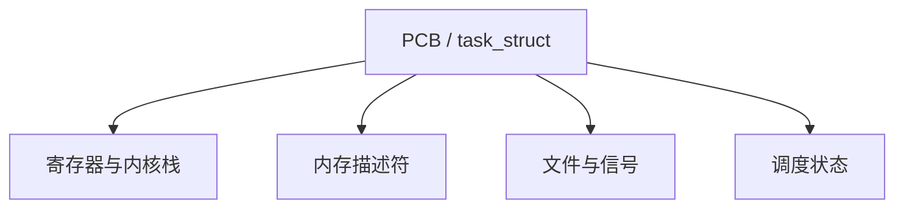

# PCB 与 task_struct

进程控制块是内核里那份可调度对象的档案：状态、寄存器副本、内存与文件的指针，而不是用户看见的可执行文件。

<footer>—— 据 Silberschatz et al., Operating System Concepts；Love, Linux Kernel Development 整理</footer>

[上一课](/cs/process-image)把正在跑的程序收成映像：页表根、寄存器、资源表。缺口是：映像在内核里要有一个**可挂队列、可命名、可指向**的对象——教材称 PCB，Linux 称 `task_struct`。本课只钉这份结构的职责，不写 `fork` 如何复制它。

## 问题

调度器不能在用户页里找「下一个进程」：用户页会被换出，也不能被内核随便信。[per-CPU 数据](/cs/percpu)是核本地的，进程却会迁移。缺口是内核堆上的控制块：PID、状态（运行/就绪/阻塞）、指向 trapframe 与内核栈、指向内存描述符与文件表。没有它，[上下文切换](/cs/context-switch)没有保存目标。

Linux 里几乎一切可调度实体都是 `task_struct`，用户进程与内核线程共用。本课先按「一条控制流一份 PCB」理解，线程课再拆共享。

## 方法

创建：分配 PCB，填初始寄存器与页表，链入就绪结构（队列形状是调度课）。查找：按 PID 哈希或树。销毁：从队列摘下，释放描述符——前提是没有人还 `wait` 着读退出码，那是僵尸课。内核只通过 PCB 碰用户状态，不把 PCB 本身映给用户写。

PID 是给用户与 `kill` 用的整数名；内核内部用指针。命名空间如何虚拟化 PID，是更后的隔离课。

## 机制

PCB 把「映像」变成可操作的内核类型。切换：保存到当前 PCB，恢复下一 PCB。[系统调用路径](/cs/syscall-path)上的 `current` 就是正在用 CPU 的那块。文件偏移存在 PCB 指向的文件表里，所以同一二进制跑两份互不相干——上一课已点过，本课落到字段。

状态位与等待队列指针让阻塞有着落：睡在哪把锁、哪个管道，PCB 上要能找到，唤醒才知道叫醒谁。

## 边界

本课不把 `task_struct` 的几百个字段当词典，不写 cgroup 指针的会计语义。线程组、进程组字段存在，语义在后续课填。也不把用户可见的 `/proc/pid` 当成 PCB 本身：那是导出。

后课默认：可调度对象就是 PCB。第一份新 PCB 如何从旧的来，下一课讲 `fork`。

## 小结

- PCB 是内核里的进程档案；Linux 名为 `task_struct`。
- 调度、切换、系统调用都通过它找到当前映像。
- 复制出子进程是下一课 `fork`。
- 出处：Silberschatz et al., *OSC*；Love, *LKD*。
