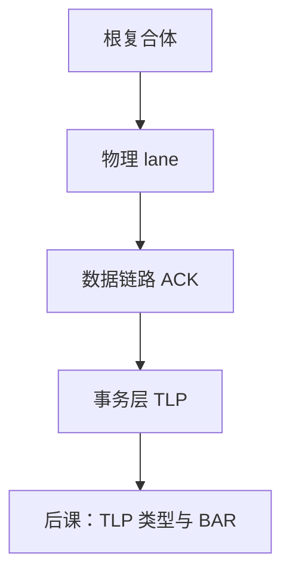

# PCIe 层次与 lane

  
PCIe 不是共享并行总线：点对点串行 lane 组成链路，分层为物理、数据链路与事务，设备各占自己的宽度。

  <footer>—— 据 PCI-SIG PCI Express Base Specification；Hennessy and Patterson, CA:AQA；Patterson and Hennessy, Computer Organization and Design 整理</footer>

[上一课](/cs/hdd-geometry)把块设备停在内部几何。组成课的[总线与 MMIO](/cs/bus-mmio) 是共享地址数据总线教学模型。缺口是当代互连 **PCIe**：lane、链路宽度 ×N、分层，让 SSD、GPU、网卡接到 CPU 根复合体。

## 问题

PCI 并行总线仲裁、反射、频率上不去。PCIe：每 lane 差分串行，×1/×4/×16 并行多 lane。分层：物理层（串扰、训练、8b/10b 或 128b/130b）、数据链路（ACK/重传、DLLP）、事务层（TLP，下一课）。缺口不是再画教学总线，而是**点对点交换机**把根端口接到端点。

链路训练协商速率与宽度。热插拔与电源状态点名。本课不把 SerDes 模拟前端画成光刻。

### lane 不是「内存通道」

DRAM 通道有命令/地址/数据时序；PCIe lane 是包交换串行链路。把 ×16 当成另一条 DDR 通道，一致性与地址译码会错——设备用 BAR 映射，不是 JEDEC 行地址。HBM 更不是 PCIe。

PCI-SIG 基规范是权威。CA:AQA 与 COD 讨论 I/O 互连演进。本课用规范层次，不背每代 GT/s 表当作业。

## 方法

根复合体发出配置与内存 TLP。交换机基于地址/ID 路由。端点（SSD 控制器、NIC）实现 BAR。带宽粗算：每 lane 有效速率 × 宽度 × 方向（全双工）。开销：编码、DLLP、TLP 头，使有效载荷低于标称。

NVMe SSD 是端点，内部再接 NAND 并行；PCIe 只负责到主机内存/CPU。

## 机制

下一课事务：Cfg/Mem/IO/Message，BAR 窗口把 MMIO 落到设备寄存器。MSI-X 用 TLP 写中断。本课先把「串行分层链路」钉住，替代教学共享总线的频率神话。

## 边界

本课不讲 CXL 全缓存一致协议（点名为 PCIe 物理上的近亲即可）。不把以太网 MAC 当 PCIe。不写光模块。不进入大模型多卡拓扑品牌。

后课默认：PCIe 是分层点对点串行互连；宽度用 lane 数表示。

## 小结

- 共享并行 PCI 被点对点 PCIe 替代。
- 物理 / 数据链路 / 事务三层；lane 可聚合。
- 下一课才是 TLP 与 BAR 地址窗口。
- 出处：PCI-SIG PCIe Base Spec；Hennessy and Patterson, CA:AQA；Patterson and Hennessy, COD。
