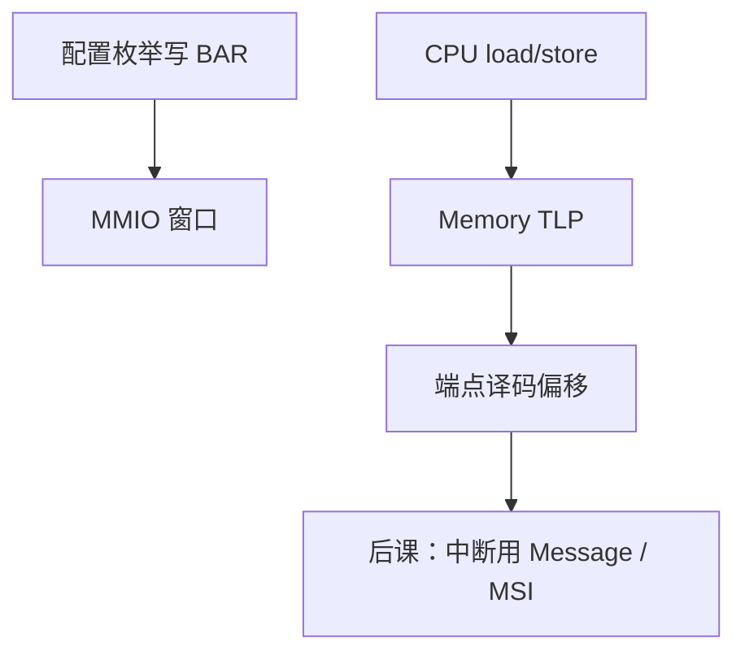

# PCIe 事务与 BAR

  
配置空间里的基址寄存器声明设备要把 MMIO 或预取内存窗口放在哪；CPU 的 load/store 变成 Memory TLP，完成包带回数据。

  <footer>—— 据 PCI-SIG PCI Express Base Specification；Patterson and Hennessy, Computer Organization and Design (RISC-V) 整理</footer>

[上一课](/cs/pcie-lanes)停在分层与 lane。[MMIO](/cs/bus-mmio) 已说设备窗口。缺口是 **TLP 与 BAR**：哪些事务类型、完成（completion）如何对应一次 `lw`，配置软件如何给 BAR 分配物理地址。

## 问题

TLP 类型：Memory Read/Write、IO（x86 遗留）、Configuration、Message（中断、错误）。非Posted 读需要完成 TLP；Posted 写可不等。BAR：设备在配置空间报告窗口大小与类型（32/64、预取），固件/OS 写入基址。缺口不是 lane 训练，而是**地址译码**：落在 BAR 的 PA 走向该端点，落在 DRAM 的走向内存控制器。

能力链表：MSI-X、电源、PCIe 能力，下一课中断用。

### BAR 不是「DRAM 行地址」

窗口里的偏移由设备定义：门铃、队列基址、NVMe 控制器寄存器。写成 JEDEC 列命令没有意义。预取 BAR 允许桥投机读，MMIO 寄存器通常标非预取，以免副作用读。

PCI-SIG 规范描述配置空间与 TLP。Patterson/Hennessy 的 MMIO 在 PCIe 上具体化为本课。枚举在固件课还会露面。

## 方法

枚举：DFS 扫描总线号/设备号/功能号，读 Vendor ID，分配 BAR。运行：CPU store → Memory Write TLP；load → Memory Read → Completion。DMA：设备当请求者发 TLP 访问主机内存（后课 DMA）。ACS 等隔离点名。

与教学总线就绪信号对照：PCIe 用完成包与重试在数据链路层，CPU 看到的是更长的未缓存访问延迟。

## 机制

MSI-X 表本身常在 BAR 里。NVMe 提交队列门铃是 BAR 里的寄存器写，触发设备去 DMA 描述符——后课散聚。本课钉事务与窗口。

## 边界

本课不写全部 TLP 头字段，不把 SR-IOV VF BAR 展开成虚拟化课。不讨论对端 ATS。不进入 GPU BAR 的 resizable BAR 营销。

后课默认：设备寄存器经 BAR 成为 PA 窗口；访问是 Memory TLP，读有完成包。

## 小结

- BAR 由配置分配，定义 MMIO/预取窗口。
- 读非 Posted，写可 Posted；完成包带回 load 数据。
- 下一课中断从线变成写消息。
- 出处：PCI-SIG PCIe Base Spec；Patterson and Hennessy, COD。
