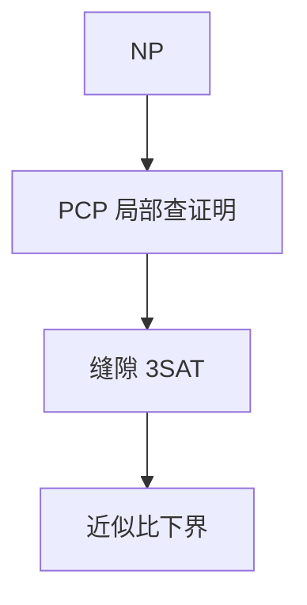

# PCP 与不可近似

NP 证明可以写成：验证者只随机看常数个比特，仍有完备与可靠；由此，许多优化问题连近似比都被钉死。

<footer>—— 据 Arora, Lund, Motwani, Sudan and Szegedy, 1998；Arora and Barak 整理</footer>

上一课[IP = PSPACE](/cs/interactive-proofs) 是多轮交谈。PCP 把「随机局部查」收成对 NP 的刻画：$\mathrm{NP}=\mathrm{PCP}(\log n, O(1))$。缺口不是再做一个交互类，而是**不可近似**：若能把 Max-3SAT 近似到 $7/8+\varepsilon$ 以内，则会把 NP 放进 P。主干[近似比](/cs/approximation-ratio) 给了 $\rho$ 的定义，未给 PCP 下界。

## 问题

PCP 验证者：掷 $O(\log n)$ 硬币，查证明的 $O(1)$ 位，多项式时间，Yes 几乎总接受，No 任意证明几乎总拒。ALMSS 定理：这正是 NP。直觉：把 SAT 证明编码成局部可测的对象（多项式、展开图），错误被放大。本课不构造。

不可近似：从 PCP 验证的接受概率做成优化目标。Max-3SAT、团、顶点覆盖的缝隙（gap）归约，使「近似到某比」等于判定 NP。Hastad 的 $7/8$ 是紧的课堂钉子，点名。

### PCP 不是 IP 的别名

PCP 验证者不与证明者交谈，证明是字面量，只是不读完。IP 的证明者自适应。类：PCP 刻画 NP，IP 刻画 PSPACE。

ALMSS 1998（PCP 定理）。Arora–Barak 第 11–18 章。Hastad 1997 最优不可近似。本课要用法：缝隙归约，不写傅里叶分析。

## 方法

陈述 PCP 定理。展示缝隙：Yes 公式可满足，No 公式任意赋值只满足 $\lt s$ 的子句，$s\lt 1$ 常数。多项式归约若保持缝隙，则近似算法会区分 SAT。对照 Cook–Levin 的「恰好可满足」：PCP 把恰好变成统计上的远离。

## 机制

有了缝隙，近似不再是「差一点的 NPC」。UGC 等更强假设收紧常数，本课不依赖。算法课的贪心比若优于 PCP 下界，只可能是对特例，或假设崩溃。

查询次数与缝隙大小互易；常数查询是定理的锋刃。

查询 $O(1)$ 比特把「读整份证明」换成抽样。缝隙 3SAT 的 Yes/No 实例在子句满足比例上分开常数。Hastad 的 $7/8$：随机赋值已达 $7/8$，更好的多项式近似除非 $P=NP$。近似比课的贪心上界若与此冲突，只可能在特殊图族。

## 边界

本课不证 PCP，不引入 Unique Games。不把 LDPC 的局部校验与 PCP 验证混为一谈（编码课后头）。后课默认：谈不可近似，先问是否 PCP 缝隙。下一课非均匀：电路。

PCP 把证明写成可随机局部查的对象，从而把「恰好 SAT」加成「满足比例的缝隙」。近似算法的 $\rho$ 从此可能有 NP 硬度，不只是启发式好坏。

上一课留下的缺口在本课收口；「PCP 与不可近似」进入后课词汇表后只引用。文献用来钉对象与边界，不把本课写成该主题的独立综述。

## 小结

- $\mathrm{NP}=\mathrm{PCP}(\log n,O(1))$：随机局部查证明。
- 缝隙归约给出近似比的 NP 硬度。
- 与 IP 分工：NP vs PSPACE。
- 出处：Arora et al., 1998；Hastad；Arora and Barak。
