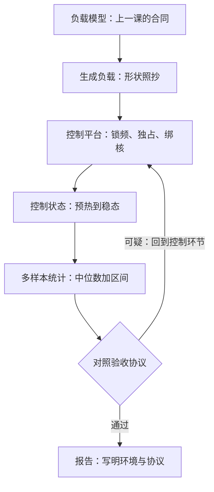

# 基准设计的陷阱

选错负载，比用错仪器更彻底地毁掉一次测量；仪器错了你知道数不可信，负载错了你还信。

<footer>—— 据 Jain，The Art of Computer Systems Performance Analysis，1991，第一章的负载选择口径整理</footer>

[上一课](/cs/pe3-requirements)把性能承诺变成数字与验收协议，但协议只说「怎样算过」，没说数字从哪来。本课补这一环：基准。基准的困境是双重的——它既要代表目标负载，又必须可复现，而这两个要求天然互相拉扯：越真实越不可控，越可控越失真。本课把这条张力上最常见的陷阱列成清单，并给每条配一个控制手段。主干课的[SPEC 与基准陷阱](/cs/spec-benchmark-pitfalls)与[TPC-C / TPC-H](/cs/tpc-benchmarks)讲过标准化基准的纪律，本课讲自己搭基准时的同款错误。

## 问题

一次基准有四个环节可以出错：负载生成、被测系统的状态、平台环境、统计判读。任何一环失守，数字都还「看起来很准」——有单位、有小数点、能画成曲线，唯独不再回答上一课定下的那个问题。不这么做会错在哪：负载用均匀固定大小的请求，而真实流量是突发长尾的，基准于是选中了系统最舒服的工作模式；数据库冷着缓存测第一遍，把页缓存预热当成了系统性能；两台机器一台满频一台降频，代码没变结论已翻。

## 方法

**控制平台**。测性能前先钉住环境：锁频或至少记录频率（[cpufreq governor](/cs/cpufreq-governor) 的调度行为直接决定「同一份代码」跑在哪个 P-state 上）；独占机器，驱逐后台任务；固定数据、固定随机种子、固定 NUMA 绑定。时钟抖动与温度节流不改代码，只改数字——两次测量之间空调启停，就能制造一次「显著优化」。

**控制状态**。预热到稳态再计时，或把冷启动单独当课题研究。缓存、分支预测器、JIT、页分配器全是有状态的机器，冷态测出来的是初始化成本。反向也要防「测的是热身副产品」：计时区间必须落在工作真正发生的窗口里。

**控制负载**。负载形状从上一课的负载模型来：大小分布、读写比、到达过程照抄，尤其是突发。开环压测（按时间表发请求，不等响应）与闭环压测（等响应再发下一个）回答不同的问题：测系统容量用开环，测单请求路径用闭环，报告时写明用哪种。

**控制统计**。多样本、多样本、多样本。报中位数与区间而不是最好的一次；事先定样本量，不要看到满意就停——那不是挑选就是噪声。

「开环/闭环」翻译成大白话：闭环像一个人排队——办完一个才取下一个号，系统越慢你的发起速率越慢；开环像一车人同时涌进来取号，系统再慢请求照样按时间表到达。前者量「一个请求的体验」，后者量「系统被打满时的容量与排队行为」，混用会答非所问。

## 机制

这些手段为什么缺一不可：性能不是代码的属性，是「代码加平台加状态」三元组的属性。锁频为什么必要——频率是乘在整条时间线上的因子，两组不同频率的对比不是测量是比较。预热为什么必要——稳态才是服务生涯的常态，用户几乎从不访问刚开机十分钟的机器。多样本为什么必要——单次计时的方差来自中断、缓存扰动与调度噪声，这些噪声不改均值却毁单次读数。标准化基准的 run rules（公开环境、禁止挑数字、禁止未披露选项）把这三条纪律写成了合同；[SPEC 与基准陷阱](/cs/spec-benchmark-pitfalls)的教训是受控比较不等于工作负载的充分统计——你的内部基准同样如此，它给出的是可控条件下的证据，不是生产预测。

一个不花一分钱就能捏造 40% 「优化」的办法：把基准从下午四点挪到凌晨两点，机房降温和负载退潮让 turbo 频率多撑几百兆赫。频率记录缺席的基准报告，等于没写测量仪器型号。

## 边界

基准再规矩也不是生产。它测不到真实数据的分布、真实的邻居与真实的故障，所以内部基准永远要和现场遥测互相校准，两套数字打架时先怀疑负载模型。也警惕 Goodhart 定律：基准数字一旦变成考核，代码就会朝基准特化——为合成负载调的哈希表参数，在真实键分布上可能是负优化。标准化套件内部的实现细节（TPC 合同条款、SPEC 编译规则）主干课已交代，本课给的是自己动手时够用的护栏。

## 小结

- 基准测的是「代码加平台加状态」三元组；平台、状态、负载、统计，四环控制缺一失守。
- 锁频并记录频率，独占机器，固定数据与种子；漂移的频率是最便宜的造假与最常见的误判。
- 预热到稳态再计时，冷启动要么单测、要么不测。
- 多样本报中位数与区间，样本量事先定；「看到满意就停」是挑选不是测量。
- 基准是受控比较不是生产预测，与现场遥测互相校准；防基准特化。
- 出处：Jain，*The Art of Computer Systems Performance Analysis*，1991；SPEC 与 TPC 的 run rules；据本课四控制口径整理。
