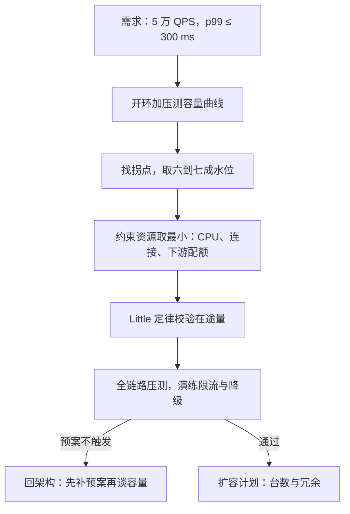

# 容量规划案例

容量不是峰值流量除以单机极限：极限吞吐那个点上的延迟通常已经不可用，按它买机器，等于把 p99 卖了换利用率。

<footer>—— 据 Beyer 等，Site Reliability Engineering，2016，第 4 章与 Little，Operations Research，1961 口径整理</footer>

[上一课](/cs/pe3-regression-case)把一次回归从报警追到引入提交，收在「判据先行」上。本课换一个前瞻性的问题：两个月后大促，预估峰值五倍流量，买（或扩）多少机器。容量规划是性能工程里少有的**预先**做的功课——错了没有排查的机会，只有当天晚上。

## 问题

[第一课](/cs/pe3-requirements)的需求已经写好：p99 不超过 300 ms，峰值 5 万 QPS，负载模型附了大小分布与突发形状。缺口在于「单机能扛多少 QPS」没有单一答案：它随负载形状、缓存命中率、依赖健康度漂移，是一个函数而不是一个数。不这么做会错在哪：把单机压到 8000 QPS 的极限吞吐，按它乘出机器数——上线后每个实例都站在自己的延迟悬崖边上，峰值的第一个突发就把 p99 推到 3 秒：吞吐达标了，需求里的另一半（延迟分位）碎了。

## 方法

第一步，测容量曲线，不测单点。开环加压（按上一课程的口径：按时间表发请求、不等响应），记录一组（吞吐，延迟）对，画出延迟随吞吐的曲线，找**拐点**——延迟开始非线性上翘的位置。容量取拐点的六到七成做安全水位，而不是极限吞吐。

第二步，找约束资源并取最小。CPU 不是唯一的账：连接数、内存、线程池、下游配额都可能先到。单机容量等于各资源上限的最小值——压测曲线只暴露最先撞上的那一块，撞墙之后的数据全部失真，要换资源维度重新测。

第三步，用 Little 定律校验在途量：$L=\lambda W$。5 万 QPS 乘 200 ms 平均延迟，全集群任意时刻有一万个请求在途——连接池、队列长度、下游连接数都按这个量级配，而不是按「每实例一百并发」拍脑袋。

第四步，全链路压测演练预案。单组件压测测不到共享依赖上的排队叠加；用影子流量按峰值形状（突发、读写比照抄第一课的负载模型）打全链路，并验证限流与降级真的在目标水位触发——[限流与熔断](/cs/rate-limit-circuit-breaker)的机制没在真实峰值下开过，等于没有。

## 机制

为什么取拐点不取极限：排队延迟随利用率 $\rho$ 趋近 1 而发散，$W_q$ 正比于 $\rho/(1-\rho)$——极限吞吐附近延迟是超线性的悬崖，水位六到七成买的不是浪费，是「容量模型错了也不越过悬崖」的保险。为什么容量取最小值：木桶约束，下游配额先到时，本机 CPU 再空也接不住；只按 CPU 算容量是最常见的漏账。为什么预案要演练：过载是罕见状态，罕见状态里的代码路径是测试覆盖最低的路径，第一次真实执行不应发生在真实过载里。

台数的一笔账：单机拐点 8000 QPS、水位取 70%，单机承载 5600；5 万峰值除以 5600 约等于 9 台，再加 N+2 冗余共 11 台。冗余那两台不是买坏天气——是买容量模型本身的误差，模型越没验证过，冗余越不能省。

## 边界

容量按负载模型成立：流量形状变了（读写比反转、请求变大），容量作废重来——第一课的负载模型是合同，本课是它的第一次履约。单点下游不随实例数扩展：一个数据库扛不住时，加应用机器只是把瓶颈推给下游并加重它的排队，扩容计划必须连同下游配额一起做。跨区域的容量与故障演练不在本课——那是容灾课的账。容量与成本是一对：安全水位买的保险有保费，买大的那部分钱如何在 SLO 约束下重新定价，是下一课的题目。

## 小结

- 容量规划交付的是曲线与水位，不是「单机极限 × 台数」的乘法。
- 拐点的六到七成是安全水位：买的是延迟稳定性，不是闲置。
- 约束资源取最小值；CPU 只是候选之一，下游配额常先到。
- Little 定律 $L=\lambda W$ 给在途量，连接与队列按它配。
- 预案必须在全链路压测里真实触发过，否则等于没有。
- 出处：Beyer 等，*Site Reliability Engineering*，2016，第 4 章；Little, *Operations Research*, 1961；据本课四步口径整理。
