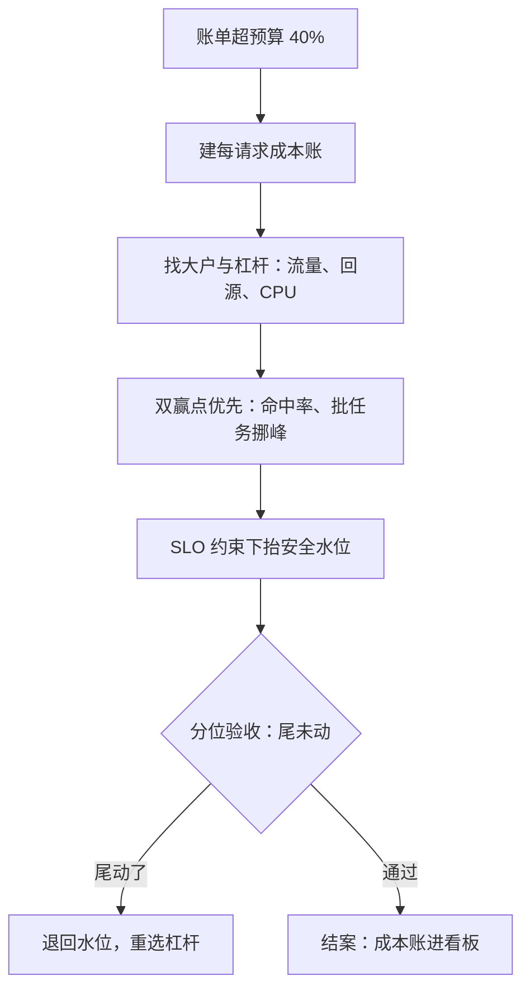

# 性能与成本的联合优化案例

SLO 是约束，成本是目标函数；只优化任何一边的团队，都是在另一边的账本上偷偷透支。

<footer>—— 据 Barroso 与 Hölzle，The Datacenter as a Computer，2nd ed., 2018 与 Beyer 等，Site Reliability Engineering，2016 口径整理</footer>

[上一课](/cs/pe3-tail-latency-case)把 p99 收回错误预算内，大促平稳落地。本课程最后一类案例处理剩下的那对张力：性能达标之后，账单怎么办。季度复盘时这个服务的月账单超预算四成——性能与成本在两份报表里分开记账，没有人同时看两本。

## 问题

性能团队的安全水位、成本团队的缩减计划互相看不见：前者为峰值买的 N+2 冗余，在后者眼里是常年闲置；后者砍掉的「低价值」缓存，正是前者刚修好的尾延迟的支柱。缺口不是哪个单方的技术，而是把两本账合成一本：**在 SLO 约束下最小化单位成本**。不这么做会错在哪：先做性能再谈成本，结果过度供给成为常态——没人记得冗余是应急保险还是永久开销；或者反过来先省钱，砍缓存、抬水位，把刚攒下的延迟余量一次性花光，下一轮回归直接烧穿预算。

## 方法

第一步，建每请求成本账。把账单摊到请求上：CPU 秒、内存 GB·时、出流量、跨区流量、以及每一次下游调用——缓存 miss 就是一次付费的下游调用。账单是聚合的，杠杆藏在分母里；没有单位成本的优化无法排序。

第二步，找大户与它们的杠杆。出流量与跨区复制常是第一大户，CPU 未必。杠杆用 Amdahl 的钱版本：优化占账单 5% 的项，全省也只有 5%。优先扫「双赢点」——性能与成本同向的地方：缓存命中率从 0.90 提到 0.95，回源量沿 $1-h$ 减半，下游费用与回源延迟同时减半；这类点先做，做完再谈取舍。

第三步，在 SLO 约束下重新定价余量。安全水位从「固定七成」变成「SLO 允许的最高水位」：[第一课](/cs/pe3-requirements)的错误预算是可以花的钱，水位每抬高一个点，都要在分位上验收——风险不是均值变差，是变异变大、尾先动（上一课的账）。延迟不敏感的批任务挪到低价时段或可抢占实例，与在线负载隔离，隔离的代价计回成本账一起算。

第四步，验收与性能优化同一套协议：灰度、分位对账、可回滚。成本优化降低的每一块钱都要能指认它对应的性能风险敞口。

## 机制

每请求成本为什么是正确的分母：它把「买多大」与「跑多快」放进同一量纲——每请求成本等于单价乘资源占用除以有效吞吐，缓存与批处理改变分母（吞吐），压缩改变分子（资源），摊平了才能比较。命中率为什么是指数杠杆：回源量正比于 $1-h$，h 从 0.90 到 0.95 在绝对数上只有五个百分点，在回源侧却是减半——在命中率高的区间优化它，性价比远高于在 CPU 上再挤 10%。水位与预算为什么必须联动：容量课的六到七成水位是按「模型有误差」定价的保险；当监控积累足够、模型误差收窄，保险可以降价——但降价幅度由错误预算付账，不由账单付账。

本案例最大的单项节省不在任何 CPU 报表里：聚合结果的跨区读改成本区读加索引同步，账单降两成而延迟不变。云账单里「数据搬运」一项经常大于计算一项——按资源类型而不是按服务维度看账单，才能看见这类钱。

## 边界

单价是外生变量：云厂商调价、机型换代、汇率，都能让优化结论翻盘——成本账必须可重算，参数与公式进版本库。成本优化有重组成本：迁移、重训、冻结期，不是每次账单上涨都值得动架构。有些钱不该省：错误预算的余量、多可用区冗余、安全容量是保险不是浪费，「全都能省」的成本报告等于没做过风险管理。本课程不进财务口径（摊销、折旧、预留折扣），只到工程能控制的资源账为止；再往下是财务的账本。

## 小结

- 联合优化写成一个不等式：SLO 约束下最小化单位成本；两本账合成一本才有解。
- 每请求成本账是排序的依据；账单是聚合的，杠杆在分母里。
- 双赢点先做：命中率沿 $1-h$ 的减半效应，性能与成本同向。
- 水位是保险：抬水位花的钱记在错误预算上，验收在分位不在均值。
- 成本账要可重算、优化要可回滚；单价一变结论就变。
- 出处：Barroso 与 Hölzle，*The Datacenter as a Computer*，2nd ed., 2018；Beyer 等，*Site Reliability Engineering*，2016；据本课四步口径整理。
