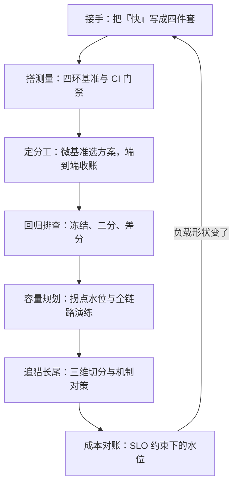

# 性能工程案例收束

性能工程的产出不是快，是每一句「快」都带着数字、负载与判据；判据缺席的地方，剩下的都是修辞。

<footer>—— 据 Jain，The Art of Computer Systems Performance Analysis，1991；Beyer 等，Site Reliability Engineering，2016；Dean 与 Barroso，CACM 2013；本课程八课口径整理</footer>

[上一课](/cs/pe3-cost-case)把性能与成本合进同一本账，在 SLO 约束下重新定价了安全水位。本课程到此收束：本课把七课拼回一张图——同一个 API 服务从接手到第二年大促的完整周期——并沉淀出换服务、换团队仍然成立的骨架，给主干课的机制课补上「落在一个真实服务上是什么样」。

## 问题

收束要回答的是：哪些知识跟场景走、哪些不跟。不这么做会错在哪：把具体工具与数字当知识带走——「我们永远用七成水位」「必须用某款 profiler」「p99 一律 200 ms」——换一个负载形状、换一代硬件、换一个云，全部作废；而真正跨场景的纪律反而没人带走。收束把七课的对象各归到服务生命周期的位置上，看它们何时出场、向谁要证据。

## 方法

按时间线走一遍。**接手**：[第一课](/cs/pe3-requirements)把「系统要快一点」写成四件套——SLI、SLO、负载模型、验收协议；这是后面每一次测量都要回头对表的合同。**搭测量**：[基准课](/cs/pe3-benchmark-pitfalls)的四环控制搭起内部基准与 CI 门禁；[第三课](/cs/pe3-microbench-vs-real)定下分工——微基准选方案、端到端收账。**第一次回归**：[第四课](/cs/pe3-regression-case)冻结现场、排除平台、二分到提交、差分归因、双收账结案。**大促**：[第五课](/cs/pe3-capacity-case)测容量曲线取拐点水位、约束资源取最小、全链路演练预案。**上线后**：[第六课](/cs/pe3-tail-latency-case)按时间、特征、实例三个维度切开分位，把惊群与排队两个来源对上同一时间轴。**年底**：[第七课](/cs/pe3-cost-case)建每请求成本账，双赢点先做，水位在错误预算上重新定价。第二年负载形状变了，回到第一课重写负载模型——课程是一个环，不是一条线。

## 机制

七课走完，三条骨架浮出来，它们不随服务、团队与云换。第一，**一切主张带判据**：数字、负载、环境、样本量，四样缺一就是修辞——需求四件套、基准的 run rules、排查的结案判据、成本账的可重算参数，是同一条纪律在四个环节的化身。第二，**测量的是三元组**：代码加平台加状态；平台与状态不受控时一切对比作废——排查先排环境、容量先钉负载形状、追尾先切维度，全是这一条在不同场景的重放。第三，**预算同构**：错误预算、容量余量、成本水位是同一笔钱的三种记法，花哪一份都要在分位上拿收据。两个公式跨课出现：Amdahl 给收益封顶，封住微基准的乐观与成本优化的账目；Little 给在途账，容量与连接池都按它配。排队发散与扇出的 max 放大则解释了尾为什么伤人、为什么削变异比堆机器便宜。

一个可携带的自查单，四个问题对应三条骨架：这个主张有数字与负载模型吗？环境受控、样本量事先定了吗？改动花了哪份预算、在哪个分位上验的收据？结案判据写进文档了吗？四个「是」之前，任何优化都只是候选。

## 边界

本课程不替代机制课：墙为什么存在，归[roofline 的深化与收束](/cs/par-roofline-map)的带宽-算力账与体系结构课；证据从哪来，归[perf 的深化](/cs/obs-perf-deep)的计数器与采样、[火焰图](/cs/obs-flamegraphs)的投影纪律、GPU 侧的[性能计数与 profiling](/cs/gpu-profiling)；尾的机制与对策细节归[Tail at Scale](/cs/tail-at-scale)与[SLO 工程](/cs/obs-slo-engineering)。本课程给的是把这些机制钉进交付流程的方法：先有判据，才有优化；先控环境，才有对比；先有预算，才有花法。八课的案例是复合的，数字为教学构造，纪律是真实的。本课程到此收束。

## 小结

- 七课拼成一个周期：定需求、搭测量、查回归、算容量、追长尾、对成本；负载一变，回到第一课。
- 三条骨架跨场景成立：一切主张带判据、测量的是三元组、预算同构。
- Amdahl 与 Little 是跨课的两个公式：一个封收益上限，一个配在途资源。
- 换环境带走的是纪律不是工具名与固定数字；水位与阈值都要随负载模型重定价。
- 出处：Jain，*The Art of Computer Systems Performance Analysis*，1991；Beyer 等，*Site Reliability Engineering*，2016；Dean 与 Barroso，*The Tail at Scale*，CACM 2013；据本课程八课口径整理。
