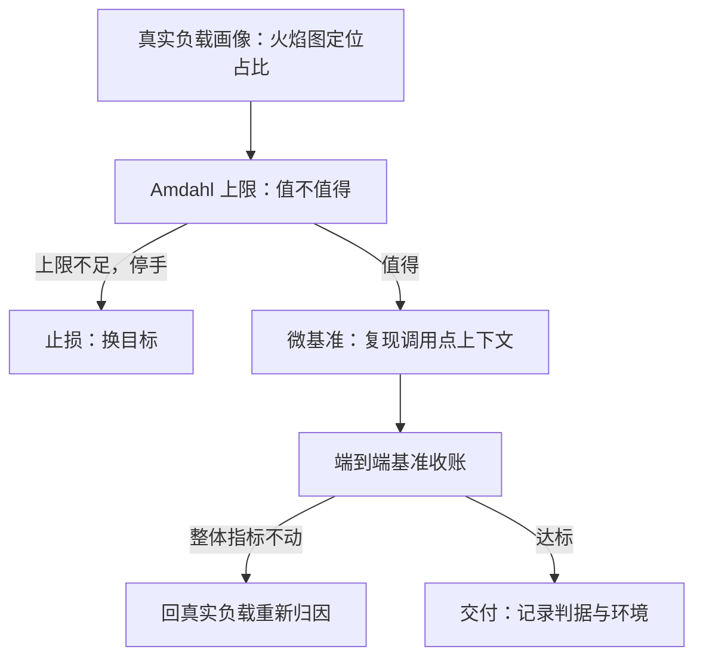
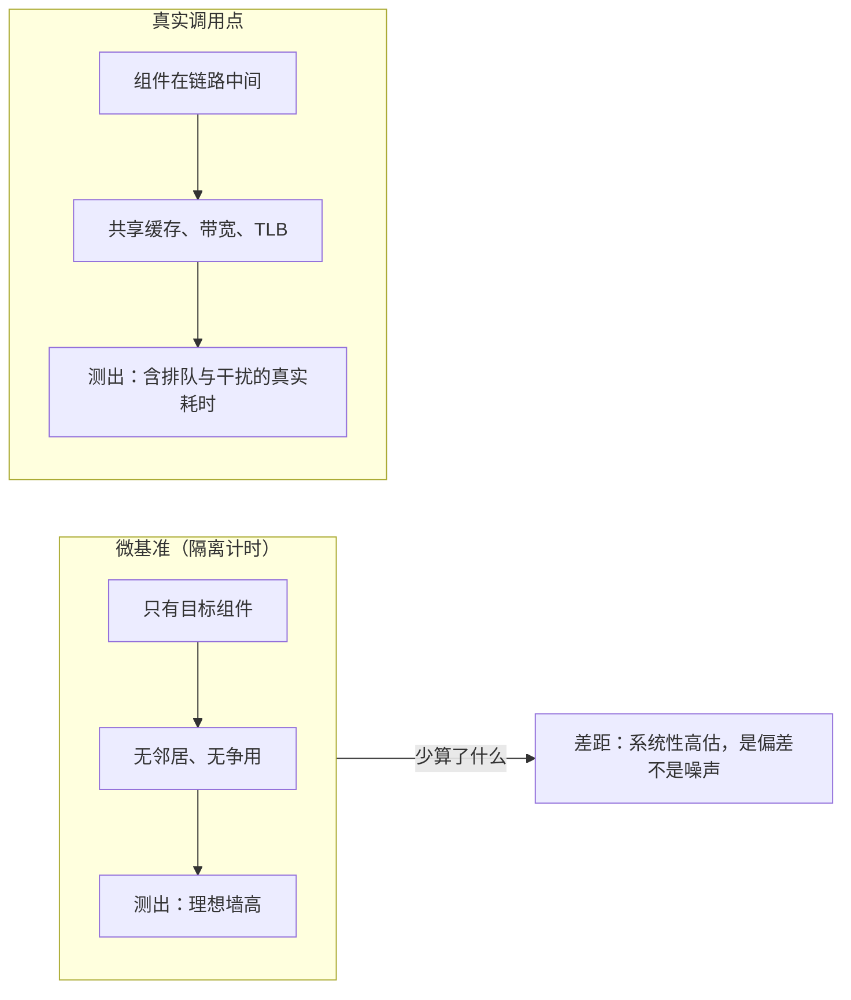

# 微基准与真实负载

微基准回答「这块代码的墙有多高」，真实负载回答「这堵墙挡住了谁」；两问不同，把前一个答案当成后一个，是最便宜的自我欺骗。

<footer>—— 据 Amdahl, AFIPS 1967 与 Gregg, Systems Performance, 2nd ed., 2018 的口径整理</footer>

[上一课](/cs/pe3-benchmark-pitfalls)把自建基准的四环控制钉了下来：平台、状态、负载、统计，缺一失守。但即便四环全对，你拿到的仍只是**那个被测单元**在**那个负载**下的数字。本课处理这类数字最常见的误用：微基准跑赢了十倍，上线纹丝不动。微基准——对单个函数、数据结构或内核的隔离计时——是性能工程里生产率最高的工具，也是被误读最多的工具；本课给它划清与真实负载的分工。

## 问题

「微基准赢了、线上没变」有两个独立来源。其一，收益上限由占比决定：目标组件只占端到端时间的 $f$，无论它加速多少倍，整体收益都封在 Amdahl 的账上——占比百分之五的组件优化一百倍，整体也只快百分之五。其二，微基准剥离了调用上下文：真实调用点上的数据分布、工作集大小、缓存与分支预测器状态、以及共享同一台机器的邻居，全都不在微基准的计时区间里。不这么做会错在哪：把一个季度的优化预算投给哈希表，理由是隔离计时快了两倍——而生产里这张表的命中率早就把它的耗时挤出了关键路径。

## 方法

第一步先归因，后动手。用[perf 的深化](/cs/obs-perf-deep)与[火焰图](/cs/obs-flamegraphs)在真实负载上确认目标组件的占比，再用 Amdahl 上限决定值不值得：组件占比 $f$、可加速 $k$ 倍时，整体加速比 $S=\dfrac{1}{(1-f)+f/k}$。上限低于验收门限，微基准根本不必写——这一步止损的钱比后面所有优化都多。

第二步，微基准要复现调用点的上下文，而不是「干净」的输入：键长与取值分布照抄生产抽样；工作集分档测——同一张表在 L1、L2、DRAM 三档工作集下是三个性能；调用形态分热循环与冷调用，前者吃分支预测器的福利，后者付缓存冷启动的税。上一课的预热与锁频纪律原样适用。

数字实例（工作集分档差多少）：一张 16 字节每条目的哈希表，条目全在 32 KB 的 L1 里时查询约几纳秒；涨到 4 MB 进 L2 变十几纳秒；涨到 2 GB 只能去 DRAM，就是上百纳秒——同一段代码，工作集差 6 万倍，耗时也差几十倍。「表多快」从来不是单个数，是随工作集变的一族数。

第三步，分工收账：微基准负责**选方案**，端到端负责**收账**。任何微基准的胜者都要回到上一课搭的端到端基准里跑一遍真实负载模型，整体指标不动，方案就不算赢。

## 机制

Amdahl 上限为什么是硬的：分母里的 $(1-f)$ 是你没动的部分，$k$ 再大也只是把 $f/k$ 压向零，$S$ 封顶在 $1/(1-f)$。微基准为什么系统性高估收益：隔离消除了共享资源上的争用——容量、内存带宽、TLB——而真实调用点上你的「优化」可能正是别人的瓶颈来源；隔离计时测出的是理想条件下的墙，不是走廊里的墙。端到端为什么是唯一收账口径：用户等待只有一条时间线，组件墙再高，不在关键路径上就不产生体验。

一个常被跳过的算术：组件占端到端 30%、微基准加速 10 倍，整体上限 $1/(0.7+0.03)\approx 1.37$——天花板是 37%，汇报里却常写成「10 倍优化」。占比 $f$ 与倍数 $k$ 必须一起报，缺一个数字就是半张收据。

这张图回答的问题是：微基准到底把哪些东西「关在了门外」？左边是它给你看的理想世界——组件独占一切资源；右边是真实世界——组件和邻居共享缓存与内存带宽，请求在链路上排队。两边数字的差不是随机误差，而是固定方向的系统性偏差：微基准永远往好里高估，所以端到端才有「收账」的资格。

直觉类比：微基准像在空跑道上测百米成绩，真实负载是早高峰挤满人的马路——同样的腿，跑出的完全是两个数。空跑道成绩用来挑运动员（选方案）没问题，但预测送外卖要几分钟（收账），必须去真实马路上量。

## 边界

微基准不是可疑的仪式：库作者与内核作者只有它——调用方千差万别，他们必须为每个工作集分档交付墙高。它的边界是回答**结构**问题（这个结构在给定分布与工作集下多快），不回答**交付**问题（用户快了多少）。GPU 侧有同款纪律：[性能计数与 profiling](/cs/gpu-profiling) 里 NCU 的微秒不能当线上延迟，单 kernel 深潜与系统时间线是两种采集。并行的收益另有[work-span 与 fork-join](/cs/work-span-model) 的跨度封顶，那是 Amdahl 在算法侧的表亲。主干课的[roofline 的深化与收束](/cs/par-roofline-map)讲墙从机器上来，本课讲墙在交付里算账。

常见误区：以为「微基准快了 10 倍」至少说明优化没白做，上线只是收益打折。实际上可能一分收益都没有——如果该组件早已不在关键路径上，或它的缓存占用减少反而喂饱了旁边的热点，端到端甚至可能变慢。收益是否存在，只能由端到端收账说了算。

## 小结

- 微基准选方案、端到端收账，两步不可互相替代、也不可只做一步。
- 先归因再动手：占比乘倍数过 Amdahl 上限，天花板不够就止损。
- 微基准要复现调用点上下文：输入分布、工作集分档、调用形态，缺了就测着另一个系统。
- 隔离消除共享资源争用，所以微基准系统性高估收益；这是偏差不是噪声。
- 出处：Amdahl, *AFIPS Conference Proceedings*, 1967；Gregg, *Systems Performance*, 2nd ed., 2018；据本课三步分工口径整理。
