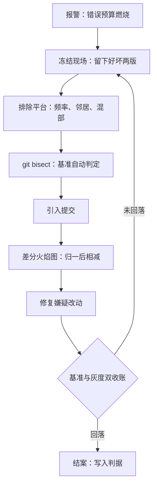
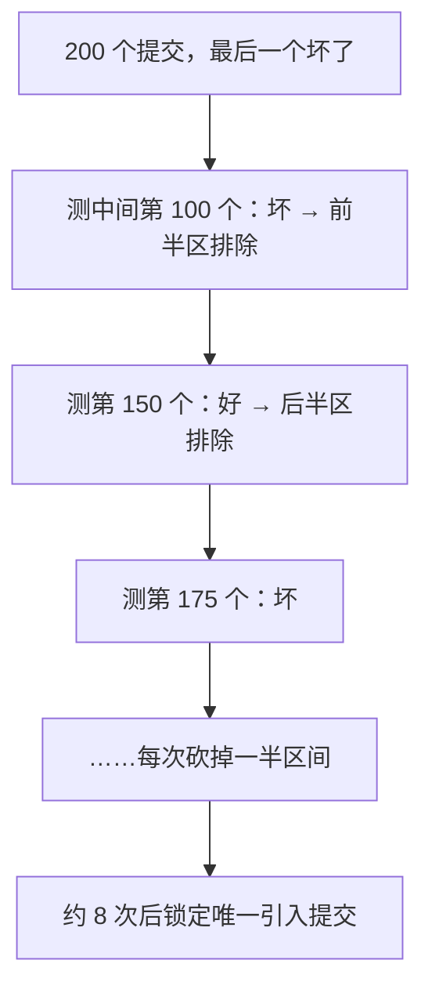

# 性能回归的排查案例

回归排查的第一原则不是找原因，是先冻结现场：坏版本与好版本都要留下来，原因只能从对照里长出来，不能从直觉里猜出来。

<footer>—— 据 Gregg, Systems Performance, 2nd ed., 2018 与 SRE 事后复盘口径整理</footer>

[上一课](/cs/pe3-microbench-vs-real)定了微基准与真实负载的分工：微基准选方案、端到端收账。本课进入第一个完整案例：一次线上性能回归的排查。案例是复合的，数字为教学构造，但每一步使用的判据都来自前两课——没有[第一课](/cs/pe3-requirements)的 SLO 与错误预算，回归连「发生」都定义不出来。

## 问题

一次例行发布后，接口 p99 从 120 ms 涨到 180 ms，功能测试全绿。缺口在于：没有性能门禁的团队，回归是被[错误预算](/cs/obs-slo-engineering)的燃烧速率报出来的——等报警响时，预算已经花了三成。排查要依次回答三问：变了什么（代码、依赖、配置、数据、环境）？哪个变化是**原因**？修复以什么判据结案？不这么做会错在哪：凭直觉挑一个「最近很可疑」的提交先改——数字没回落，又叠上一个新变量，现场被二次污染，从此没人分得清哪个因素对应哪次变化。

## 方法

第一步，冻结现场并排除平台。保留坏版本与好版本的镜像、配置与依赖清单；先复核[基准课](/cs/pe3-benchmark-pitfalls)的平台三件事——频率、邻居、混部。空调启停与后台任务制造的「回归」不花一行代码，这一步排除不掉，后面全是白干。

为什么重要：一旦带着「可疑提交已临时回滚一半」的现场继续排查，每多动一个变量，因果链条就断一节——最后修复生效时，你永远说不清是修复的功劳还是环境恰好变了。冻结现场就像出事故先拉警戒线：不是不让人干活，是保证之后每一步观察都还作数。

第二步，二分定位引入点。对提交序列跑 `git bisect`，每个提交跑同一个端到端基准，按「p99 是否超阈值」自动判定好坏。二分的前提是基准一键可跑、结果自动判定——这正是它必须进 CI 的理由。

第三步，差分归因。对好坏两版在同一环境采 profile，做差分火焰图（先按各自样本总数归一）：红色增宽的子树是嫌疑犯。本案例中，坏版的序列化子树翻倍——那个「无害」的提交把日志从纯文本换成了结构化 JSON，每请求多序列化两段大对象，写入又是同步的。

第四步，修复与验收。改动在端到端基准与线上灰度各收一次账：基准回落、灰度 p99 回到错误预算内，才算结案；两处只回落一处，说明还有未观测变量。

## 机制

二分为什么有效：提交序列上假设原因单调——存在唯一的引入点，对分把 $n$ 次排查缩到 $\log_2 n$ 次；两百个提交、单次基准三十分钟，线性是一百小时，二分是四小时。为什么必须先控平台再二分：环境噪声会制造假引入点，把排查精确地引向一个无辜提交——二分对噪声没有免疫力，它只忠实于判据。差分为什么必须先归一：两次采样总数不同时直接相减，把「第二次跑得久」当成「这段代码变慢」，[火焰图](/cs/obs-flamegraphs)课的数学在这里原样生效。

性能门禁把发现成本前置：CI 里三分钟的基准，把一次回归从「线上烧预算三天」变成「合并前挡住一次」。门禁阈值要定期与线上遥测对表——内部基准漂了，门禁就成了摆设或冤案机器。

这张图回答的问题是：`git bisect` 凭什么用几次测试就从两百个提交里揪出元凶？它每次都在剩余区间的中点测一次，无论结果是「好」还是「坏」，都能排除一半候选——区间从 200 → 100 → 50 → 25 → …，锁一个提交只需 $\log_2 200 \approx 8$ 次。前提只有一个：基准能自动、可靠地判定「好/坏」，判据错了二分会忠实地冤枉无辜提交。

数字实例：单次端到端基准跑 30 分钟时，线性逐个试 200 个提交最坏要 100 小时；二分只要 8 次、约 4 小时。二分省的不是「聪明」，是把排查次数从 $n$ 压到 $\log_2 n$——代码库越大，这笔账越悬殊。

## 边界

不是所有回归都能二分。基础设施变更（内核升级、机型迁移）、数据分布漂移、下游变慢都没有「提交」可分——这时退回变量隔离：一次只动一个因素，其余钉死，本质上是把基准课的四环控制手工重放一遍。二分也依赖判据单调：两个提交各自无害、组合起来变慢的交互型回归，会让朴素二分指向错误半区，此时要在分界处做两两组合验证。本案例不展开根因的机制细节（为什么同步序列化这么贵）——那是[perf 的深化](/cs/obs-perf-deep)与 off-CPU 分析的事，本课给的是排查的流程骨架。

常见误区：初学者容易以为差分火焰图里「变红的子树」就是元凶，抓来直接改。实际上红色只说明这段代码在坏版里耗时占比升高——可能是它真变慢，也可能是它 upstream 的输入变大、调用更频繁；它是线索不是判决，归因要顺着调用链向上游问「谁把它喂大了」。

## 小结

- 回归三问按序回答：变了什么、哪个是原因、以什么判据结案；跳步就是叠加变量。
- 先冻结现场、排除平台，再二分：噪声下的二分会精确地冤枉无辜提交。
- 差分火焰图先按总数归一再相减；增宽子树是嫌疑，不是判决。
- 修复要基准与灰度双收账；只回落一处说明还有未观测变量。
- 性能门禁把发现前置，但门禁阈值必须定期与遥测对表。
- 出处：Gregg, *Systems Performance*, 2nd ed., 2018；Beyer 等，*Site Reliability Engineering*，2016；据本课四步流程口径整理。
