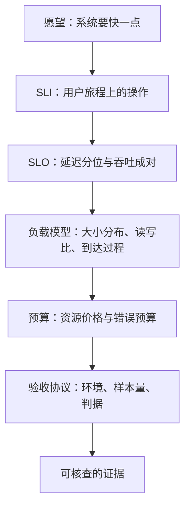

# 性能需求的工程化

没有数字的性能要求不是需求，是愿望；愿望不占用预算，也不接受验收。

<footer>—— 据 Beyer 等，Site Reliability Engineering，2016，第 3-4 章的 SLO 口径整理</footer>

[上一课](/cs/emb-case-map)把嵌入式课程收在三条骨架上：预算按最坏情况记账，信任从独立域出发，承诺都要留下可核查的证据。本课程「性能工程案例」把同一套纪律搬回通用服务，第一课先处理最常被含糊掉的一环：把「系统要快一点」翻译成可以记账、可以核验的工程需求。这是本课程的第一课，后面七课——基准、微基准、回归、容量、长尾、成本、收束——都默认你已经读完本课：没有这里定下的数字与判据，后面的一切测量都没有结论可言。

## 问题

「快一点」不可施工。它没有测量对象，没有通过标准，也没有失效时的处置。缺口因此不是优化技术，而是先把承诺变成四个可回答的问题：对**谁**的什么操作快（SLI）；快到**多少**（SLO）；在**什么负载**下（负载模型）；**谁信**（验收协议）。[SLO 工程](/cs/obs-slo-engineering)已经给过 SLI 与错误预算的机制，本课不再重讲定义，只解决它们在性能需求里如何落账：性能需求不是一份文档，而是后面每一次测量都要回头对表的判据。不这么做会错在哪：没有判据的团队会把任何一次基准跑赢当成「性能做完了」，等到大促当天才第一次见到真实负载。

## 方法

第一步，从用户旅程取 SLI。性能的 SLI 几乎总是成对出现：延迟（一个请求多久返回）与吞吐（一秒能接多少请求），外加资源价格（每请求耗多少毫核、多少字节）。只定 QPS 不定延迟，等于允许用无限延迟换吞吐；只定延迟不定吞吐，等于允许用无限机器换延迟。

第二步，延迟一律报分位数，不报平均。p99 是一百个请求里最慢的一个；它防的是「平均值漂亮、长尾伤人」的假达标。吞吐与延迟必须**在同一张压测里同时读出**：单独宣称的任何一方都是半张收据。

第三步，负载模型是需求的一部分。同一服务在均匀小请求下和在突发大请求下是两个系统：请求大小分布、读写比、到达过程（平稳还是突发）、缓存命中率，都得写进需求。换负载模型换结论，这不是测量误差，是换了题目。

## 机制

分位数为什么不可替代：请求延迟是重尾分布，平均数可能落在分布里没有任何请求的位置上；p99 却一定对应真实体验的上沿。吞吐与延迟为什么必须成对：压测可以永远把系统压在轻载区刷出好延迟，成对读数才能暴露你所在的工作点。负载模型为什么属于需求：它决定后面的基准设计与容量计算；负载写错，后面每一步都精确地测着一个不存在的系统。

预算让需求有了花法。[SLO 工程](/cs/obs-slo-engineering)的错误预算 $1-\mathrm{SLO}$ 是可以花的钱：留百分之多少给发布回归、多少给实验、多少给成本优化，本课程后面四类案例——回归、容量、长尾、成本——做的都是花这笔预算的账。[长尾规模](/cs/tail-at-scale)则解释了为什么预算要花在分位上：扇出服务里用户等待由最慢分位决定，均值达标换不来体验达标。

p99=200 ms 的直觉账：它是比率不是全员承诺——日请求量 $10^8$ 的服务，p99 之外的慢请求每天仍有 $10^6$ 个。分位数选多严，就是在决定把多大的慢人群算进「达标」。

## 边界

需求只承诺可测的东西。「用 Redis」「上 K8s」是实现，不是需求；把实现写进需求，等于在看见问题之前锁死了解法。SLO 不是 SLA：SLO 是内部目标与预算，SLA 是对外违约条款，后者永远比前者松。数字要可证伪：验收协议必须写明环境、数据、加压方式、样本量与判读规则，否则任何人都能让任何系统「达标」一次。本课程不做的是从第一性原理推导延迟模型——那是主干课排队与体系结构的事，这里只把已知的机制钉进需求格式。

## 小结

- 性能需求四件套：SLI（谁的操作）、SLO（分位数与吞吐成对）、负载模型、验收协议，缺一不可施工。
- 平均数在重尾分布上会落在无人经历的位置；性能承诺报分位，不报均值。
- 错误预算让 SLO 从目标变成可花的钱，后续案例都在花这笔预算。
- 负载模型属于需求本身：负载写错，等于换了题目再精确作答。
- 出处：Beyer 等，*Site Reliability Engineering*，2016，第 3-4 章；Dean 与 Barroso，*The Tail at Scale*，CACM 2013；据本课四件套口径整理。
