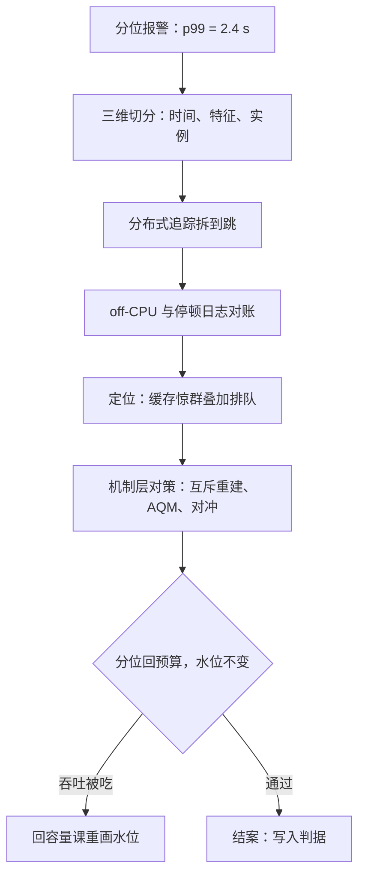
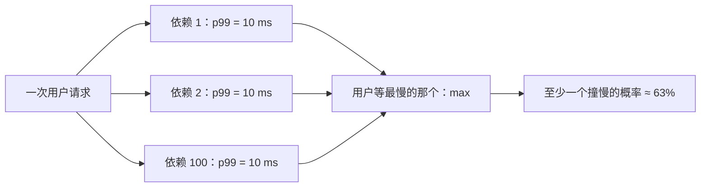

# 延迟长尾的追猎案例

均值是报表的语言，分位是体验的语言；长尾追猎的第一步不是优化，是把报表从平均数上拆下来。

<footer>—— 据 Dean 与 Barroso，The Tail at Scale，CACM 2013 口径整理</footer>

[上一课](/cs/pe3-capacity-case)用容量曲线与安全水位把大促峰值接住了。但大促当晚的仪表盘上，p50 是 40 ms、p99 却是 2.4 s：容量够，尾炸了。本课追这条尾——它的猎法与均值不同源，用均值问题的思路打尾，枪枪落空。

## 问题

均值由服务时间的中心决定，尾由**变异**与**等待**决定，两者的嫌疑人名单不同。常见嫌疑：GC 停顿与周期性后台任务（慢簇固定出现在整点或固定间隔）、缓存失效惊群（过期瞬间一群请求同砸下游）、共享资源上的排队（日志刷盘、[fsync](/cs/fsync)、锁）、以及慢邻居与坏实例。不这么做会错在哪：只看聚合监控——几百个实例的分位混平均，尾被抹成一条平线；或者优化均值路径，把序列化再加快一倍，而 200 ms 的坑根本是每分钟一次的 GC。

## 方法

第一步，先把尾切开，再谈优化。按三个维度切分位数：**时间**（慢是否聚在固定时刻）、**特征**（慢是否聚在特定请求——大请求、缓存未命中、特定分片）、**实例**（慢是否聚在固定节点）。聚合看不见的簇，切开后自己显形。[分布式追踪](/cs/obs-distributed-tracing)把端到端的尾拆到跳，定位它住在哪一跳。

「三维切分」可以想象成查堵车：不问「全城平均车速多少」（那是均值，永远 40 迈），而是问——堵车是不是都发生在早八点（时间）？是不是都堵在货车走的路线（特征）？是不是总卡在某一座桥（实例）？三个问题分别对应慢在何时、何种请求、哪台机器，交叉一下嫌疑范围就缩到很小。

第二步，on-CPU 之外查 off-CPU。等锁、等 IO、等调度不在 CPU 剖面里，要用[perf 的深化](/cs/obs-perf-deep)的调度事件把等待时间聚成直方图；GC 停顿要看运行时的停顿日志而不是猜。本案例的 2.4 s 最后对上两个来源：缓存批量过期造成的下游惊群，叠加过载时段入口队列的排队。

第三步，机制层砍尾。缓存过期改逻辑过期加互斥重建（[缓存雪崩与热键](/cs/cache-stampede-hotkey)）；入口队列上主动队列管理，早丢早拒绝而不是让请求排到超时（[AQM：RED 与 CoDel](/cs/aqm-red-codel)）；读路径加对冲请求，扇出链路用[尾延迟与对冲请求](/cs/tail-latency-hedging)与[Tail at Scale](/cs/tail-at-scale)的分层对策。

第四步，收账回到 SLO。修复后分位写回错误预算（[SLO 工程](/cs/obs-slo-engineering)），并与容量课的安全水位对表：砍尾如果吃掉了吞吐，水位要重新画。

## 机制

扇出为什么放大尾：一次请求等 $N$ 个依赖，用户等待是各依赖延迟的 max——一百个依赖各自只有 1% 的概率超过 10 ms，整体至少一个超标的概率是 $1-0.99^{100}\approx 63\%$。稀有慢在扇出后变成常态慢，这是 Dean–Barroso 的原始论点，也是对冲请求存在的理由。变异为什么进排队账：Pollaczek–Khinchine 公式 $W_q\approx\dfrac{\rho}{1-\rho}\cdot\dfrac{1+C_s^{2}}{2\mu}$ 里，等待随服务时间变异系数 $C_s$ 线性涨——均值相同、变异翻倍的服务，在高利用率下排队等待同样翻倍；这就是「削平变异」（隔离、互斥重建、早拒绝）与「加机器」不等价、且常常更便宜的原因。对冲为什么要有预算：过载时所有请求都慢，对冲退化为同步双发，负载放大趋近两倍并正反馈——所以触发条件要延迟化，且能自动关闭。

本案例的 2.4 s 不是任何一跳的正常耗时：惊群那一跳 p99 是 300 ms，入口排队再乘一个过载因子。长尾案件里最常见的结论是「两个各不致命的来源在同一个瞬间相遇」——单变量排查在这里会漏案，要在同一时间轴上对齐多路证据。

这张图回答的问题是：每个依赖都很快，为什么用户还是慢？扇出请求要等所有依赖返回，用户等待取的是 max 而不是平均。一百个依赖各自只有 1% 的概率超过 10 ms，几乎可以肯定其中有一个这次就是慢的——单点的「稀有慢」经过扇出被放大成用户的「经常慢」。对冲请求（同发多份、谁先回用谁）就是买断这种 max 风险的保险。

数字实例（变异进排队账）：两个服务均值都是 10 ms，一个变异系数 $C_s=1$（波动与均值相当），另一个 $C_s=3$（忽快忽慢）。排队公式里等待正比于 $1+C_s^2$：前者系数是 1，后者是 5——利用率 80% 时，前者排队约 8 ms，后者要等 40 ms。均值一点没变，体验翻了五倍。

## 边界

不是所有分位都值得砍：第一课的 SLO 只承诺到 p99，p99.9 的尾可能属于另一本预算，为它付架构税要先立项。砍尾的手段各有代价——隔离降低利用率（与容量课的水位直接冲突）、对冲加负载、早拒绝牺牲吞吐——都要与错误预算对账后选型。跨地域的尾有光速下限，不是工程能砍掉的。本课不重讲[尾延迟与对冲请求](/cs/tail-latency-hedging)的触发参数学与[Tail at Scale](/cs/tail-at-scale)的微分区机制，只给把它们放进案件的顺序：先切分、再归因、后选机制。

常见误区：以为「尾慢就是机器不够多」。如果是 GC 停顿或缓存惊群造成的慢簇，加机器只是把同一个整点停顿摊到更多实例上，p99 该跳还跳——而且实例一多，扇出放大反而更凶。先归因到机制（变异与等待），再决定是削变异还是加容量。

## 小结

- 均值与尾不同源：尾由变异与等待决定，嫌疑人名单要先换再查。
- 三维切分（时间、特征、实例）让不可见的慢簇显形，聚合监控是帮凶。
- off-CPU 与停顿日志是尾案件的常规证物；on-CPU 剖面查不出等待。
- 削平变异与加机器不等价：$C_s$ 直接进排队公式，高利用率下更贵。
- 对冲与隔离都有账：负载放大与利用率损失要写进错误预算的对账单。
- 出处：Dean 与 Barroso，*The Tail at Scale*，CACM 2013；Gregg，*Systems Performance*，2nd ed., 2018；据本课四步追猎口径整理。
